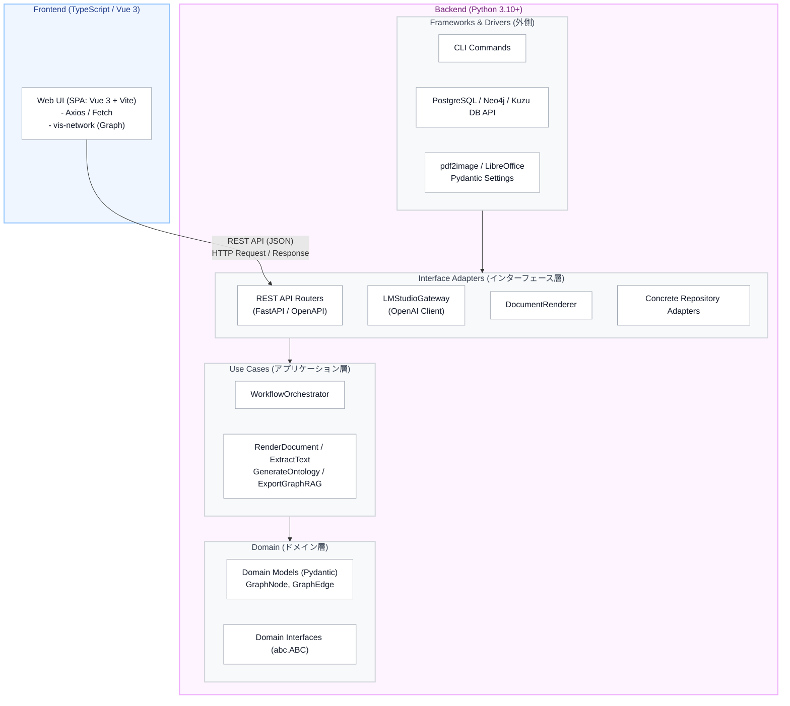
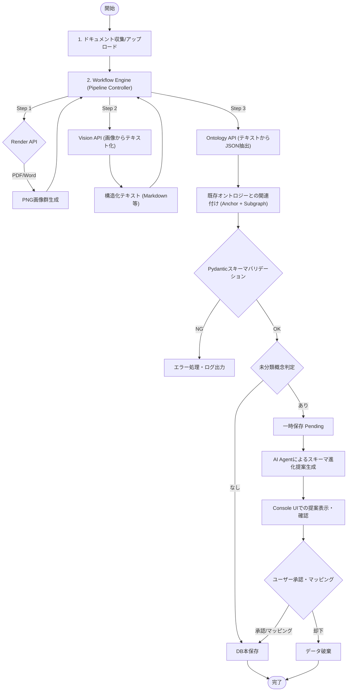
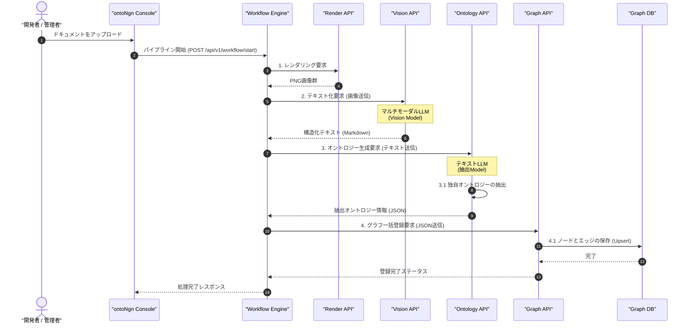

# ontoNgn (Ontology Engine) 全体設計書
Version: 2.0.0

---

## 1. ソフトウェアアーキテクチャの全体構成

本システムは、クリーンアーキテクチャの考え方を採用し、ドメインロジック（ビジネスルール）とインフラストラクチャ（データベース、LLMクライアント、レンダラーなどの具象実装）を分離しています。

### 1.1 アーキテクチャ構成図



**言語とコンポーネント間の連携（TypeScript/JavaScript ↔ Python）**:
- **Frontend (TypeScript/JavaScript)**: `Vue 3` と `Vite` を用いたSPA（Single Page Application）として構築されます。UIの描画やネットワークグラフ（`vis-network` 等）の制御をTS/JSエコシステムで完結させます。
- **Backend (Python)**: LLMの呼び出し、重いPDF処理、グラフDB操作など、データサイエンス/AIエコシステムに強い Python (`FastAPI`) で構築されます。
- **境界 (REST API)**: 両者は完全に分離されており、`FastAPI` が自動生成する OpenAPI (Swagger) スキーマに基づき、JSONフォーマットの HTTP/REST API を介して疎結合に連携します。これにより、Pydanticモデル（Python）とTypeScriptの型定義を安全に対応させることが可能です。


## 2. 機能一覧および各機能の概要

| 項番 | 機能モジュール | 役割の概要 |
| :--- | :--- | :--- |
| 01 | **Workflow Orchestrator** | ドキュメントの読み込みから画像化、テキスト化、オントロジー抽出にいたるパイプライン全体のステート（処理フェーズ・成否）を管理し、非同期タスクキューを用いてタスクを連動させます。各フェーズでの状態遷移やエラー時のリトライ・通知機構も担います。 |
| 02 | **Document Render API** | ドキュメント（PDF/Word/Excel）をパースし、Vision Modelに入力可能な高解像度PNG画像群へ変換します（LibreOffice等を利用）。 |
| 03 | **Vision Extraction API** | レンダリングされた画像群を入力としてマルチモーダルLLMを呼び出し、マークダウンなどの構造化されたレイアウト維持テキストを出力します。 |
| 04 | **Ontology Generation API** | 構造化テキストから、エンティティ（手続き、アクター等）とリレーション（依存関係等）をJSON形式で抽出し、バリデーションした上でデータベースへ保存します。 |
| 05 | **Ontology Linking Engine** | 新規抽出されたオントロジーについて、アンカー探索と既存サブグラフの取得を行い、LLM推論により既存知識グラフとの関連付け（リンク生成・マージ）を行います。 |
| 06 | **Ontology Evolution Agent** | 未分類の概念（`ap:UnclassifiedConcept`）に対し、既存スキーマとの類似度や文脈情報を分析し、新規クラス昇格や既存へのマッピング案を自律的に生成します。 |
| 07 | **Schema Compiler** | 承認された進化提案に基づき、Zod/Pydantic validation定義ファイルおよびOWL/Turtleオントロジーファイルを動的に再生成・コンパイルします。 |
| 08 | **Schema Evolution API** | 未承認（Pending）状態のオントロジー進化提案をユーザーが確認し、承認（クラス昇格/既存マッピング）または却下（データ破棄）するアクションを受け付け、Graph RepositoryやSchema Compilerへ連携するAPI。 |
| 09 | **Graph Repository** | DB非依存の知識グラフ管理インターフェース。Neo4j、Kuzu等の各グラフDBへのデータ同期およびエクスポート処理を担います。 |
| 10 | **Console UI (SPA)** | 処理状態ダッシュボードの表示、エラーログの閲覧、およびスキーマ進化提案に対する人間の承認／却下のフィードバック収集を担うフロントエンドSPA。 |
| 11 | **Graph Visualization UI** | データベースに蓄積されたノードとエッジを、検索を起点として動的に探索・可視化するネットワークグラフUI（Vue 3 + vis-network等を利用）。 |

---

## 3. API仕様一覧 (API Specifications)

本システムは、分離されたフロントエンド（SPA）や外部システムからの連携のために、以下のRESTful APIを提供します。

### 3.1 Document API (ドキュメント管理)
| Method | Endpoint | 概要 | リクエスト例 | レスポンス例 |
| :--- | :--- | :--- | :--- | :--- |
| POST | `/api/v1/documents/upload` | ファイルをアップロードして登録 | `multipart/form-data` (file) | `{ "document_id": "uuid", "status": "Uploaded" }` |
| POST | `/api/v1/documents/register-path` | ローカルパスを自動収集対象に登録 | `{ "path": "/path/to/dir" }` | `{ "status": "success", "count": 5 }` |
| GET | `/api/v1/documents` | 登録済みドキュメント一覧とステータス取得 | - | `[{ "id": "uuid", "filename": "...", "status": "Completed" }]` |
| GET | `/api/v1/documents/{id}` | 特定ドキュメントの詳細・ステータス取得 | - | `{ "id": "uuid", "status": "Rendering", "error_log": null }` |
| DELETE | `/api/v1/documents/{id}` | ドキュメントおよび関連データの削除 | - | `{ "status": "deleted" }` |

### 3.2 Workflow API (ワークフロー制御)
| Method | Endpoint | 概要 | リクエスト例 | レスポンス例 |
| :--- | :--- | :--- | :--- | :--- |
| POST | `/api/v1/workflow/{id}/start` | ドキュメントの解析パイプライン開始 | - | `{ "status": "Rendering" }` |
| POST | `/api/v1/workflow/{id}/retry` | エラー終了した処理の再試行 | - | `{ "status": "Processing" }` |
| POST | `/api/v1/workflow/{id}/cancel` | 実行中のパイプラインをキャンセル | - | `{ "status": "Cancelled" }` |

### 3.3 Schema Evolution API (スキーマ進化管理)
| Method | Endpoint | 概要 | リクエスト例 | レスポンス例 |
| :--- | :--- | :--- | :--- | :--- |
| GET | `/api/v1/schema/candidates` | 未分類概念とAgent提案一覧の取得 | - | `[{ "concept": "...", "proposal": "..." }]` |
| POST | `/api/v1/schema/candidates/{id}/approve` | 提案(新規クラス作成など)を承認 | `{ "action": "create_class", "name": "NewClass" }` | `{ "status": "Approved" }` |
| POST | `/api/v1/schema/candidates/{id}/reject` | 提案を却下または既存クラスへマッピング | `{ "action": "map_existing", "target": "BaseClass" }` | `{ "status": "Rejected" }` |

### 3.4 Export API (エクスポート・連携)
| Method | Endpoint | 概要 | リクエスト例 | レスポンス例 |
| :--- | :--- | :--- | :--- | :--- |
| GET | `/api/v1/export/graphrag` | LlamaIndex等向けJSON形式のエクスポート | `?format=json` | `{ "nodes": [...], "edges": [...] }` |
| GET | `/api/v1/export/turtle` | 標準的なRDF/Turtle形式でのエクスポート | - | (Turtle format text file) |

### 3.5 Graph API (グラフCRUD・可視化・探索)
| Method | Endpoint | 概要 | リクエスト例 | レスポンス例 |
| :--- | :--- | :--- | :--- | :--- |
| POST | `/api/v1/graph/ingest` | 抽出済みのオントロジーJSONを一括でGraphDBへUpsert登録 | `{ "nodes": [...], "edges": [...] }` | `{ "status": "success", "nodes_upserted": 10 }` |
| POST | `/api/v1/graph/nodes` | 単一ノードの作成/更新 (Upsert) | `{ "id": "...", "type": "...", "label": "..." }` | `{ "status": "success" }` |
| GET | `/api/v1/graph/nodes/{node_id}` | ノード詳細の取得 | - | `{ "id": "...", "label": "..." }` |
| DELETE | `/api/v1/graph/nodes/{node_id}` | ノードの削除 | - | `{ "status": "deleted" }` |
| POST | `/api/v1/graph/edges` | 単一エッジの作成/更新 (Upsert) | `{ "source_id": "...", "target_id": "..." }` | `{ "status": "success" }` |
| DELETE | `/api/v1/graph/edges` | エッジの削除 | `?source_id=...&target_id=...` | `{ "status": "deleted" }` |
| GET | `/api/v1/graph/search` | キーワードに基づくアンカーノード検索とサブグラフ取得 | `?q=keyword&hops=1` | `{ "nodes": [...], "edges": [...], "hits": [...] }` |
| GET | `/api/v1/graph/expand` | 指定ノードを中心とする特定ホップ数のサブグラフ再取得 | `?node_id=uuid&hops=2` | `{ "nodes": [...], "edges": [...] }` |

※ 内部的な処理の連鎖（`RenderDocumentUseCase`, `ExtractTextUseCase`, `GenerateOntologyUseCase` の呼び出し等）は、ワークフロー制御エンジンにより非同期タスクとして実行・管理されます。

---

## 4. 処理フロー図 (Processing Flowchart)

以下は、ドキュメントがアップロードされてから、オントロジーの抽出、未分類概念の判定、スキーマの進化（人間の承認）、そして最終的なDB保存にいたる全体の処理フローです。



---

## 5. クラス図 (Backend Class Diagram)

クリーンアーキテクチャの境界と、各コンポーネントの依存関係を表すクラス図です。


---

## 6. シーケンス図 (Processing Sequence Diagram)

ドキュメントのアップロードから各APIの呼び出し、未分類概念による保留処理までのエンドツーエンドシーケンス図です。



---

## 7. ディレクトリ構造 (Directory Structure)

```text
app/
├── main.py                     # エントリーポイント (FastAPI application)
├── core/                       # 環境設定と共通基盤
│   ├── config.py               # 環境設定のスキーマ定義 (Pydantic Settings)
│   └── dependencies.py         # FastAPI Dependency Injection 設定
├── domain/                     # 1. ドメインレイヤー
│   ├── models/
│   │   └── graph.py            # GraphNode, GraphEdge 定義 (Pydantic)
│   └── services/
│       ├── vision_service.py     # IVisionService 抽象クラス
│       ├── text_llm_service.py   # ITextLLMService 抽象クラス
│       └── graph_repository.py   # IGraphRepository 抽象クラス
├── usecases/                   # 2. ユースケースレイヤー
│   ├── render_document.py      # 画像レンダリング処理
│   ├── extract_text.py         # Visionを用いたテキスト抽出
│   ├── generate_ontology.py    # LLMを用いたオントロジー生成
│   └── export_graphrag.py      # GraphRAG用データエクスポート
├── workflows/                  # ワークフロー制御層
│   └── orchestrator.py         # パイプライン状態管理と各UseCase/APIの非同期呼び出し
├── interfaces/                 # 3. インターフェースアダプター層
│   ├── api/                    # 疎結合化されたFastAPI ルーター群
│   │   ├── workflow.py         # ワークフロー制御API
│   │   ├── render.py           # レンダリングAPI
│   │   ├── vision.py           # Vision抽出API
│   │   ├── ontology.py         # オントロジー生成・管理API
│   │   └── graph.py            # グラフ可視化・検索API
│   ├── gateways/               # 外部システム（LLM等）の具象アダプター
│   │   └── lmstudio_gateway.py # LMStudio接続 (Vision/Text両対応)
│   ├── repositories/           # DBリポジトリの具象アダプター
│   │   ├── kuzu_graph_repository.py # Kuzu DB用アダプター
│   │   ├── age_graph_repository.py  # Apache AGE用アダプター
│   │   ├── neo4j_graph_repository.py# Neo4j用アダプター
│   │   └── in_memory_rdf_repository.py # rdflib用アダプター
│   └── renderers/              # ドキュメントレンダラー
│       └── document_renderer.py
└── infrastructure/             # 4. インフラストラクチャ層
    └── database/               # DBドライバ・接続セッション管理
        └── kuzu_db.py          # Kuzu DBの低レベル接続・クエリ実行
frontend/                       # [NEW] フロントエンドSPA (Vue 3 + Vite)
├── package.json                # Node.js 依存関係
├── src/                        # UIソースコード
└── dist/                       # ビルド済み静的ファイル (FastAPIがマウントして配信)
```

---

## 8. 環境設定と設定値 (Environment Configuration)

本システムは `app.core.config.Settings` (Pydantic Settings) を利用してアプリケーション全体の設定を管理しています。
実行時に必要な設定値は、環境変数 `APP_ENV`（デフォルトは `test`） に応じて、プロジェクト直下の `.env.{APP_ENV}` ファイルから読み込まれます。

開発を開始・実行する際は、リポジトリに含まれる `.env.template` を `.env.dev` 等にコピーして使用してください。

### 主な設定項目 (Core Settings)
- `KUZU_DB_PATH`: Kuzuデータベースの保存パス (例: `tests/integration/manual_tests/integration.kuzu_db`)
- `LLM_API_BASE_URL`: LLM推論サーバーのエンドポイント (デフォルトでローカルのLMStudio等のAPIに接続可能)
- `LLM_API_KEY`: API通信に使用する認証キー
- `TEXT_MODEL_NAME`: オントロジー抽出や関連付けに使用するモデル名
- `LLM_TEMPERATURE`: LLMの出力温度（決定論的な挙動を担保するため、基本的には `0.0` を推奨）
