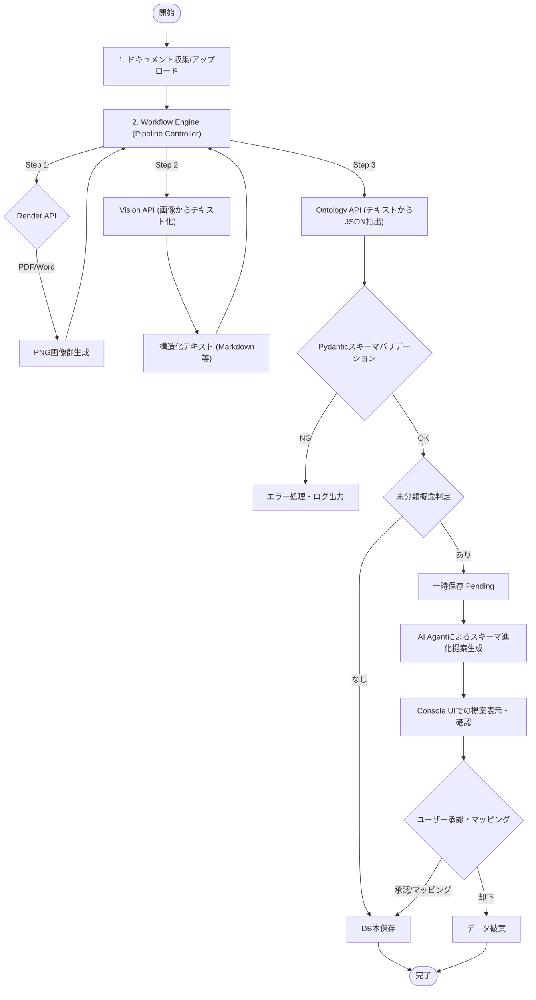
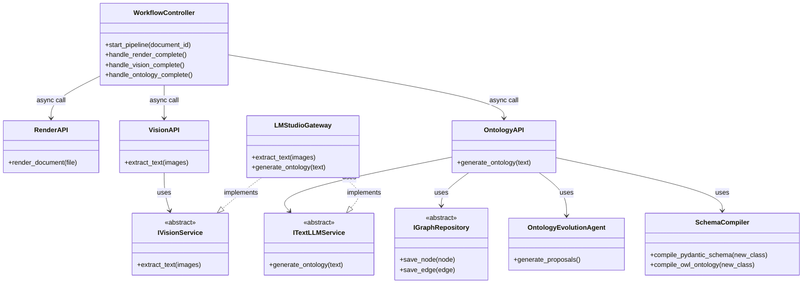
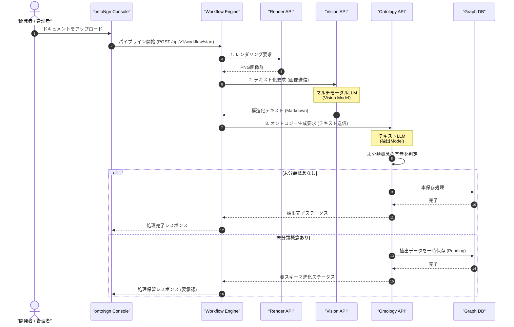

# ontoNgn (Ontology Engine) 全体設計書
Version: 2.0.0

---

## 1. ソフトウェアアーキテクチャの全体構成

本システムは、クリーンアーキテクチャの考え方を採用し、ドメインロジック（ビジネスルール）とインフラストラクチャ（データベース、LLMクライアント、レンダラーなどの具象実装）を分離しています。

### 1.1 アーキテクチャ構成図

```
+-----------------------------------------------------------------------+
|                         Frameworks & Drivers                          |
|  - Web UI (HTMX + Jinja2)  - Pydantic Settings                        |
|  - CLI Commands          - pdf2image / LibreOffice Headless           |
|  - PostgreSQL Client     - Neo4j Driver / Kuzu DB Python API          |
+-----------------------------------------------------------------------+
                               |
+------------------------------v----------------------------------------+
|                        Interface Adapters                             |
|  - REST API Routers (Workflow, Render, Vision, Ontology)              |
|  - LMStudioGateway (OpenAI Python Client Wrapper)                     |
|  - DocumentRenderer (PDF/Word/Excel to PNG)                           |
|  - [Concrete Repository Adapters]                                     |
|    * Neo4jGraphRepository     * AgeGraphRepository (Postgres AGE)     |
|    * KuzuGraphRepository      * InMemoryRdfRepository (rdflib)        |
+-----------------------------------------------------------------------+
                               |
+------------------------------v----------------------------------------+
|                            Use Cases                                  |
|  - WorkflowOrchestrator (Manages Pipeline State)                      |
|  - RenderDocumentUseCase      - ExtractTextUseCase (Vision)           |
|  - GenerateOntologyUseCase    - ExportGraphRAGUseCase                 |
+-----------------------------------------------------------------------+
                               |
+------------------------------v----------------------------------------+
|                             Domain                                    |
|  - Domain Models (GraphNode, GraphEdge, ExtractionResult - Pydantic)  |
|  - Domain Interfaces (Abstract Base Classes - abc.ABC)                |
|    * IVisionService           * ITextLLMService                       |
|    * IGraphRepository                                                 |
+-----------------------------------------------------------------------+
```

### 1.2 ディレクトリ構造

```text
app/
├── main.py                     # エントリーポイント (FastAPI application)
├── core/                       # 環境設定と共通基盤
│   ├── config.py               # 環境設定のスキーマ定義 (Pydantic Settings)
│   └── dependencies.py         # FastAPI Dependency Injection 設定
├── domain/                     # 1. ドメインレイヤー
│   ├── models/
│   │   └── graph.py            # GraphNode, GraphEdge 定義 (Pydantic)
│   └── services/
│       ├── vision_service.py     # IVisionService 抽象クラス
│       ├── text_llm_service.py   # ITextLLMService 抽象クラス
│       └── graph_repository.py   # IGraphRepository 抽象クラス
├── usecases/                   # 2. ユースケースレイヤー
│   ├── render_document.py      # 画像レンダリング処理
│   ├── extract_text.py         # Visionを用いたテキスト抽出
│   ├── generate_ontology.py    # LLMを用いたオントロジー生成
│   └── export_graphrag.py      # GraphRAG用データエクスポート
├── workflows/                  # ワークフロー制御層
│   └── orchestrator.py         # パイプライン状態管理と各UseCase/APIの非同期呼び出し
├── interfaces/                 # 3. インターフェースアダプター層
│   ├── api/                    # 疎結合化されたFastAPI ルーター群
│   │   ├── workflow.py         # ワークフロー制御API
│   │   ├── render.py           # レンダリングAPI
│   │   ├── vision.py           # Vision抽出API
│   │   └── ontology.py         # オントロジー生成・管理API
│   ├── gateways/               # 外部連携の具象クラス
│   │   ├── lmstudio_gateway.py # LMStudio接続 (Vision/Text両対応)
│   │   ├── kuzu_repository.py  # KuzuDBリポジトリ
│   │   ├── age_repository.py   # Apache AGEリポジトリ
│   │   ├── neo4j_repository.py # Neo4jリポジトリ
│   │   └── rdf_repository.py   # rdflib (トリプル) リポジトリ
│   └── renderers/              # ドキュメントレンダラー
│       └── document_renderer.py
└── infrastructure/             # 4. インフラストラクチャ層
    └── db/
        └── session.py          # DBセッション管理
templates/                      # HTMX用 Jinja2 テンプレート
├── index.html
└── partials/
```

---

## 2. 機能一覧および各機能の概要

| 機能モジュール | 役割の概要 |
| :--- | :--- |
| **Workflow Orchestrator** | ドキュメントの読み込みから画像化、テキスト化、オントロジー抽出にいたるパイプライン全体のステート（処理フェーズ・成否）を管理し、非同期にタスクを連動させます。 |
| **Document Render API** | ドキュメント（PDF/Word/Excel）をパースし、Vision Modelに入力可能な高解像度PNG画像群へ変換します（LibreOffice等を利用）。 |
| **Vision Extraction API** | レンダリングされた画像群を入力としてマルチモーダルLLMを呼び出し、マークダウンなどの構造化されたレイアウト維持テキストを出力します。 |
| **Ontology Generation API** | 構造化テキストから、エンティティ（手続き、アクター等）とリレーション（依存関係等）をJSON形式で抽出し、バリデーションした上でデータベースへ保存します。 |
| **Ontology Evolution Agent** | 未分類の概念（`ap:UnclassifiedConcept`）に対し、既存スキーマとの類似度や文脈情報を分析し、新規クラス昇格や既存へのマッピング案を自律的に生成します。 |
| **Schema Compiler** | 承認された進化提案に基づき、Zod/Pydantic validation定義ファイルおよびOWL/Turtleオントロジーファイルを動的に再生成・コンパイルします。 |
| **Console UI (Minimal UI)** | 処理状態ダッシュボードの表示、エラーログの閲覧、およびスキーマ進化提案に対する人間の承認／却下のフィードバック収集を担うロジッドレスUI。 |

---

## 3. 各機能を構成する処理一覧

本システムの処理は、FastAPIのエンドポイントとそれに対応する内部クラスの呼び出しによって構成されます。

1. **ドキュメント登録・再処理**
   - `POST /api/v1/documents/upload`: ファイルバッファを受け取り、一時ファイルに保存。
   - `POST /api/v1/documents/register-path`: ローカルパスを自動収集対象として登録。
   - `POST /api/v1/documents/{id}/reprocess`: 指定されたドキュメントの再解析をキューイング。
   - `DELETE /api/v1/documents/{id}`: データのクリーンアップと削除。

2. **パイプライン・ワークフロー処理**
   - `WorkflowOrchestrator.start_pipeline`: 対象ドキュメントIDを取得し、処理開始。
   - `DocumentRenderer.render_to_images`: PDF/OfficeをPNG画像群バッファに変換。
   - `IVisionService.extract_text`: 画像バッファ群からVision LLMを呼び出し構造化テキストを生成。
   - `ITextLLMService.generate_ontology`: テキストから構造化JSONオントロジーを抽出。

3. **スキーマ進化処理**
   - `GET /api/v1/schema/candidates`: グラフDBから未分類概念を検索し、Agentによる提案を取得。
   - `POST /api/v1/schema/candidates/{id}/approve`: 提案された新規クラス定義を承認。
   - `SchemaCompiler.compile_pydantic_schema`: Pydanticスキーマコードの自動書き換え。
   - `SchemaCompiler.compile_owl_ontology`: OWL (Turtle) オントロジー定義ファイルの更新。

4. **オントロジー同期・エクスポート**
   - `IGraphRepository.save_node` / `save_edge`: 各データベース（Neo4j / Kuzu / AGE / rdflib）への書き込み。
   - `GET /api/v1/documents/export`: LlamaIndex形式のJSON、またはTurtle形式ファイルのエクスポート。

---

## 4. 処理フロー図 (Processing Flowchart)

以下は、ドキュメントがアップロードされてから、オントロジーの抽出、未分類概念の判定、スキーマの進化（人間の承認）、そして最終的なDB保存にいたる全体の処理フローです。



---

## 5. クラス図 (Backend Class Diagram)

クリーンアーキテクチャの境界と、各コンポーネントの依存関係を表すクラス図です。



---

## 6. シーケンス図 (Processing Sequence Diagram)

ドキュメントのアップロードから各APIの呼び出し、未分類概念による保留処理までのエンドツーエンドシーケンス図です。


