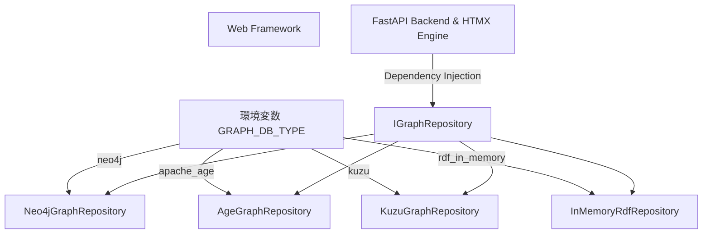

# 技術選定・比較検討報告書 (Technology Decisions Report)

本ドキュメントは、汎用オントロジー構築・提供エンジン **「ontoNgn (Ontology Engine)」** の開発にあたり、採用されたコア技術（プログラミング言語、データベース）の比較検討経緯、およびそれに基づき決定されたソフトウェアアーキテクチャの背景について記録する技術選定報告書です。

---

## 1. 開発言語・UIフレームワークの選定：Python (FastAPI) + HTMX

システムのバックエンド開発言語およびUIフレームワークについて、**TypeScript (NestJS) + Next.js** の構成と、AI開発のデファクトである **Python (FastAPI) + HTMX** を比較検討しました。

### 1.1 比較一覧

| 比較項目 | TypeScript (NestJS) + Next.js | Python (FastAPI) + HTMX |
| :--- | :--- | :--- |
| **LLM/AIエコシステム** | ○ (JS SDK等は成熟しつつあるが最新機能は遅れる) | ◎ (デファクトであり、すべてのAI/LLMライブラリがフルサポート) |
| **バリデーションとスキーマ管理** | ◎ (ZodとTypeScript型定義の強力な組み合わせ) | ◎ (Pydanticによるシンプルかつ強力なデータパースと自動バリデーション) |
| **開発コスト・アーキテクチャ** | △ (モノレポ構成やフロント・バックのビルドパイプラインが必要) | ◎ (HTMXの採用によりクライアント側のビルド不要、Python一本で完結) |
| **UIパフォーマンス** | ○ (SPAによるリッチな描画、ただし初期ロードや構築コスト大) | ◎ (HTMXによるHTMLフラグメントのAjax通信でSPA同等の速度を軽量に実現) |
| **コードメンテナンス性** | ◎ (強固な静的型システムとDIコンテナによる疎結合設計) | ○ (PydanticとFastAPIのDI機能、およびPythonのABCを用いたクリーン設計) |

### 1.2 検討経緯と意思決定の理由

#### ① AI/LLMエコシステムとの直接的親和性
本システムはマルチモーダルLLMとの高度な連携やオントロジー推論、将来的にはRAG検索などを担うため、最新のAI/LLMライブラリ（LangChain, LlamaIndex等）およびPDF/Word/Excelなどの高度な解析スクリプトを直接、オーバーヘッドなしに呼び出す必要があります。Pythonを採用することで、これらのエコシステムをフルに活用できます。

#### ② HTMX採用による「フロントエンド開発のロジックレス化」と「型共有の不要化」
当初はTypeScriptを用いてフロント・バックエンドでZodスキーマを共有するモノレポ構成を想定していましたが、フロントエンド（ontoNgn Console）の目的が「AIエージェントの提案を人間が承認/却下する」などのシンプルな管理業務に特化している点に着目しました。
**HTMX** を採用することで、クライアント側にReact/Next.js等の重厚なフレームワークやビルド環境を構築する必要がなくなり、FastAPI (Jinja2) が返却するHTMLフラグメントをHTMXで部分的に差し替えるだけで、SPA（シングルページアプリケーション）と同等のインタラクティブ性を実現できます。これにより、フロントエンドとバックエンドの境界で型定義をやり取りする必要性が完全に消失し、Python (Pydantic) だけでデータ構造を一元管理できるようになりました。

#### 決定事項
本システム **`ontoNgn`** のバックエンドには **Python (FastAPI)** を、フロントエンド（Console UI）には **HTMX + Jinja2** を採用します。これにより、インフラやビルドプロセスの複雑さを最小化しつつ、AI処理の柔軟性とUIの高速開発を最大化します。

---

## 2. データベースの選定およびDB非依存設計の背景

オントロジー（知識グラフ）の格納先となるデータベースの選定、およびそれに紐づくデータベース抽象化（リポジトリパターン）の設計背景について記録します。

### 2.1 グラフデータベースの比較評価

本システムでは、商用利用時のライセンス形態（GPLコピーレフトや商用利用制限）に焦点を当て、主要なグラフデータベースおよびRDFトリプルストアの比較を行いました。

| 比較項目 | Neo4j (Community) | Apache AGE | Kùzu | InMemory RDF (N3.js) |
| :--- | :--- | :--- | :--- | :--- |
| **ライセンス** | GPL v3 | **Apache 2.0** | **MIT** | **MIT / Apache 2.0** |
| **ライセンス制約** | コピーレフト制約あり (オンプレミス配布時に注意) | 完全商用フリー | 完全商用フリー | 完全商用フリー |
| **実行形態** | クライアント・サーバー型 | PostgreSQLの拡張機能 | 組み込み型 (SQLite風) | インメモリ (ファイル出力) |
| **クエリ言語** | Cypher | openCypher / SQL | Cypher | SPARQL / トリプル操作 |
| **強み** | デファクト。エコシステム最大 | PostgreSQLの信頼性と既存RDBデータとの連携 | サーバ構築不要、超高速、MITライセンス | 標準セマンティックWeb準拠、ポータブル |
| **適したフェーズ** | 一般的なSaaS運用 | エンタープライズ既存システムとの統合 | PoC、軽量アプリ、エッジ実行 | オープンデータ公開、軽量エクスポート |

### 2.2 データベース非依存設計 (`IGraphRepository`) の決定理由

本システムでは、特定のグラフデータベース（例: Neo4j）にコードをハードコード（密結合）せず、ドメイン層に抽象クラス `IGraphRepository` を定義し、環境変数 `GRAPH_DB_TYPE` の変更だけで接続先を切り替えられる設計を採用しました。

#### 決定理由

#### ① 商用ライセンスリスクの回避（ロイヤリティフリー）
Neo4jは非常に優れていますが、Community版はGPLv3ライセンスであり、本システムをオンプレミスパッケージとして顧客に配布する場合、自社ソースコードの開示義務が発生するリスクがあります。
DB非依存設計にすることで、開発環境や閉じたSaaS環境では便利な Neo4j を使いつつ、ライセンスが厳しい顧客環境や組み込み環境では **Kùzu (MIT)** や **Apache AGE (Apache 2.0)** に瞬時に切り替えられるようにし、商用化の選択肢を最大化しました。

#### ② スケールやインフラ環境への適応力向上
システムが動作するインフラ環境によって最適なDB構成は異なります。
- **軽量PoC / ローカルPC**: DBサーバの構築が不要な組み込み型の `Kùzu` を使用。
- **既存のRDB/PostgreSQLがある環境**: PostgreSQLの上にグラフを載せる `Apache AGE` を使用（RDBとグラフの結合クエリが可能）。
- **大規模なセマンティック分析**: 標準化されたセマンティックデータをエクスポート・処理するため `RDF_IN_MEMORY` を使用。
これらをコード修正なしで切り替えられるようにすることが、長期的なアーキテクチャの持続可能性（Sustainability）に寄与します。

#### ③ 差分更新（参照カウント方式）の共通実装化
データベースに依存しないクリーンな状態遷移（ドキュメント再読み込み時の孤立ノードのクリーンアップなど）を実現するため、参照カウントロジックを各リポジトリ具象クラスで共通化して満たすべき仕様として定義しています。これにより、どのデータベースを採用しても、データ整合性が全く同じ挙動で担保されます。

### 2.3 ベクトルデータベース (Vector DB) の選定と pgvector 比較

GraphRAGのテキストインデックス検索やセマンティック検索で使用する「ベクトル検索エンジン」の選定にあたり、専用ベクトルDBおよびPostgreSQLの拡張機能である **pgvector** を比較検討しました。

#### ① ベクトルデータベース比較表

| 比較項目 | pgvector (PostgreSQL拡張) | Chroma | Qdrant | Pinecone |
| :--- | :--- | :--- | :--- | :--- |
| **ライセンス** | **PostgreSQL License** (商用フリー) | **Apache 2.0** (商用フリー) | **Apache 2.0** (商用フリー) | プロプライエタリ (SaaSのみ) |
| **実行形態** | RDB拡張機能 (インプロセス) | 組み込み型 または スタンドアロン | スタンドアロン型 (Rust製) | フルマネージドSaaS |
| **データモデル** | リレーショナル + ベクトル | ベクトル・ドキュメント専用 | ベクトル専用 | ベクトル専用 |
| **開発言語** | C (PostgreSQL拡張) | Python / TypeScript | Rust | 非公開 |
| **強み** | **RDBのメタデータやグラフ(Apache AGE)とのトランザクション一貫性** | 導入が極めてシンプル (Python/TS) | 検索性能が極めて高い、フィルタリングが強力 | インフラ管理ゼロ、超大規模スケール |
| **弱み** | インデックス構築（HNSW等）時のメモリ消費量が大きい | スケールアウトや永続化の運用実績が薄い | 独立したサーバ構築と運用コストが必要 | 完全に外部クラウド依存、ベンダーロックイン |

#### ② PostgreSQL (pgvector) 選定の優位性
本システムでは、グラフデータベースとして PostgreSQL 拡張である **Apache AGE** を評価候補としているため、ベクトルストアとしても PostgreSQL の拡張である **pgvector** を組み合わせるアプローチが極めて強力なシナジーを生み出します。
- **データの一元化 (Single Source of Truth)**:
  - 1つの PostgreSQL インスタンスの中に、「手続きの構造化データ（RDBテーブル）」、「手続きの関係性（Apache AGE によるグラフ）」、「手続きドキュメントの文章ベクトル（pgvector）」をすべて共存させることができます。これにより、別々のDB（Neo4jとPineconeなど）を個別に運用・同期するインフラ複雑性を完全に排除できます。
- **トランザクション一貫性 (ACID)**:
  - 手続きが更新された際、リレーショナル・グラフ・ベクトルインデックスの全データ更新を単一のトランザクション内で実行でき、データの不整合（孤立ベクトルの発生など）を防ぎます。

### 2.4 PostgreSQLのドキュメントデータベース（Document DB）機能と拡張性

本システムでは、ドキュメントのOCRブロック情報、解析ログ、チャンク分けされたテキストデータなど、半構造化・非構造化データ（JSONドキュメント）も管理する必要があります。PostgreSQLはRDBでありながら、以下の優れたドキュメントDB機能・拡張性を備えています。

#### ① ネイティブの JSONB サポート (標準機能)
PostgreSQLはバージョン9.4以降、バイナリ形式のJSONを格納する **`JSONB`** 型を標準サポートしています。
- **高性能インデックス (GIN インデックス)**:
  - JSON内の特定のキーやネストされたオブジェクトに対して GIN (Generalized Inverted Index) を張ることで、数百万件のドキュメントから特定のプロパティを持つオブジェクトをミリ秒単位で高速検索できます。
- **柔軟なクエリ操作**:
  - `JSON Path` 構文（`jsonb_path_query` 等）を用いることで、MongoDBと同等の高度なドキュメント検索・抽出・集計クエリをSQLから直接記述できます。

#### ② MongoDB互換拡張 `pg_documentdb` (最新の動向)
近年、Microsoftからオープンソースとして提供された **`pg_documentdb`** は、PostgreSQLを完全なMongoDB互換データベース化する拡張機能です。
- **MongoDB API 互換**:
  - アプリケーション側からは標準のMongoDBドライバーやクエリ（BSONプロトコル）を用いて操作でき、裏側の物理ストレージ・実行エンジンとしてPostgreSQLの堅牢な基盤を利用できます。これにより、既存のMongoDBエコシステムをそのままPostgreSQL上に統合できます。

#### ③ 究極の「マルチモデルデータベース」としての統合的価値
PostgreSQLを採用し、各種の拡張機能を有効化することで、以下のすべてのデータモデルを **単一のデータベースインスタンス** 内で表現・処理することが可能になります。

```
+-----------------------------------------------------------------------------------+
|                            PostgreSQL (マルチモデル)                               |
|                                                                                   |
|  [Relational (SQL)]      -->  システム構成、ユーザー管理、監査ログ                  |
|  [Graph (Apache AGE)]   -->  手続き・アクター・書類の知識グラフ (Cypher)          |
|  [Vector (pgvector)]    -->  チャンクテキスト・エンティティのベクトル埋め込み       |
|  [Document (JSONB)]     -->  解析済みドキュメントのOCR構造データ、LLM解析ログ      |
+-----------------------------------------------------------------------------------+
```

これにより、システム構成部品（ミドルウェア）が大幅に削減され、データ同期の遅延、スキーマ変更時の不整合、バックアップ運用の複雑さ、ライセンス管理コストがすべて最小化されます。GraphRAGのような高度なAIシステムを商用運用する上で、このマルチモデル特性は極めて強力な技術的メリットであると結論付けました。

---

## 3. まとめ (Decision Matrix)

本システムは、以下のマトリクスに基づいて実行時に技術要素を結合します。



本選定記録は、今後のシステムのスケールアウトや、インフラ移行、ライセンスモデル変更が発生した際の重要なアーキテクチャ方針決定の歴史的根拠として参照されます。
