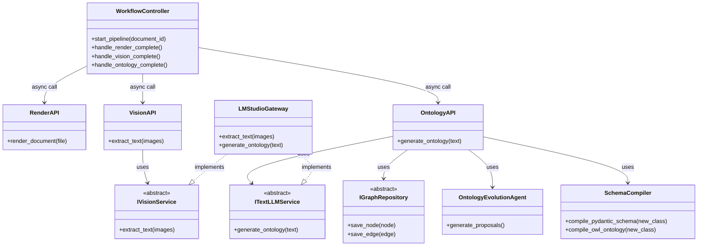
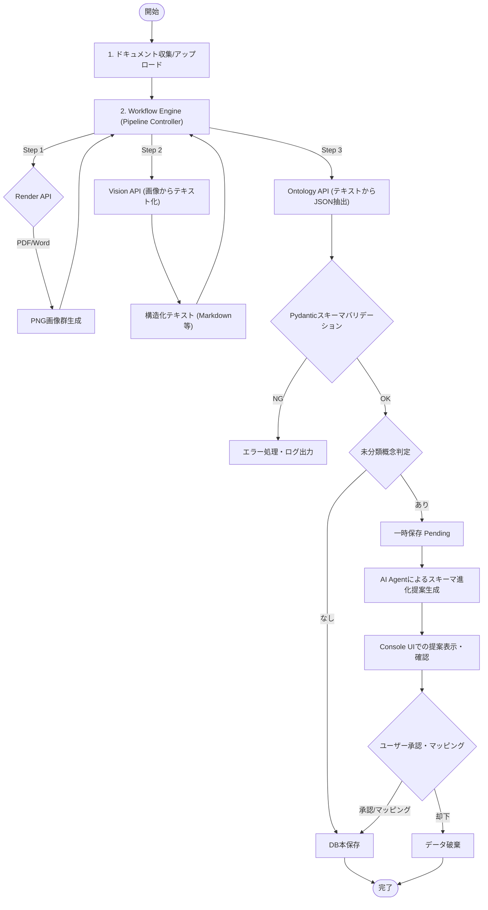
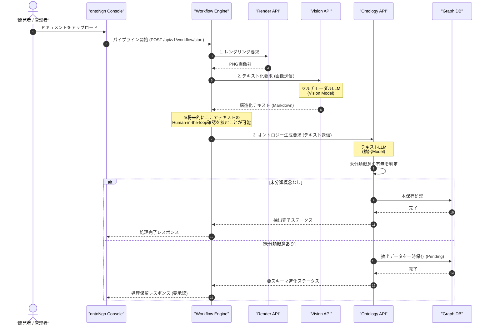

# ontoNgn (Ontology Engine) 詳細設計書
Version: 2.0.0

---

## 1. はじめに
本ドキュメントは、多様な規定やマニュアルドキュメント（PDF, Word, Excel等）を解析し、セマンティックな知識表現である「オントロジー（知識グラフ）」を自動的・汎用的に生成・提供するバックグラウンド実行エンジン **「ontoNgn」** の詳細設計書です。
本システムは、バックエンドに **Python (FastAPI)** を採用し、**マルチモーダルLLM (Vision Model)** を用いてドキュメントのレイアウト情報を含めて概念を直接抽出します。生成されたオントロジーは、GraphRAG（Graph-based Retrieval-Augmented Generation）システムなどの基盤情報として、APIを介してリアルタイムに提供されます。

---

## 2. システム要件

### 2.1 機能要件 (Functional Requirements)
1. **ワークフロー制御エンジン (Workflow Orchestrator)**
   - ドキュメントのアップロードからオントロジー生成までのパイプラインを一元管理し、各処理を非同期APIとして疎結合に呼び出す。
   - 各ステップのステータス管理、エラーハンドリング、およびHuman-in-the-Loop（中間テキストの確認・修正など）を可能にする状態管理を行う。
2. **ドキュメント画像レンダリングAPI (Document Render API)**
   - **PDF変換**: `pdfjs-dist` を用いて、PDFの各ページを高解像度のPNG画像にレンダリングする。
   - **Word/Excel変換**: ヘッドレスの LibreOffice 等を用いて一度PDFに変換し、その後PNG画像にレンダリングする。
3. **Visionテキスト抽出API (Vision Extraction API)**
   - 画像リストを受け取り、Vision Model（マルチモーダルLLM）を用いてドキュメントのレイアウトを維持した構造化テキスト（Markdown等）を抽出・生成する。
4. **オントロジー生成API (Ontology Generation API)**
   - 抽出された構造化テキストを受け取り、Text Modelを用いてJSONスキーマに従い、エンティティ（手続き、アクター、必要書類等）とリレーション（エッジ）を抽出する。
   - 接続先LLM（APIエンドポイント、モデル名等）は設定ファイル（`.env`）で切り替え可能とする。
5. **型安全なバリデーション (Zodによるパース)**
   - LLMから返却されたJSONデータを `Zod` スキーマで検証し、ドメインモデルである `GraphNode` および `GraphEdge` に変換する。
4. **DB非依存のオントロジー管理 (IGraphRepository)**
   - 生成された知識グラフを、設定一つで複数のグラフDB（Neo4j、Apache AGE/PostgreSQL、Kùzu、またはインメモリRDF/rdflib）に保存・同期できるように抽象化する。
5. **GraphRAG 連携（エクスポート機能）**
   - LlamaIndex や LangChain、外部グラフデータベースに直接ロード・インポートできる構造化JSON（Nodes & Edges）およびTurtle形式（.ttl）ファイルでエクスポートする。
6. **マルチランゲージ対応 (Multi-language Support)**
   - ontoNgn Console (Developer UI) および APIのエラーメッセージ等のインターフェース表示は多言語（日本語・英語など）をサポートする。
   - 解析対象ドキュメントの記述言語、および抽出するオントロジー語彙（ラベルや説明）の言語設定を、設定ファイルまたはAPIリクエストから動的に指定可能とする。

### 2.2 非機能要件 (Non-Functional Requirements)
1. **クリーンアーキテクチャによる低依存設計**:
   - データベース（Neo4j / Kùzu 等）やLLM API、ファイルパーサーの変更といった「技術的詳細」が、ビジネスロジック（ユースケース）に影響を与えないよう、Pythonの抽象基盤クラス（abc.ABC）を用いた依存性注入（DI）を徹底する。
2. **非同期実行パフォーマンス**:
   - Node.jsの非同期I/O（`async/await`）を活用し、画像の生成やLLM APIの呼び出しを非ブロッキングで並行処理する。
3. **データのポータビリティ**:
   - データの実体は標準的なトリプル（RDF）またはノード＆エッジ（LPG）として表現し、いつでも別のデータベースへ移行可能とする。
4. **英語ベースのソースコード規約 (English-based Codebase Standard)**:
   - 将来的なグローバル展開およびオープンソース化を見据え、プログラム内のコメント、JSDoc/TSDoc、識別子（クラス名、関数/メソッド名、変数名）はすべて英語（English）で記述・統一する。

### 2.3 アーキテクチャ設計方針（フロントエンド・ロジックレス思想とエンジン化）

本システムでは、データの整合性保証、セキュリティ、およびオントロジー進化エージェントの推論結果の確実性を担保するため、**「フロントエンド・ロジックレス（Thin Client / Dumb UI）」**設計を徹底し、本体をバックグラウンドで自律的に動作するエンジンとして構築します。

- **ontoNgn Console (Minimal Dev UI) の役割**:
  - 純粋な開発者用・管理者用のプレゼンテーション表示層（ミニマルな管理画面）として動作します。
  - バックエンドAPIから受け取ったドキュメントの処理ステータス、ログ、AIエージェントからの「スキーマ進化の提案（クラス名、型、説明、推論理由）」を画面に描画し、人間の「承認 / 却下」入力を受け取ってそのままバックエンドAPIに中継する機能のみを担当します。
  - クラス類似性の判定やコードのコンパイルなど、いかなるビジネスロジックもコンソール側には配置しません。
- **ontoNgn Engine (Backend API Engine) の役割**:
  - ワークフローエンジンとしてパイプライン全体をオーケストレーションし、ドキュメントの画像化(Render API)、テキスト抽出(Vision API)、JSON抽出(Ontology API)といった**疎結合なビジネスロジック群をステートマシンとして一元的に管理・実行します**。
  - グラフ更新時のクリーンアップ、未分類概念（`ap:UnclassifiedConcept`）の収集とAI Agentによる評価・提案生成、コードコンパイルなどの機能も、非同期ジョブとして連動させます。

---

## 3. オントロジー設計 (データモデル)

任意のドキュメントから汎用的な概念体系を構築するためのデータモデル設計については、別ドキュメントに切り出しています。詳細は以下をご参照ください。

- [ontoNgn データモデル設計書 (ontology_model_design.md)](file:///d:/dev/ontrogy/docs/ontology_model_design.md)

---

## 4. ソフトウェアアーキテクチャ (FastAPI)

FastAPIのDependency Injection（DI）システムとルーターを利用し、クリーンアーキテクチャのレイヤーを実装します。

```
+-----------------------------------------------------------------------+
|                         Frameworks & Drivers                          |
|  - Web UI (HTMX + Jinja2)  - Pydantic Settings                        |
|  - CLI Commands          - pdf2image / LibreOffice Headless           |
|  - PostgreSQL Client     - Neo4j Driver / Kuzu DB Python API          |
+-----------------------------------------------------------------------+
                               |
+------------------------------v----------------------------------------+
|                        Interface Adapters                             |
|  - REST API Routers (Workflow, Render, Vision, Ontology)              |
|  - LMStudioGateway (OpenAI Python Client Wrapper)                     |
|  - DocumentRenderer (PDF/Word/Excel to PNG)                           |
|  - [Concrete Repository Adapters]                                     |
|    * Neo4jGraphRepository     * AgeGraphRepository (Postgres AGE)     |
|    * KuzuGraphRepository      * InMemoryRdfRepository (rdflib)        |
+-----------------------------------------------------------------------+
                               |
+------------------------------v----------------------------------------+
|                            Use Cases                                  |
|  - WorkflowOrchestrator (Manages Pipeline State)                      |
|  - RenderDocumentUseCase      - ExtractTextUseCase (Vision)           |
|  - GenerateOntologyUseCase    - ExportGraphRAGUseCase                 |
+-----------------------------------------------------------------------+
                               |
+------------------------------v----------------------------------------+
|                             Domain                                    |
|  - Domain Models (GraphNode, GraphEdge, ExtractionResult - Pydantic)  |
|  - Domain Interfaces (Abstract Base Classes - abc.ABC)                |
|    * IVisionService           * ITextLLMService                       |
|    * IGraphRepository                                                 |
+-----------------------------------------------------------------------+
```

### 4.1 ディレクトリ構造
```text
app/
├── main.py                     # エントリーポイント (FastAPI application)
├── core/                       # 環境設定と共通基盤
│   ├── config.py               # 環境設定のスキーマ定義 (Pydantic Settings)
│   └── dependencies.py         # FastAPI Dependency Injection 設定
├── domain/                     # 1. ドメインレイヤー
│   ├── models/
│   │   └── graph.py            # GraphNode, GraphEdge 定義 (Pydantic)
│   └── services/
│       ├── vision_service.py     # IVisionService 抽象クラス
│       ├── text_llm_service.py   # ITextLLMService 抽象クラス
│       └── graph_repository.py   # IGraphRepository 抽象クラス
├── usecases/                   # 2. ユースケースレイヤー
│   ├── render_document.py      # 画像レンダリング処理
│   ├── extract_text.py         # Visionを用いたテキスト抽出
│   ├── generate_ontology.py    # LLMを用いたオントロジー生成
│   └── export_graphrag.py      # GraphRAG用データエクスポート
├── workflows/                  # ワークフロー制御層
│   └── orchestrator.py         # パイプライン状態管理と各UseCase/APIの非同期呼び出し
├── interfaces/                 # 3. インターフェースアダプター層
│   ├── api/                    # 疎結合化されたFastAPI ルーター群
│   │   ├── workflow.py         # ワークフロー制御API
│   │   ├── render.py           # レンダリングAPI
│   │   ├── vision.py           # Vision抽出API
│   │   └── ontology.py         # オントロジー生成・管理API
│   ├── gateways/               # 外部連携の具象クラス
│   │   ├── lmstudio_gateway.py # LMStudio接続 (Vision/Text両対応)
│   │   ├── kuzu_repository.py  # KuzuDBリポジトリ
│   │   ├── age_repository.py   # Apache AGEリポジトリ
│   │   ├── neo4j_repository.py # Neo4jリポジトリ
│   │   └── rdf_repository.py   # rdflib (トリプル) リポジトリ
│   └── renderers/              # ドキュメントレンダラー
│       └── document_renderer.py
└── infrastructure/             # 4. インフラストラクチャ層
    └── db/
        └── session.py          # DBセッション管理
templates/                      # HTMX用 Jinja2 テンプレート
├── index.html
└── partials/
```

### 4.2 クラス構造図（Backend Class Diagram）

バックエンド（FastAPI）におけるクリーンアーキテクチャのレイヤー構造と、各サービスの依存関係を表すクラス図です。



### 4.3 処理の概要フロー（Processing Flowchart）

ドキュメントのアップロードから、未分類概念の事前判定、必要に応じたスキーマ進化、および最終的なグラフデータベースへの本保存にいたるシステム全体の処理プロセスです。



### 4.4 処理シーケンス図（Processing Sequence Diagram）

ドキュメントのアップロード画像処理から、未分類概念の事前判定、一時保存、AIエージェントによる一次評価、および人間の承認・コンパイルを経て本保存に至るエンドツーエンドの処理シーケンスです。



---

## 5. 詳細設計：データベースの抽象化と低依存設計

特定のグラフデータベースへの依存を排除するため、ドメイン層に共通モデルと抽象クラスを定義します。FastAPIのDI機能を利用し、抽象クラス（`abc.ABC`）をインターフェースとして使用します。

### 5.1 ドメイン・グラフモデル (`app/domain/models/graph.py`)
```python
from pydantic import BaseModel, Field
from typing import Dict, Any, List

class GraphNode(BaseModel):
    id: str = Field(..., description="URI expression (e.g., 'ap:Procedure_JidouTeate')")
    label: str = Field(..., description="Class name (e.g., 'ap:Procedure')")
    properties: Dict[str, Any] = Field(default_factory=dict)

class GraphEdge(BaseModel):
    source_id: str = Field(..., description="Source node ID")
    target_id: str = Field(..., description="Target node ID")
    relation_type: str = Field(..., description="Relation type (e.g., 'ap:requiresDocument')")
    properties: Dict[str, Any] = Field(default_factory=dict)

class ExtractionResult(BaseModel):
    nodes: List[GraphNode]
    edges: List[GraphEdge]
```

### 5.2 リポジトリインターフェース (`app/domain/services/graph_repository.py`)
```python
from abc import ABC, abstractmethod
from typing import Optional, List
from app.domain.models.graph import GraphNode, GraphEdge, ExtractionResult

class IGraphRepository(ABC):
    @abstractmethod
    async def save_node(self, node: GraphNode) -> None:
        pass
        
    @abstractmethod
    async def save_edge(self, edge: GraphEdge) -> None:
        pass
        
    @abstractmethod
    async def get_node(self, node_id: str) -> Optional[GraphNode]:
        pass
        
    @abstractmethod
    async def query_neighbors(self, node_id: str) -> List[GraphEdge]:
        pass
        
    @abstractmethod
    async def export_all(self) -> ExtractionResult:
        pass
```

### 5.3 依存性注入（DI）プロバイダ (`app/core/dependencies.py`)
環境変数 `GRAPH_DB_TYPE` の値に応じて、実行時にバインドするデータベース実装を決定します。

```python
from fastapi import Depends
from app.core.config import get_settings, Settings
from app.domain.services.graph_repository import IGraphRepository
from app.interfaces.gateways.neo4j_repository import Neo4jGraphRepository
from app.interfaces.gateways.age_repository import AgeGraphRepository
from app.interfaces.gateways.kuzu_repository import KuzuGraphRepository
from app.interfaces.gateways.rdf_repository import InMemoryRdfRepository

def get_graph_repository(settings: Settings = Depends(get_settings)) -> IGraphRepository:
    db_type = settings.graph_db_type.lower()
    
    if db_type == 'neo4j':
        return Neo4jGraphRepository(
            uri=settings.neo4j_uri,
            user=settings.neo4j_user,
            password=settings.neo4j_password
        )
    elif db_type == 'apache_age':
        return AgeGraphRepository(dsn=settings.postgres_dsn)
    elif db_type == 'kuzu':
        return KuzuGraphRepository(db_path=settings.kuzu_db_path)
    else:
        # Default to RDF in memory
        return InMemoryRdfRepository(output_path=settings.rdf_output_path)
```

---

## 6. 詳細設計：パイプラインAPIとLLM連携

パイプラインで利用する画像テキスト化（Vision）と、テキストからのJSON抽出（Text LLM）をそれぞれ独立したサービスインターフェースとして定義します。

### 6.1 Vision抽象サービス (`app/domain/services/vision_service.py`)
```python
from abc import ABC, abstractmethod
from typing import List

class IVisionService(ABC):
    @abstractmethod
    async def extract_text(
        self,
        image_buffers: List[bytes]
    ) -> str:
        """
        ページの画像群から、レイアウト情報を維持した構造化テキスト（Markdown等）を抽出します。
        """
        pass
```

### 6.2 Text LLM抽象サービス (`app/domain/services/text_llm_service.py`)
```python
from abc import ABC, abstractmethod
from app.domain.models.graph import ExtractionResult

class ITextLLMService(ABC):
    @abstractmethod
    async def generate_ontology(
        self,
        text_content: str
    ) -> ExtractionResult:
        """
        構造化テキストから、オントロジー構造（ノード・エッジ）を抽出します。
        """
        pass
```

### 6.3 PydanticによるLLM出力バリデーション
オントロジー抽出用LLMからのJSONデータを型安全にパースするためのスキーマ定義です。

```python
from pydantic import BaseModel, Field
from typing import List, Dict, Any, Literal

class ExtractedNode(BaseModel):
    id: str = Field(..., pattern=r"^ap:[A-Za-z0-9_]+$")
    type: Literal[
        'ap:Procedure',
        'ap:Actor',
        'ap:Document',
        'ap:Condition',
        'ap:Organization',
        'ap:InputItem',
        'ap:LegalBasis'
    ]
    label: str
    description: str | None = None
    properties: Dict[str, Any] = Field(default_factory=dict)

class ExtractedRelationship(BaseModel):
    source: str
    target: str
    type: Literal[
        'ap:hasTargetActor',
        'ap:requiresDocument',
        'ap:producesDocument',
        'ap:hasPrerequisite',
        'ap:administeredBy',
        'ap:basedOnLaw',
        'ap:nextProcedure'
    ]
    properties: Dict[str, Any] = Field(default_factory=dict)

class LLMExtraction(BaseModel):
    nodes: List[ExtractedNode]
    relationships: List[ExtractedRelationship]
```

### 6.4 LMStudioGateway 実装 (`app/interfaces/gateways/lmstudio_gateway.py`)
LMStudioが提供するOpenAI互換APIを用いて、VisionとText両方の実装を提供します。

```python
import base64
import json
from openai import AsyncOpenAI
from typing import List
from fastapi import Depends
from app.core.config import get_settings, Settings
from app.domain.services.vision_service import IVisionService
from app.domain.services.text_llm_service import ITextLLMService
from app.domain.models.graph import ExtractionResult, GraphNode, GraphEdge
from app.interfaces.gateways.schemas.extraction_schema import LLMExtraction

class LMStudioGateway(IVisionService, ITextLLMService):
    def __init__(self, settings: Settings = Depends(get_settings)):
        self.client = AsyncOpenAI(
            base_url=settings.llm_api_base_url,
            api_key=settings.llm_api_key or "lm-studio",
        )
        self.vision_model_name = settings.vision_model_name
        self.text_model_name = settings.text_model_name
        self.temperature = settings.llm_temperature

    async def extract_text(self, image_buffers: List[bytes]) -> str:
        # Vision Modelを利用してテキスト抽出
        content_parts = [
            {
                "type": "text",
                "text": "提供された画像に含まれる文書の構造（見出し、表、段落など）を維持し、詳細なMarkdown形式のテキストとして抽出してください。"
            }
        ]
        
        for buf in image_buffers:
            base64_image = base64.b64encode(buf).decode('utf-8')
            content_parts.append({
                "type": "image_url",
                "image_url": {
                    "url": f"data:image/png;base64,{base64_image}"
                }
            })

        response = await self.client.chat.completions.create(
            model=self.vision_model_name,
            temperature=0.0, # テキスト抽出は低いtemperatureを推奨
            messages=[{"role": "user", "content": content_parts}]
        )
        return response.choices[0].message.content or ""

    async def generate_ontology(self, text_content: str) -> ExtractionResult:
        # Text Modelを利用してJSON抽出
        response = await self.client.chat.completions.create(
            model=self.text_model_name,
            temperature=self.temperature,
            response_format={"type": "json_object"},
            messages=[
                {
                    "role": "system",
                    "content": "あなたは行政ドキュメントを読み取り、指定されたJSON構造で手続き・必要書類・アクターの関係性を抽出する専門家です。指定のスキーマ以外のプロパティは含めないでください。"
                },
                {
                    "role": "user",
                    "content": f"以下の構造化テキストから行政手続きのオントロジー関係を抽出してください。\n\nテキスト:\n{text_content}"
                }
            ]
        )

        response_text = response.choices[0].message.content or "{}"
        json_parsed = json.loads(response_text)

        validated_data = LLMExtraction.model_validate(json_parsed)

        nodes = [
            GraphNode(
                id=n.id,
                label=n.label,
                properties={"type": n.type, "description": n.description, **n.properties}
            ) for n in validated_data.nodes
        ]

        edges = [
            GraphEdge(
                source_id=r.source,
                target_id=r.target,
                relation_type=r.type,
                properties=r.properties
            ) for r in validated_data.relationships
        ]

        return ExtractionResult(nodes=nodes, edges=edges)
```

### 6.4 スキーマ進化AIエージェント (`app/domain/services/evolution_agent.py`)

一次抽出で分類しきれなかった未知の概念（`ap:UnclassifiedConcept`）をセマンティックに判定し、既存スキーマへのマッピングまたは新規クラス昇格の提案を自律的に生成するエージェントサービスです。

```python
import json
from pydantic import BaseModel
from typing import List, Literal, Optional, Dict
from app.domain.services.llm_service import ILLMService
from app.domain.services.graph_repository import IGraphRepository

class EvolutionProposal(BaseModel):
    id: str
    action: Literal['PROMOTE_CLASS', 'MAP_TO_PROPERTY', 'DISCARD']
    targetConcept: str
    proposedName: str
    proposedDescription: str
    suggestedProperties: List[Dict[str, str]]
    targetExistingClassOrProperty: Optional[str] = None
    rationale: str

class OntologyEvolutionAgent:
    def __init__(self, llm_service: ILLMService, graph_repository: IGraphRepository):
        self.llm_service = llm_service
        self.graph_repository = graph_repository

    async def generate_proposals(self) -> List[EvolutionProposal]:
        # 1. Fetch all unclassified concepts (ap:UnclassifiedConcept) from the graph database
        unclassified_nodes = await self.graph_repository.find_nodes_by_type('ap:UnclassifiedConcept')
        if not unclassified_nodes:
            return []

        # 2. Get the currently active ontology schema (classes, properties) from metadata
        current_schema = await self.graph_repository.get_schema_definition()

        # 3. Construct prompt and request evaluation from LLM Agent
        proposals = []
        for node in unclassified_nodes:
            proposal = await self._evaluate_concept(node, current_schema)
            proposals.append(proposal)

        return proposals

    async def _evaluate_concept(self, node: Any, current_schema: Any) -> EvolutionProposal:
        import uuid
        import json
        
        prompt = f"""
あなたはドメインオントロジーの設計を監督する「OntologyEvolutionAgent」です。
ドキュメント解析中に、既存の定義クラスに当てはまらない概念が見つかりました。この概念について一次判定（Triage）を行い、人間への提案を生成してください。

【評価対象の未知概念】
- 概念名: {node.properties.get('label')}
- 抽出された文脈: {node.properties.get('contextDescription')}
- 想定属性候補: {json.dumps(node.properties.get('suggestedProperties'))}

【現在の定義済みクラス一覧】
{json.dumps(current_schema.get('classes', []))}

【判定基準】
1. 表記揺れまたは部分一致する既存クラス・プロパティがあれば「MAP_TO_PROPERTY」を選択し、マッピング先を指定してください。
2. 既存クラスでは表現できない独自のエンティティ（例：「手帳種別」「障害支援区分」など、固有の属性値や他のノードと複雑に接続する構造を持つ場合）は「PROMOTE_CLASS」を選択し、新規クラス名、説明、属性構造を設計してください。
3. 手続きと関係のないノイズや、単純な値の抽出エラーであれば「DISCARD」を選択してください。

以下のJSON形式のみで回答してください:
{{
  "action": "PROMOTE_CLASS" | "MAP_TO_PROPERTY" | "DISCARD",
  "proposedName": "推奨されるクラス名/プロパティ名（CamelCase）",
  "proposedDescription": "概念の説明",
  "suggestedProperties": [{{"name": "プロパティ名", "type": "string" | "number" | "boolean"}}],
  "targetExistingClassOrProperty": "MAP_TO_PROPERTYの場合のマッピング先ID",
  "rationale": "この判定に至った論理的根拠・推論プロセス（日本語）"
}}
"""
        # Call LLM for triage decision and parse the response (Assuming text-only method)
        result_text = await self.llm_service.extract_ontology(prompt, []) # Simplification for example
        # In actual implementation, LLMService should expose a general chat/completion method.
        # ... logic to extract json from result ...
        
        # Example parsed data
        parsed = {} # parsed json from LLM response
        
        return EvolutionProposal(
            id=f"prop_{uuid.uuid4().hex[:8]}",
            action=parsed.get('action', 'DISCARD'),
            targetConcept=node.properties.get('label', ''),
            proposedName=parsed.get('proposedName', ''),
            proposedDescription=parsed.get('proposedDescription', ''),
            suggestedProperties=parsed.get('suggestedProperties', []),
            targetExistingClassOrProperty=parsed.get('targetExistingClassOrProperty'),
            rationale=parsed.get('rationale', '')
        )
```

```python
import os
import re

class SchemaCompiler:
    def __init__(self):
        self.schema_file_path = os.path.join(os.path.dirname(__file__), '../interfaces/gateways/schemas/extraction_schema.py')

    async def compile_pydantic_schema(self, new_class: dict) -> None:
        """
        Recompile (dynamically update) the Pydantic validation schema code based on the approved proposal.
        """
        # 1. Read the existing schema file
        with open(self.schema_file_path, 'r', encoding='utf-8') as f:
            schema_code = f.read()

        # 2. Parse and append the new class into the Literal type hint
        enum_search_regex = r"type:\s*Literal\[\s*([^\]]+?)\s*\]"
        match = re.search(enum_search_regex, schema_code)
        
        if match:
            current_enums = [s.strip().strip("'").strip('"') for s in match.group(1).split(',')]
            class_name = f"ap:{new_class['name']}"
            if class_name not in current_enums:
                current_enums.append(class_name)
                new_enum_content = ",\n        ".join(f"'{e}'" for e in current_enums)
                
                schema_code = re.sub(
                    enum_search_regex,
                    f"type: Literal[\n        {new_enum_content}\n    ]",
                    schema_code
                )

        # 3. Write back the updated schema code
        with open(self.schema_file_path, 'w', encoding='utf-8') as f:
            f.write(schema_code)

    async def compile_owl_ontology(self, new_class: dict) -> None:
        """
        Append the new class definition to the W3C standard OWL ontology file (.ttl).
        """
        owl_path = os.path.join(os.getcwd(), 'docs/schema/ontology.ttl')
        ttl_fragment = f"""
###  http://example.org/ap/{new_class['name']}
ap:{new_class['name']} rdf:type owl:Class ;
       rdfs:subClassOf ap:DomainEntity ;
       rdfs:label "{new_class['name']}"@ja ;
       rdfs:comment "{new_class['description']}"@ja .
"""
        with open(owl_path, 'a', encoding='utf-8') as f:
            f.write(ttl_fragment)
```

```python
import asyncio
from pdf2image import convert_from_bytes
import tempfile
import os
from typing import List

class DocumentRenderer:
    """
    Receives a PDF/Word/Excel file and generates an array of PNG page image buffers.
    """
    async def render_to_images(self, file_buffer: bytes, file_extension: str) -> List[bytes]:
        pdf_buffer = file_buffer

        # Convert Word/Excel files to PDF temporarily using LibreOffice
        if file_extension.lower() in ['.docx', '.xlsx']:
            pdf_buffer = await self._convert_to_pdf_via_libreoffice(file_buffer, file_extension)

        # Render the PDF buffer to an array of PNG images
        return await self._render_pdf_to_pngs(pdf_buffer)

    async def _convert_to_pdf_via_libreoffice(self, buffer: bytes, ext: str) -> bytes:
        temp_dir = os.path.join(os.getcwd(), 'temp')
        os.makedirs(temp_dir, exist_ok=True)
        
        with tempfile.NamedTemporaryFile(dir=temp_dir, suffix=ext, delete=False) as temp_input:
            temp_input.write(buffer)
            temp_input_path = temp_input.name

        try:
            # Run LibreOffice in headless mode to convert the document to PDF
            process = await asyncio.create_subprocess_shell(
                f'soffice --headless --convert-to pdf --outdir "{temp_dir}" "{temp_input_path}"',
                stdout=asyncio.subprocess.PIPE,
                stderr=asyncio.subprocess.PIPE
            )
            await process.communicate()
            
            # LibreOffice replaces the extension with .pdf
            base_name = os.path.splitext(os.path.basename(temp_input_path))[0]
            temp_pdf_path = os.path.join(temp_dir, f"{base_name}.pdf")
            
            with open(temp_pdf_path, 'rb') as f:
                pdf_buffer = f.read()

            return pdf_buffer
        finally:
            # Clean up temporary files
            if os.path.exists(temp_input_path):
                os.remove(temp_input_path)
            if 'temp_pdf_path' in locals() and os.path.exists(temp_pdf_path):
                os.remove(temp_pdf_path)

    async def _render_pdf_to_pngs(self, pdf_buffer: bytes) -> List[bytes]:
        # convert_from_bytes handles pdf2image conversion
        # This blocks, so we might want to run it in an executor in real app
        images = convert_from_bytes(pdf_buffer, dpi=200)
        
        buffers = []
        for img in images:
            import io
            img_byte_arr = io.BytesIO()
            img.save(img_byte_arr, format='PNG')
            buffers.append(img_byte_arr.getvalue())
            
        return buffers
```

---

---

## 8. 詳細設計：ドキュメント収集（Ingestion）およびID管理設計

ドキュメントの多様な取り込み経路に対応し、取り込んだオントロジーを一意なドキュメントIDベースで安全に管理・更新（Upsert）するための設計です。

### 8.1 ドキュメント管理モデル (`app/domain/models/document_source.py`)
ドキュメント自体のメタデータおよび処理ステータスを管理するエンティティです（メタデータ用DBに永続化）。

```python
from pydantic import BaseModel
from typing import Optional, Literal
from datetime import datetime

SourceType = Literal['upload', 'local_path', 'url']
ProcessingStatus = Literal['pending', 'processing', 'completed', 'failed']

class DocumentSource(BaseModel):
    id: str                 # Unique identifier (user-provided or file hash)
    file_name: str          # File name
    source_type: SourceType # Source ingestion type
    source_path: Optional[str] = None # Local path or download URL
    status: ProcessingStatus # Processing status
    error_message: Optional[str] = None # Error message if processing failed
    hash: str               # Content hash for change detection
    created_at: datetime
    updated_at: datetime
```

### 8.2 ドキュメント収集エンジン (Ingestion Engine)
ドキュメント収集の仕組みは、CeleryやAPScheduler等のタスクキュー/スケジューラまたはイベントトリガーで起動します。

1. **手動アップロード (`UploadHandler`)**:
   - 管理UIからアップロードされたファイルバッファを受け取り、`documentId` をハッシュ値または指定IDで登録して即時解析キューに投入。
2. **ローカルパス自動収集 (`LocalPathScanner`)**:
   - 設定されたローカルディレクトリのパスを定期スキャン（または監視）。
   - ディレクトリ内の各ファイルを検知し、ファイルパスをIDとし、最終更新日時またはハッシュを比較して更新・新規追加があれば解析を実行。
3. **URL自動収集 (`UrlDownloader`)**:
   - 指定されたURLからドキュメントをGETリクエストでダウンロード。
   - レスポンスヘッダ（ETagやLast-Modified）およびコンテンツハッシュを検証し、変更があれば自動で再解析をトリガー。

### 8.3 オントロジー差分更新 (Clean Upsert) アルゴリズム
同一ドキュメントIDのファイルが再アップロード・更新された場合、グラフDB内の整合性を崩さずに該当部分のみを置換するトランザクションロジックです。

```
【オントロジー差分置換の流れ】
1. 該当 documentId を持つすべてのエッジ(関係性)を削除
   (※関係性は特定の文脈に依存するため、ドキュメントの更新時に全削除して問題ない)
2. 該当 documentId が関連付けられているノードの参照を更新
   - ノードは複数のドキュメント間で共有（例：「申請者：保護者」）される可能性があるため、
     ノードの属性 `sourceDocumentIds`（配列）から当該 documentId を削除。
   - sourceDocumentIds が空になった（どのドキュメントからも参照されていない）ノードを削除。
3. 新しいドキュメントを解析してオントロジーを抽出。
4. 抽出データに含まれる未分類概念の有無を判定：
   - 未分類概念がない場合：即座にステップ5の本保存処理を実行。
   - 未分類概念がある場合：抽出データを一時保存（Pending）とし、AI Agentによる提案および開発者による承認・マッピング（スキーマ更新）完了後にステップ5を実行。
5. 新規抽出されたノードとエッジを本保存として登録：
   - 既存ノードがある場合：そのノードの `sourceDocumentIds` に当該 documentId を追加。
   - 新規ノードの場合：`sourceDocumentIds` = [documentId] で作成。
   - 新規エッジの場合：`properties.sourceDocumentId` = documentId で作成。
```

---

## 9. 詳細設計：ontoNgn Console (Minimal Dev UI) および ontoNgn Engine API設計

本システムはヘッドレスな実行エンジンとして動作することを基本としますが、ドキュメントの処理状態を視覚的に把握し、AI Agentが提案したスキーマ進化の検証・承認を容易にするため、最小限のWebインターフェースである **`ontoNgn Console`** を提供します。

### 9.1 ontoNgn Engine APIエンドポイント設計

| メソッド | パス | 説明 |
| :--- | :--- | :--- |
| `GET` | `/api/v1/documents` | 登録されているすべてのドキュメントソースとステータスを一覧取得します。 |
| `POST` | `/api/v1/documents/upload` | ドキュメントの手動アップロードを実行します（`multipart/form-data`）。 |
| `POST` | `/api/v1/documents/register-path` | ローカルパスまたはURLを自動収集ソースとして登録します。 |
| `POST` | `/api/v1/documents/:id/reprocess` | 指定されたドキュメントの再解析を強制実行します。 |
| `DELETE` | `/api/v1/documents/:id` | ドキュメントメタデータを削除し、紐づくオントロジー関係（孤立ノード含む）をクリーンアップします。 |
| `GET` | `/api/v1/schema/candidates` | LLMが検出した、既存の分類に属さない「未分類概念・新規クラス候補」の一覧を取得します。 |
| `POST` | `/api/v1/schema/candidates/:id/approve` | 候補概念を新規クラスとして承認し、スキーマ（OWL/Zod等）に反映します。 |
| `POST` | `/api/v1/schema/candidates/:id/map` | 候補概念を既存のクラス（またはプロパティ）にマッピング（統合）します。 |

### 9.2 ontoNgn Console (Minimal Dev UI) 構成案

ontoNgn Console は、ドキュメントのインプット監視、およびスキーマ進化（候補の承認・統合）のみに機能を絞ったデベロッパー向けツールです。

```
+----------------------------------------------------------------------------------+
|  ontoNgn Console - デベロッパーダッシュボード                                        |
+----------------------------------------------------------------------------------+
|  [ドキュメント管理]  [スキーマ進化管理 (Schema Evolution)]  [API・接続設定]              |
+----------------------------------------------------------------------------------+
|  (選択中: ドキュメント管理)                                                      |
|  [新規アップロード]  [自動収集パスの登録]                                        |
|  (ドラッグ&ドロップ)  (ローカルディレクトリ/URL)                                    |
|                                                                                  |
|  ■ 取り込みドキュメント一覧                                                      |
|  +------------+----------------------+----------+-------------+------------------+
|  | ID         | ドキュメント名       | 収集元   | ステータス  | アクション       |
|  +------------+----------------------+----------+-------------+------------------+
|  | doc-01     | 児童手当_案内.pdf     | UPLOAD   | [COMPLETED] | [再処理] [削除]  |
|  | doc-02     | 保育所入所要件.xlsx   | PATH     | [PROCESSING]| [再処理] [削除]  |
|  | doc-03     | https://.../guide.doc| URL      | [FAILED]    | [ログ表示] [削除]|
|  +------------+----------------------+----------+-------------+------------------+
|                                                                                  |
|  ■ 処理エラーログ (選択されたドキュメントの失敗詳細)                                |
|  [doc-03]: LMStudio APIへの接続がタイムアウトしました。ローカルサーバーの稼働を... |
+----------------------------------------------------------------------------------+

+----------------------------------------------------------------------------------+
|  ontoNgn Console - スキーマ進化管理 (Schema Evolution)                             |
+----------------------------------------------------------------------------------+
|  (選択中: スキーマ進化管理)                                                      |
|  ■ LLM/Agentが検出した新しい概念・クラス候補一覧                                 |
|  +--------------------+--------------+----------------------------------+--------+
|  | 提案概念(ID)       | 検出元文書   | 抽出された文脈・プロパティ例     | 操作   |
|  +--------------------+--------------+----------------------------------+--------+
|  | ap:SupportDivision | doc-02       | 「障害支援区分」に関する条件記述  | [承認] |
|  | (新規クラス提案)   |              | properties: 区分1〜6             | [統合] |
|  +--------------------+--------------+----------------------------------+--------+
|  | ap:AssocFacility   | doc-04       | 「指定医療機関」「指定相談事業所」 | [承認] |
|  | (新規クラス提案)   |              | properties: 施設コード、名称     | [統合] |
|  +--------------------+--------------+----------------------------------+--------+
|                                                                                  |
|  * [承認] ボタン: 概念を新規クラスとしてオントロジーモデルおよびZodスキーマに追加します。 |
|  * [統合] ボタン: 既存のクラス (例: ap:Organization) のプロパティ属性へマッピングします。 |
+----------------------------------------------------------------------------------+
```

---

## 10. GraphRAG 連携設計

生成されたオントロジーを、GraphRAGフレームワーク（LlamaIndex 等）で再利用するための連携構造です。

### 10.1 LlamaIndex 用 JSON エクスポート
GraphRAGが知識グラフを構築するために読み込む、標準的なノードと関係性のスキーマです（`GET /api/v1/documents/export` で取得可能）。

```json
{
  "nodes": [
    {
      "id": "ap:Procedure_JidouTeate_Shinsei",
      "type": "ap:Procedure",
      "properties": {
        "label": "児童手当の申請",
        "description": "児童手当の受給資格を得るための申請手続きです。",
        "sourceDocumentIds": ["doc-01"]
      }
    },
    {
      "id": "ap:Actor_Parent",
      "type": "ap:Actor",
      "properties": {
        "label": "児童の養育者（父母など）",
        "sourceDocumentIds": ["doc-01", "doc-02"]
      }
    }
  ],
  "relationships": [
    {
      "source": "ap:Procedure_JidouTeate_Shinsei",
      "target": "ap:Actor_Parent",
      "type": "ap:hasTargetActor",
      "properties": {
        "sourceDocumentId": "doc-01"
      }
    }
  ]
}
```

### 10.2 W3C標準 Turtle (.ttl) 形式の rdflib による出力
RDFトリプルストアやセマンティックWebシステムへの連携用に、rdflibライブラリを使用してシリアライズされた標準的なTurtle表記を提供します。

```turtle
@prefix ap: <http://example.org/ap/> .
@prefix rdf: <http://www.w3.org/1999/02/22-rdf-syntax-ns#> .
@prefix rdfs: <http://www.w3.org/2000/01/rdf-schema#> .

ap:Procedure_JidouTeate_Shinsei rdf:type ap:Procedure ;
    rdfs:label "児童手当の申請" ;
    ap:description "児童手当の受給資格を得るための申請手続きです。" ;
    ap:hasTargetActor ap:Actor_Parent .

ap:Actor_Parent rdf:type ap:Actor ;
    rdfs:label "児童の養育者（父母など）" .
```

---

## 11. 次のステップ

1. **設計の最終確認**:
   - 本ドキュメントに記載された、ontoNgn Console構成、自動収集エンジン、ID差分更新（Upsert）ロジックの妥当性をレビュー。
2. **設計成果物の承認**:
   - ユーザーから詳細設計に対する承認（設計完了）を得る。
3. **実装開始への準備 (次フェーズ)**:
   - 設計承認後、次のフェーズでプロジェクトのディレクトリ構築、`requirements.txt` または `pyproject.toml` によるライブラリセットアップ、FastAPI環境での基本モジュールのコーディングを開始する。

