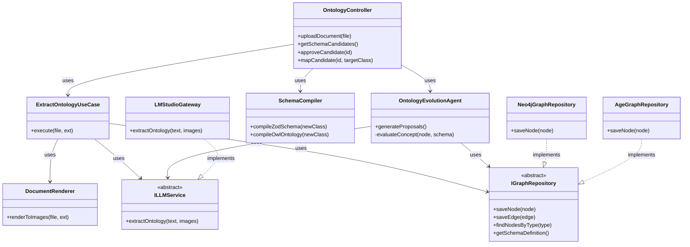
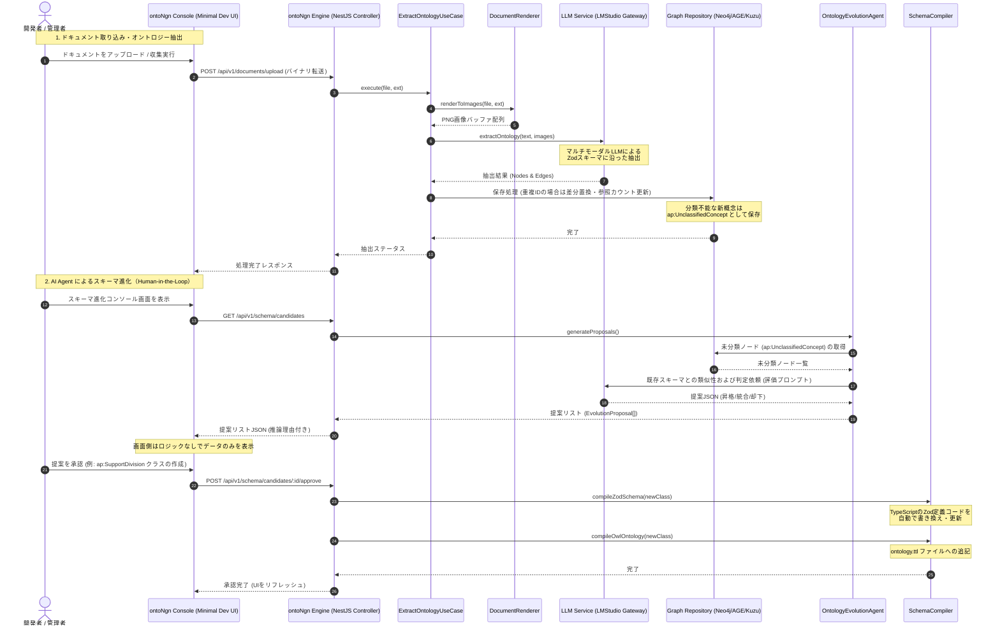

# ontoNgn (Ontology Engine) 詳細設計書
Version: 2.0.0

---

## 1. はじめに
本ドキュメントは、多様な規定やマニュアルドキュメント（PDF, Word, Excel等）を解析し、セマンティックな知識表現である「オントロジー（知識グラフ）」を自動的・汎用的に生成・提供するバックグラウンド実行エンジン **「ontoNgn」** の詳細設計書です。
本システムは、バックエンドに **TypeScript (NestJS)** を採用し、**マルチモーダルLLM (Vision Model)** を用いてドキュメントのレイアウト情報を含めて概念を直接抽出します。生成されたオントロジーは、GraphRAG（Graph-based Retrieval-Augmented Generation）システムなどの基盤情報として、APIを介してリアルタイムに提供されます。

---

## 2. システム要件

### 2.1 機能要件 (Functional Requirements)
1. **マルチモーダル・ドキュメント画像レンダリング (DocumentRenderer)**
   - **PDF変換**: `pdfjs-dist` を用いて、PDFの各ページを高解像度のPNG画像にレンダリングする。
   - **Word (`.docx`) / Excel (`.xlsx`) 変換**: レイアウトや表構造を完全に保持するため、ヘッドレスの LibreOffice 等を用いて一度PDFに変換し、その後PNG画像にレンダリングする。
2. **マルチモーダルLLM抽出エンジン (LMStudio連携)**
   - 変換された画像リスト（全ページ）を、LMStudio等でホストされたマルチモーダルLLMに送信する。
   - プロンプトにて指定したJSONスキーマに従い、エンティティ（手続き、アクター、必要書類、条件等）およびリレーション（エッジ）をJSON形式で直接抽出する。
   - 接続先LLM（APIエンドポイント、モデル名、パラメータ等）は設定ファイル（`.env`）で動的に切り替え可能とする。
3. **型安全なバリデーション (Zodによるパース)**
   - LLMから返却されたJSONデータを `Zod` スキーマで検証し、ドメインモデルである `GraphNode` および `GraphEdge` に変換する。
4. **DB非依存のオントロジー管理 (IGraphRepository)**
   - 生成された知識グラフを、設定一つで複数のグラフDB（Neo4j、Apache AGE/PostgreSQL、Kùzu、またはインメモリRDF/N3.js）に保存・同期できるように抽象化する。
5. **GraphRAG 連携（エクスポート機能）**
   - LlamaIndex.TS や LangChain.js、外部グラフデータベースに直接ロード・インポートできる構造化JSON（Nodes & Edges）およびTurtle形式（.ttl）ファイルでエクスポートする。

### 2.2 非機能要件 (Non-Functional Requirements)
1. **クリーンアーキテクチャによる低依存設計**:
   - データベース（Neo4j / Kùzu 等）やLLM API、ファイルパーサーの変更といった「技術的詳細」が、ビジネスロジック（ユースケース）に影響を与えないよう、TypeScriptの抽象クラスを用いた依存性注入（DI）を徹底する。
2. **非同期実行パフォーマンス**:
   - Node.jsの非同期I/O（`async/await`）を活用し、画像の生成やLLM APIの呼び出しを非ブロッキングで並行処理する。
3. **データのポータビリティ**:
   - データの実体は標準的なトリプル（RDF）またはノード＆エッジ（LPG）として表現し、いつでも別のデータベースへ移行可能とする。

### 2.3 アーキテクチャ設計方針（フロントエンド・ロジックレス思想とエンジン化）

本システムでは、データの整合性保証、セキュリティ、およびオントロジー進化エージェントの推論結果の確実性を担保するため、**「フロントエンド・ロジックレス（Thin Client / Dumb UI）」**設計を徹底し、本体をバックグラウンドで自律的に動作するエンジンとして構築します。

- **ontoNgn Console (Minimal Dev UI) の役割**:
  - 純粋な開発者用・管理者用のプレゼンテーション表示層（ミニマルな管理画面）として動作します。
  - バックエンドAPIから受け取ったドキュメントの処理ステータス、ログ、AIエージェントからの「スキーマ進化の提案（クラス名、型、説明、推論理由）」を画面に描画し、人間の「承認 / 却下」入力を受け取ってそのままバックエンドAPIに中継する機能のみを担当します。
  - クラス類似性の判定やコードのコンパイルなど、いかなるビジネスロジックもコンソール側には配置しません。
- **ontoNgn Engine (Backend API Engine) の役割**:
  - ドキュメント画像へのレンダリング、LMStudio経由のLLM抽出処理、グラフ更新時のクリーンアップ、未分類概念（`ap:UnclassifiedConcept`）の収集とAI Agentによる一次評価・提案生成、OWLおよびZod定義コードの自動再コンパイルといった**すべてのビジネスロジックおよび状態管理を一元的に実行します**。

---

## 3. オントロジー設計 (データモデル)

任意のドキュメントから汎用的な概念体系を構築するためのデータモデル設計については、別ドキュメントに切り出しています。詳細は以下をご参照ください。

- [ontoNgn データモデル設計書 (ontology_model_design.md)](file:///d:/dev/ontrogy/docs/ontology_model_design.md)

---

## 4. ソフトウェアアーキテクチャ (NestJS)

NestJSのモジュールシステムを利用し、クリーンアーキテクチャのレイヤーを実装します。

```
+-----------------------------------------------------------------------+
|                         Frameworks & Drivers                          |
|  - Web UI (Next.js)      - ConfigModule / Dotenv                      |
|  - CLI Commands          - PDF.js / LibreOffice Headless              |
|  - PostgreSQL Client     - Neo4j SDK / Kuzu DB Drivers                |
+-----------------------------------------------------------------------+
                               |
+------------------------------v----------------------------------------+
|                        Interface Adapters                             |
|  - REST API Controllers (Express)                                     |
|  - LMStudioGateway (OpenAI Client Wrapper)                            |
|  - DocumentRenderer (PDF/Word/Excel to PNG)                           |
|  - [Concrete Repository Adapters]                                     |
|    * Neo4jGraphRepository     * AgeGraphRepository (Postgres AGE)     |
|    * KuzuGraphRepository      * InMemoryRdfRepository (N3.js)         |
+-----------------------------------------------------------------------+
                               |
+------------------------------v----------------------------------------+
|                            Use Cases                                  |
|  - ParseDocumentUseCase                                               |
|  - ExtractOntologyUseCase (Uses IGraphRepository, ILLMService)        |
|  - ExportGraphRAGUseCase                                              |
+-----------------------------------------------------------------------+
                               |
+------------------------------v----------------------------------------+
|                             Domain                                    |
|  - Domain Models (GraphNode, GraphEdge, ExtractionResult)             |
|  - Domain Interfaces (Abstract Classes for NestJS DI)                 |
|    * ILLMService              * IGraphRepository                      |
+-----------------------------------------------------------------------+
```

### 4.1 ディレクトリ構造
```text
src/
├── main.ts                     # エントリーポイント
├── app.module.ts               # ルートモジュール
├── config/                     # 環境設定のスキーマ定義 (Zod / NestConfig)
│   └── configuration.ts
├── domain/                     # 1. ドメインレイヤー
│   ├── models/
│   │   └── graph.ts            # GraphNode, GraphEdge 定義
│   └── services/
│       ├── llm.service.ts      # ILLMService 抽象クラス
│       └── graph.repository.ts # IGraphRepository 抽象クラス
├── usecases/                   # 2. ユースケースレイヤー
│   ├── extract-ontology.usecase.ts # LLMを用いたオントロジー生成
│   └── export-graphrag.usecase.ts  # GraphRAG用データエクスポート
├── interfaces/                 # 3. インターフェースアダプター層
│   ├── controllers/            # Web APIコントローラー
│   │   └── ontology.controller.ts
│   ├── gateways/               # 外部連携の具象クラス
│   │   ├── lmstudio.gateway.ts # LMStudio接続
│   │   ├── kuzu.repository.ts  # KuzuDBリポジトリ
│   │   ├── age.repository.ts   # Apache AGEリポジトリ
│   │   ├── neo4j.repository.ts # Neo4jリポジトリ
│   │   └── rdf.repository.ts   # N3.js (トリプル) リポジトリ
│   └── renderers/              # ドキュメントレンダラー
│       └── document.renderer.ts
└── infrastructure/             # 4. インフラストラクチャ層
    ├── di/                     # 依存関係定義モジュール
    │   └── graph-db.provider.ts # 設定によるDB切り替えプロバイダ
    └── modules/
        ├── ontology.module.ts
        └── config.module.ts
```

### 4.2 クラス構造図（Backend Class Diagram）

バックエンド（NestJS）におけるクリーンアーキテクチャのレイヤー構造と、各サービスの依存関係を表すクラス図です。



### 4.3 処理シーケンス図（Processing Sequence Diagram）

ドキュメントのアップロード画像処理から、AIエージェントによる一次評価、および人間の承認・コンパイルに至るエンドツーエンドの処理シーケンスです。



---

## 5. 詳細設計：データベースの抽象化と低依存設計

特定のグラフデータベースへの依存を排除するため、ドメイン層に共通モデルと抽象クラスを定義します。NestJSのDIコンテナではインターフェースがランタイムで消滅するため、**抽象クラス（Abstract Class）**をトークンとして使用します。

### 5.1 ドメイン・グラフモデル (`src/domain/models/graph.ts`)
```typescript
export class GraphNode {
  constructor(
    public readonly id: string,                 // URI表現 (例: "ap:Procedure_JidouTeate")
    public readonly label: string,              // クラス名 (例: "ap:Procedure")
    public readonly properties: Record<string, any> = {} // 属性値 (label, description等)
  ) {}
}

export class GraphEdge {
  constructor(
    public readonly sourceId: string,           // 始点ノードID
    public readonly targetId: string,           // 終点ノードID
    public readonly relationType: string,       // リレーション名 (例: "ap:requiresDocument")
    public readonly properties: Record<string, any> = {}
  ) {}
}

export class ExtractionResult {
  constructor(
    public readonly nodes: GraphNode[],
    public readonly edges: GraphEdge[]
  ) {}
}
```

### 5.2 リポジトリインターフェース (`src/domain/services/graph.repository.ts`)
```typescript
import { GraphNode, GraphEdge, ExtractionResult } from '../models/graph';

export abstract class IGraphRepository {
  abstract saveNode(node: GraphNode): Promise<void>;
  abstract saveEdge(edge: GraphEdge): Promise<void>;
  abstract getNode(nodeId: string): Promise<GraphNode | null>;
  abstract queryNeighbors(nodeId: string): Promise<GraphEdge[]>;
  abstract exportAll(): Promise<ExtractionResult>;
}
```

### 5.3 依存性注入（DI）プロバイダ (`src/infrastructure/di/graph-db.provider.ts`)
環境変数 `GRAPH_DB_TYPE` の値に応じて、実行時にバインドするデータベース実装を決定します。

```typescript
import { Provider } from '@nestjs/common';
import { ConfigService } from '@nestjs/config';
import { IGraphRepository } from '../../domain/services/graph.repository';
import { Neo4jGraphRepository } from '../../interfaces/gateways/neo4j.repository';
import { AgeGraphRepository } from '../../interfaces/gateways/age.repository';
import { KuzuGraphRepository } from '../../interfaces/gateways/kuzu.repository';
import { InMemoryRdfRepository } from '../../interfaces/gateways/rdf.repository';

export const GraphRepositoryProvider: Provider = {
  provide: IGraphRepository,
  useFactory: (configService: ConfigService): IGraphRepository => {
    const dbType = configService.get<string>('GRAPH_DB_TYPE', 'rdf_in_memory').toLowerCase();

    switch (dbType) {
      case 'neo4j':
        return new Neo4jGraphRepository(
          configService.get<string>('NEO4J_URI')!,
          configService.get<string>('NEO4J_USER')!,
          configService.get<string>('NEO4J_PASSWORD')!
        );
      case 'apache_age':
        return new AgeGraphRepository(
          configService.get<string>('POSTGRES_DSN')!
        );
      case 'kuzu':
        return new KuzuGraphRepository(
          configService.get<string>('KUZU_DB_PATH')!
        );
      case 'rdf_in_memory':
      default:
        return new InMemoryRdfRepository(
          configService.get<string>('RDF_OUTPUT_PATH')!
        );
    }
  },
  inject: [ConfigService],
};
```

---

## 6. 詳細設計：可変LLM（LMStudio）マルチモーダル抽出

### 6.1 LLM抽象サービス (`src/domain/services/llm.service.ts`)
```typescript
import { ExtractionResult } from '../models/graph';

export abstract class ILLMService {
  /**
   * ページの画像およびテキストから、オントロジー構造（ノード・エッジ）を抽出します。
   * @param textContent 抽出テキスト
   * @param imageBuffers 各ページの画像バッファ（PNG）
   */
  abstract extractOntology(
    textContent: string,
    imageBuffers: Buffer[]
  ): Promise<ExtractionResult>;
}
```

### 6.2 ZodによるLLM出力バリデーション
LLMからの抽出データを型安全にパースするためのスキーマ定義です。

```typescript
import { z } from 'zod';

export const LLMExtractionSchema = z.object({
  nodes: z.array(
    z.object({
      id: z.string().regex(/^ap:[A-Za-z0-9_]+$/),
      type: z.enum([
        'ap:Procedure',
        'ap:Actor',
        'ap:Document',
        'ap:Condition',
        'ap:Organization',
        'ap:InputItem',
        'ap:LegalBasis',
      ]),
      label: z.string(),
      description: z.string().optional(),
      properties: z.record(z.any()).default({}),
    })
  ),
  relationships: z.array(
    z.object({
      source: z.string(),
      target: z.string(),
      type: z.enum([
        'ap:hasTargetActor',
        'ap:requiresDocument',
        'ap:producesDocument',
        'ap:hasPrerequisite',
        'ap:administeredBy',
        'ap:basedOnLaw',
        'ap:nextProcedure',
      ]),
      properties: z.record(z.any()).default({}),
    })
  ),
});

export type LLMExtraction = z.infer<typeof LLMExtractionSchema>;
```

### 6.3 LMStudioGateway 実装 (`src/interfaces/gateways/lmstudio.gateway.ts`)
LMStudioが提供するOpenAI互換APIにマルチモーダル（テキスト＋画像バッファ）でリクエストを送信します。

```typescript
import { Injectable } from '@nestjs/common';
import { ConfigService } from '@nestjs/config';
import { ILLMService } from '../../domain/services/llm.service';
import { ExtractionResult, GraphNode, GraphEdge } from '../../domain/models/graph';
import { LLMExtractionSchema } from './schemas/extraction.schema';
import OpenAI from 'openai';

@Injectable()
export class LMStudioGateway implements ILLMService {
  private openai: OpenAI;
  private modelName: string;
  private temperature: number;

  constructor(private configService: ConfigService) {
    this.openai = new OpenAI({
      baseURL: this.configService.get<string>('LLM_API_BASE_URL'),
      apiKey: this.configService.get<string>('LLM_API_KEY', 'lm-studio'),
    });
    this.modelName = this.configService.get<string>('LLM_MODEL_NAME', 'vision-model');
    this.temperature = this.configService.get<number>('LLM_TEMPERATURE', 0.1);
  }

  async extractOntology(textContent: string, imageBuffers: Buffer[]): Promise<ExtractionResult> {
    // 1. OpenAI規格メッセージの組み立て
    const contentParts: any[] = [
      {
        type: 'text',
        text: `以下の行政ドキュメントのビジュアル情報（画像）およびテキストから、行政手続きのオントロジー関係を抽出してください。\n\nドキュメントテキスト:\n${textContent}`
      }
    ];

    // 2. 画像のBase64エンコードとメッセージへの追加
    for (const buf of imageBuffers) {
      const base64Image = buf.toString('base64');
      contentParts.push({
        type: 'image_url',
        image_url: {
          url: `data:image/png;base64,${base64Image}`
        }
      });
    }

    // 3. API実行
    const response = await this.openai.chat.completions.create({
      model: this.modelName,
      temperature: this.temperature,
      response_format: { type: 'json_object' },
      messages: [
        {
          role: 'system',
          content: 'あなたは行政ドキュメントを読み取り、指定されたJSON構造で手続き・必要書類・アクターの関係性を抽出する専門家です。指定のスキーマ以外のプロパティは含めないでください。'
        },
        {
          role: 'user',
          content: contentParts
        }
      ]
    });

    const responseText = response.choices[0]?.message?.content || '{}';
    const jsonParsed = JSON.parse(responseText);

    // 4. Zodによる検証
    const validatedData = LLMExtractionSchema.parse(jsonParsed);

    // 5. ドメインモデルへの変換
    const nodes = validatedData.nodes.map(
      n => new GraphNode(n.id, n.type, { label: n.label, description: n.description, ...n.properties })
    );

    const edges = validatedData.relationships.map(
      r => new GraphEdge(r.source, r.target, r.type, r.properties)
    );

    return new ExtractionResult(nodes, edges);
  }
}
```

### 6.4 スキーマ進化AIエージェント (`src/domain/services/evolution.agent.ts`)

一次抽出で分類しきれなかった未知の概念（`ap:UnclassifiedConcept`）をセマンティックに判定し、既存スキーマへのマッピングまたは新規クラス昇格の提案を自律的に生成するエージェントサービスです。

```typescript
import { Injectable } from '@nestjs/common';
import { ILLMService } from '../services/llm.service';
import { IGraphRepository } from '../repositories/graph.repository';

export interface EvolutionProposal {
  id: string;
  action: 'PROMOTE_CLASS' | 'MAP_TO_PROPERTY' | 'DISCARD';
  targetConcept: string;
  proposedName: string;
  proposedDescription: string;
  suggestedProperties: Array<{ name: string; type: 'string' | 'number' | 'boolean' }>;
  targetExistingClassOrProperty?: string;
  rationale: string; // 一時判定の推論理由
}

@Injectable()
export class OntologyEvolutionAgent {
  constructor(
    private readonly llmService: ILLMService,
    private readonly graphRepository: IGraphRepository
  ) {}

  /**
   * 未分類概念（ap:UnclassifiedConcept）を収集し、既存のオントロジー定義と照合して提案を生成します。
   */
  async generateProposals(): Promise<EvolutionProposal[]> {
    // 1. グラフDBからすべての未分類概念（ap:UnclassifiedConcept）を取得
    const unclassifiedNodes = await this.graphRepository.findNodesByType('ap:UnclassifiedConcept');
    if (unclassifiedNodes.length === 0) return [];

    // 2. 現在アクティブなオントロジースキーマ（クラス構造、プロパティ）をメタデータから取得
    const currentSchema = await this.graphRepository.getSchemaDefinition();

    // 3. AI Agent (LLM) に対する一時判定プロンプトの組み立て
    const proposals: EvolutionProposal[] = [];
    for (const node of unclassifiedNodes) {
      const proposal = await this.evaluateConcept(node, currentSchema);
      proposals.push(proposal);
    }

    return proposals;
  }

  private async evaluateConcept(node: any, currentSchema: any): Promise<EvolutionProposal> {
    const prompt = `
あなたはドメインオントロジーの設計を監督する「OntologyEvolutionAgent」です。
ドキュメント解析中に、既存の定義クラスに当てはまらない概念が見つかりました。この概念について一次判定（Triage）を行い、人間への提案を生成してください。

【評価対象の未知概念】
- 概念名: ${node.properties.label}
- 抽出された文脈: ${node.properties.contextDescription}
- 想定属性候補: ${JSON.stringify(node.properties.suggestedProperties)}

【現在の定義済みクラス一覧】
${JSON.stringify(currentSchema.classes)}

【判定基準】
1. 表記揺れまたは部分一致する既存クラス・プロパティがあれば「MAP_TO_PROPERTY」を選択し、マッピング先を指定してください。
2. 既存クラスでは表現できない独自のエンティティ（例：「手帳種別」「障害支援区分」など、固有の属性値や他のノードと複雑に接続する構造を持つ場合）は「PROMOTE_CLASS」を選択し、新規クラス名、説明、属性構造を設計してください。
3. 手続きと関係のないノイズや、単純な値の抽出エラーであれば「DISCARD」を選択してください。

以下のJSON形式のみで回答してください:
{
  "action": "PROMOTE_CLASS" | "MAP_TO_PROPERTY" | "DISCARD",
  "proposedName": "推奨されるクラス名/プロパティ名（CamelCase）",
  "proposedDescription": "概念の説明",
  "suggestedProperties": [{"name": "プロパティ名", "type": "string" | "number" | "boolean"}],
  "targetExistingClassOrProperty": "MAP_TO_PROPERTYの場合のマッピング先ID",
  "rationale": "この判定に至った論理的根拠・推論プロセス（日本語）"
}
`;
    // LLMに判定を依頼し、結果をパース（モック処理含む）
    const result = await this.llmService.callVisionOrText(prompt);
    const parsed = JSON.parse(result);

    return {
      id: `prop_${Date.now()}_${Math.random().toString(36).substr(2, 5)}`,
      action: parsed.action,
      targetConcept: node.properties.label,
      proposedName: parsed.proposedName,
      proposedDescription: parsed.proposedDescription,
      suggestedProperties: parsed.suggestedProperties || [],
      targetExistingClassOrProperty: parsed.targetExistingClassOrProperty,
      rationale: parsed.rationale,
    };
  }
}

import * as fs from 'fs/promises';
import * as path from 'path';

@Injectable()
export class SchemaCompiler {
  private schemaFilePath = path.join(__dirname, '../gateways/schemas/extraction.schema.ts');

  /**
   * 承認された提案を元に、Zodバリデーションスキーマコードを再コンパイル（動的更新）します。
   */
  async compileZodSchema(newClass: { name: string; properties: any[] }): Promise<void> {
    // 1. 既存のスキーマファイルを読み込む
    let schemaCode = await fs.readFile(this.schemaFilePath, 'utf-8');

    // 2. z.enum の配列に新規クラスを追加する置換処理
    const enumSearchRegex = /type:\s*z\.enum\(\[\s*([\s\S]*?)\s*\]\)/;
    const match = schemaCode.match(enumSearchRegex);
    
    if (match) {
      const currentEnums = match[1].split(',').map(s => s.trim().replace(/'/g, ''));
      if (!currentEnums.includes(`ap:${newClass.name}`)) {
        currentEnums.push(`ap:${newClass.name}`);
        const newEnumContent = currentEnums.map(e => `        '${e}',`).join('\n');
        
        schemaCode = schemaCode.replace(
          enumSearchRegex,
          `type: z.enum([\n${newEnumContent}\n      ])`
        );
      }
    }

    // 3. スキーマファイルを上書き書き出し
    await fs.writeFile(this.schemaFilePath, schemaCode, 'utf-8');
  }

  /**
   * W3C標準のOWLオントロジーファイル(.ttl)に新規クラス定義を追記します。
   */
  async compileOwlOntology(newClass: { name: string; description: string }): Promise<void> {
    const owlPath = path.join(process.cwd(), 'docs/schema/ontology.ttl');
    const ttlFragment = `
###  http://example.org/ap/${newClass.name}
ap:${newClass.name} rdf:type owl:Class ;
       rdfs:subClassOf ap:DomainEntity ;
       rdfs:label "${newClass.name}"@ja ;
       rdfs:comment "${newClass.description}"@ja .
`;
    await fs.appendFile(owlPath, ttlFragment, 'utf-8');
  }
}

import * as pdfjs from 'pdfjs-dist';
import { exec } from 'child_process';
import { promisify } from 'util';

const execAsync = promisify(exec);

@Injectable()
export class DocumentRenderer {
  /**
   * PDF/Word/Excelを受け取り、各ページ画像（PNG）のバッファ配列を生成します。
   */
  async renderToImages(fileBuffer: Buffer, fileExtension: string): Promise<Buffer[]> {
    let pdfBuffer = fileBuffer;

    // Word/Excel の場合は LibreOffice を用いてPDFに一時変換する
    if (['.docx', '.xlsx'].includes(fileExtension.toLowerCase())) {
      pdfBuffer = await this.convertToPdfViaLibreOffice(fileBuffer, fileExtension);
    }

    // PDFバッファをPNG画像の配列にレンダリングする
    return this.renderPdfToPngs(pdfBuffer);
  }

  private async convertToPdfViaLibreOffice(buffer: Buffer, ext: string): Promise<Buffer> {
    const tempDir = path.join(process.cwd(), 'temp');
    await fs.mkdir(tempDir, { recursive: true });
    
    const tempInputPath = path.join(tempDir, `input_${Date.now()}${ext}`);
    await fs.writeFile(tempInputPath, buffer);

    try {
      // LibreOffice (headlessモード) を用いたPDF変換コマンドの実行
      // (Windows環境では soffice.exe へのパスが通っている必要があります)
      await execAsync(`soffice --headless --convert-to pdf --outdir "${tempDir}" "${tempInputPath}"`);
      
      const tempPdfPath = tempInputPath.replace(ext, '.pdf');
      const pdfBuffer = await fs.readFile(tempPdfPath);

      // 一時ファイルの削除
      await fs.unlink(tempInputPath);
      await fs.unlink(tempPdfPath);

      return pdfBuffer;
    } catch (err) {
      // エラーハンドリング
      throw new Error(`Failed to convert office document to PDF: ${(err as Error).message}`);
    }
  }

  private async renderPdfToPngs(pdfBuffer: Buffer): Promise<Buffer[]> {
    const images: Buffer[] = [];
    const loadingTask = pdfjs.getDocument({ data: new Uint8Array(pdfBuffer) });
    const pdfDocument = await loadingTask.promise;

    for (let pageNum = 1; pageNum <= pdfDocument.numPages; pageNum++) {
      const page = await pdfDocument.getPage(pageNum);
      const viewport = page.getViewport({ scale: 2.0 }); // 高解像度レンダリング用

      // ※ 実際のNode.js上でのレンダリングには 'canvas' ライブラリを用いて
      // pdfjsのレンダリングコンテキストに描画し、Bufferを取得します。
      // (実装フェーズにて canvas npm ライブラリを導入します)
      // canvas = createCanvas(viewport.width, viewport.height);
      // context = canvas.getContext('2d');
      // page.render({ canvasContext: context, viewport })
      // images.push(canvas.toBuffer('image/png'))
      
      // (設計モック用プレースホルダー)
      images.push(Buffer.from(`page-${pageNum}-png-stub`));
    }

    return images;
  }
}
```

---

---

## 8. 詳細設計：ドキュメント収集（Ingestion）およびID管理設計

ドキュメントの多様な取り込み経路に対応し、取り込んだオントロジーを一意なドキュメントIDベースで安全に管理・更新（Upsert）するための設計です。

### 8.1 ドキュメント管理モデル (`src/domain/models/document-source.ts`)
ドキュメント自体のメタデータおよび処理ステータスを管理するエンティティです（メタデータ用DBに永続化）。

```typescript
export type SourceType = 'upload' | 'local_path' | 'url';
export type ProcessingStatus = 'pending' | 'processing' | 'completed' | 'failed';

export class DocumentSource {
  constructor(
    public readonly id: string,                 // 一意識別ID (ユーザー指定、またはファイルハッシュ)
    public readonly fileName: string,           // ファイル名
    public readonly sourceType: SourceType,     // 収集チャネル
    public readonly sourcePath: string | null,   // ローカルパスまたは取得URL
    public readonly status: ProcessingStatus,   // 処理ステータス
    public readonly errorMessage: string | null,// エラー発生時のログ
    public readonly hash: string,               // コンテンツのハッシュ値 (更新検知用)
    public readonly createdAt: Date,
    public readonly updatedAt: Date
  ) {}
}
```

### 8.2 ドキュメント収集エンジン (Ingestion Engine)
ドキュメント収集の仕組みは、NestJSのスケジュール機能（`@nestjs/schedule`）またはイベントトリガーで起動します。

1. **手動アップロード (`UploadHandler`)**:
   - 管理UIからアップロードされたファイルバッファを受け取り、`documentId` をハッシュ値または指定IDで登録して即時解析キューに投入。
2. **ローカルパス自動収集 (`LocalPathScanner`)**:
   - 設定されたローカルディレクトリのパスを定期スキャン（または監視）。
   - ディレクトリ内の各ファイルを検知し、ファイルパスをIDとし、最終更新日時またはハッシュを比較して更新・新規追加があれば解析を実行。
3. **URL自動収集 (`UrlDownloader`)**:
   - 指定されたURLからドキュメントをGETリクエストでダウンロード。
   - レスポンスヘッダ（ETagやLast-Modified）およびコンテンツハッシュを検証し、変更があれば自動で再解析をトリガー。

### 8.3 オントロジー差分更新 (Clean Upsert) アルゴリズム
同一ドキュメントIDのファイルが再アップロード・更新された場合、グラフDB内の整合性を崩さずに該当部分のみを置換するトランザクションロジックです。

```
【オントロジー差分置換の流れ】
1. 該当 documentId を持つすべてのエッジ(関係性)を削除
   (※関係性は特定の文脈に依存するため、ドキュメントの更新時に全削除して問題ない)
2. 該当 documentId が関連付けられているノードの参照を更新
   - ノードは複数のドキュメント間で共有（例：「申請者：保護者」）される可能性があるため、
     ノードの属性 `sourceDocumentIds`（配列）から当該 documentId を削除。
   - sourceDocumentIds が空になった（どのドキュメントからも参照されていない）ノードを削除。
3. 新しいドキュメントを解析してオントロジーを抽出。
4. 新規抽出されたノードとエッジを登録：
   - 既存ノードがある場合：そのノードの `sourceDocumentIds` に当該 documentId を追加。
   - 新規ノードの場合：`sourceDocumentIds` = [documentId] で作成。
   - 新規エッジの場合：`properties.sourceDocumentId` = documentId で作成。
```

---

## 9. 詳細設計：ontoNgn Console (Minimal Dev UI) および ontoNgn Engine API設計

本システムはヘッドレスな実行エンジンとして動作することを基本としますが、ドキュメントの処理状態を視覚的に把握し、AI Agentが提案したスキーマ進化の検証・承認を容易にするため、最小限のWebインターフェースである **`ontoNgn Console`** を提供します。

### 9.1 ontoNgn Engine APIエンドポイント設計

| メソッド | パス | 説明 |
| :--- | :--- | :--- |
| `GET` | `/api/v1/documents` | 登録されているすべてのドキュメントソースとステータスを一覧取得します。 |
| `POST` | `/api/v1/documents/upload` | ドキュメントの手動アップロードを実行します（`multipart/form-data`）。 |
| `POST` | `/api/v1/documents/register-path` | ローカルパスまたはURLを自動収集ソースとして登録します。 |
| `POST` | `/api/v1/documents/:id/reprocess` | 指定されたドキュメントの再解析を強制実行します。 |
| `DELETE` | `/api/v1/documents/:id` | ドキュメントメタデータを削除し、紐づくオントロジー関係（孤立ノード含む）をクリーンアップします。 |
| `GET` | `/api/v1/schema/candidates` | LLMが検出した、既存の分類に属さない「未分類概念・新規クラス候補」の一覧を取得します。 |
| `POST` | `/api/v1/schema/candidates/:id/approve` | 候補概念を新規クラスとして承認し、スキーマ（OWL/Zod等）に反映します。 |
| `POST` | `/api/v1/schema/candidates/:id/map` | 候補概念を既存のクラス（またはプロパティ）にマッピング（統合）します。 |

### 9.2 ontoNgn Console (Minimal Dev UI) 構成案

ontoNgn Console は、ドキュメントのインプット監視、およびスキーマ進化（候補の承認・統合）のみに機能を絞ったデベロッパー向けツールです。

```
+----------------------------------------------------------------------------------+
|  ontoNgn Console - デベロッパーダッシュボード                                        |
+----------------------------------------------------------------------------------+
|  [ドキュメント管理]  [スキーマ進化管理 (Schema Evolution)]  [API・接続設定]              |
+----------------------------------------------------------------------------------+
|  (選択中: ドキュメント管理)                                                      |
|  [新規アップロード]  [自動収集パスの登録]                                        |
|  (ドラッグ&ドロップ)  (ローカルディレクトリ/URL)                                    |
|                                                                                  |
|  ■ 取り込みドキュメント一覧                                                      |
|  +------------+----------------------+----------+-------------+------------------+
|  | ID         | ドキュメント名       | 収集元   | ステータス  | アクション       |
|  +------------+----------------------+----------+-------------+------------------+
|  | doc-01     | 児童手当_案内.pdf     | UPLOAD   | [COMPLETED] | [再処理] [削除]  |
|  | doc-02     | 保育所入所要件.xlsx   | PATH     | [PROCESSING]| [再処理] [削除]  |
|  | doc-03     | https://.../guide.doc| URL      | [FAILED]    | [ログ表示] [削除]|
|  +------------+----------------------+----------+-------------+------------------+
|                                                                                  |
|  ■ 処理エラーログ (選択されたドキュメントの失敗詳細)                                |
|  [doc-03]: LMStudio APIへの接続がタイムアウトしました。ローカルサーバーの稼働を... |
+----------------------------------------------------------------------------------+

+----------------------------------------------------------------------------------+
|  ontoNgn Console - スキーマ進化管理 (Schema Evolution)                             |
+----------------------------------------------------------------------------------+
|  (選択中: スキーマ進化管理)                                                      |
|  ■ LLM/Agentが検出した新しい概念・クラス候補一覧                                 |
|  +--------------------+--------------+----------------------------------+--------+
|  | 提案概念(ID)       | 検出元文書   | 抽出された文脈・プロパティ例     | 操作   |
|  +--------------------+--------------+----------------------------------+--------+
|  | ap:SupportDivision | doc-02       | 「障害支援区分」に関する条件記述  | [承認] |
|  | (新規クラス提案)   |              | properties: 区分1〜6             | [統合] |
|  +--------------------+--------------+----------------------------------+--------+
|  | ap:AssocFacility   | doc-04       | 「指定医療機関」「指定相談事業所」 | [承認] |
|  | (新規クラス提案)   |              | properties: 施設コード、名称     | [統合] |
|  +--------------------+--------------+----------------------------------+--------+
|                                                                                  |
|  * [承認] ボタン: 概念を新規クラスとしてオントロジーモデルおよびZodスキーマに追加します。 |
|  * [統合] ボタン: 既存のクラス (例: ap:Organization) のプロパティ属性へマッピングします。 |
+----------------------------------------------------------------------------------+
```

---

## 10. GraphRAG 連携設計

生成されたオントロジーを、GraphRAGフレームワーク（LlamaIndex.TS 等）で再利用するための連携構造です。

### 10.1 LlamaIndex.TS 用 JSON エクスポート
GraphRAGが知識グラフを構築するために読み込む、標準的なノードと関係性のスキーマです（`GET /api/v1/documents/export` で取得可能）。

```json
{
  "nodes": [
    {
      "id": "ap:Procedure_JidouTeate_Shinsei",
      "type": "ap:Procedure",
      "properties": {
        "label": "児童手当の申請",
        "description": "児童手当の受給資格を得るための申請手続きです。",
        "sourceDocumentIds": ["doc-01"]
      }
    },
    {
      "id": "ap:Actor_Parent",
      "type": "ap:Actor",
      "properties": {
        "label": "児童の養育者（父母など）",
        "sourceDocumentIds": ["doc-01", "doc-02"]
      }
    }
  ],
  "relationships": [
    {
      "source": "ap:Procedure_JidouTeate_Shinsei",
      "target": "ap:Actor_Parent",
      "type": "ap:hasTargetActor",
      "properties": {
        "sourceDocumentId": "doc-01"
      }
    }
  ]
}
```

### 10.2 W3C標準 Turtle (.ttl) 形式の N3.js による出力
RDFトリプルストアやセマンティックWebシステムへの連携用に、N3.jsライブラリを使用してシリアライズされた標準的なTurtle表記を提供します。

```turtle
@prefix ap: <http://example.org/ap/> .
@prefix rdf: <http://www.w3.org/1999/02/22-rdf-syntax-ns#> .
@prefix rdfs: <http://www.w3.org/2000/01/rdf-schema#> .

ap:Procedure_JidouTeate_Shinsei rdf:type ap:Procedure ;
    rdfs:label "児童手当の申請" ;
    ap:description "児童手当の受給資格を得るための申請手続きです。" ;
    ap:hasTargetActor ap:Actor_Parent .

ap:Actor_Parent rdf:type ap:Actor ;
    rdfs:label "児童の養育者（父母など）" .
```

---

## 11. 次のステップ

1. **設計の最終確認**:
   - 本ドキュメントに記載された、ontoNgn Console構成、自動収集エンジン、ID差分更新（Upsert）ロジックの妥当性をレビュー。
2. **設計成果物の承認**:
   - ユーザーから詳細設計に対する承認（設計完了）を得る。
3. **実装開始への準備 (次フェーズ)**:
   - 設計承認後、次のフェーズでプロジェクトのディレクトリ構築、`package.json` によるライブラリセットアップ、NestJS環境での基本モジュールのコーディングを開始する。

