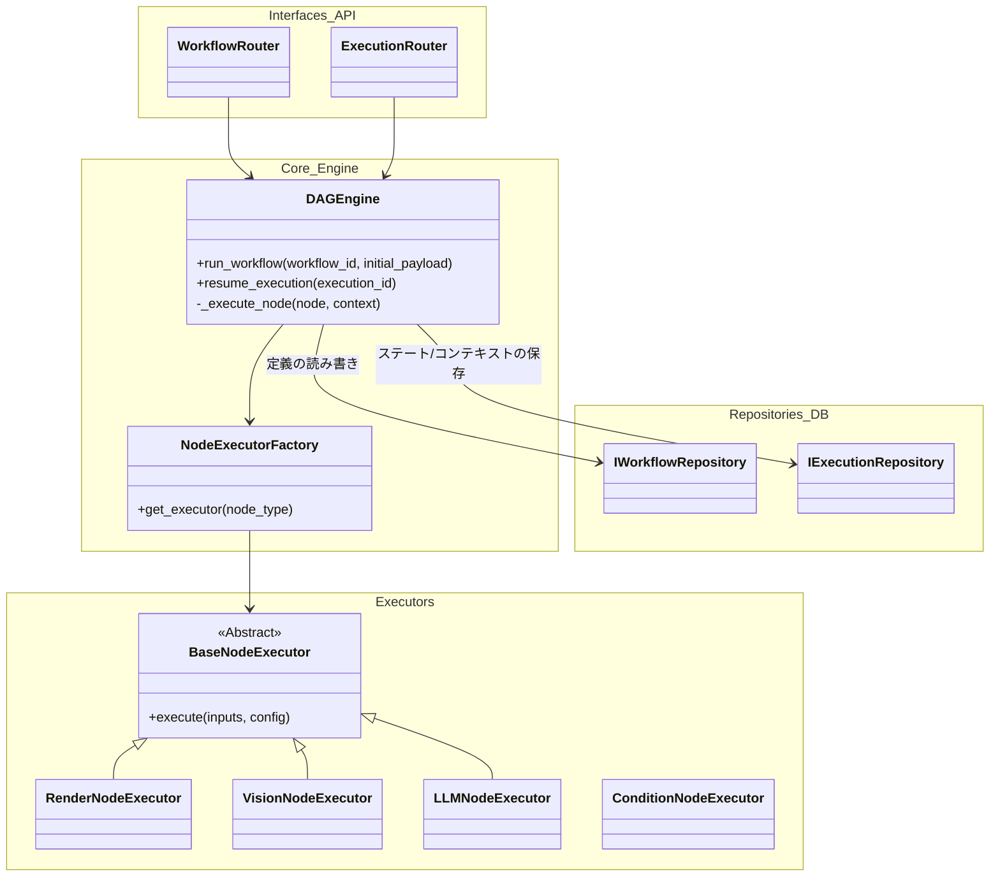
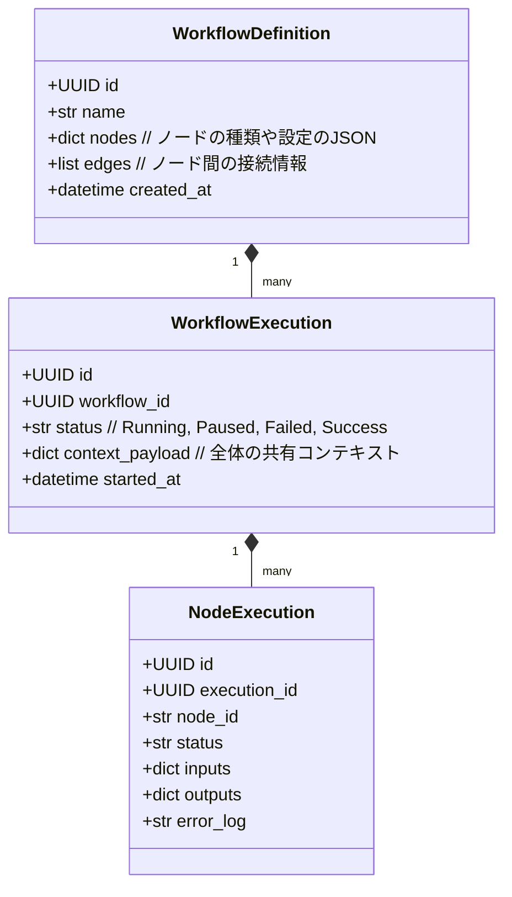
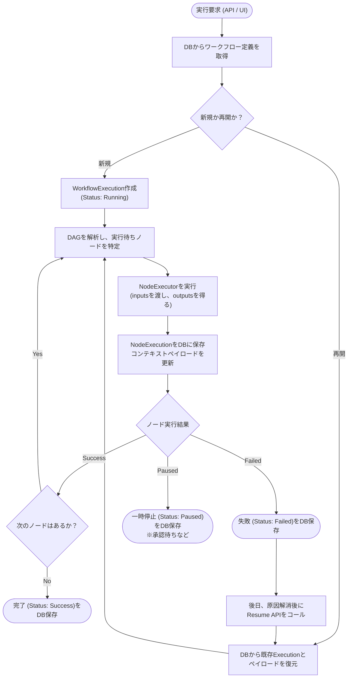
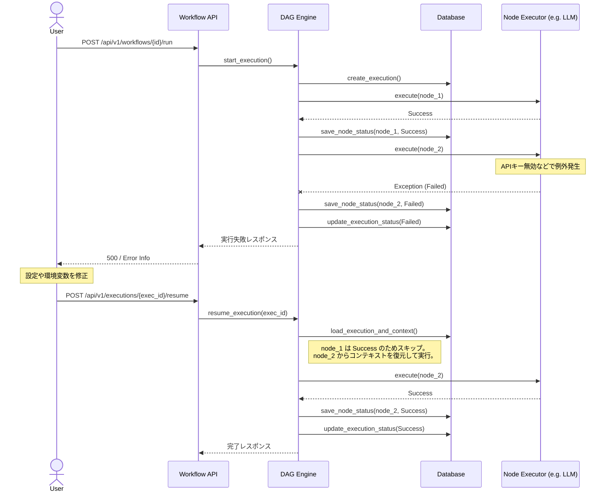

# 01. Workflow Orchestrator 詳細設計

## 1. 対象機能の概要・処理一覧

本システムにおける全体の実行をつかさどる、**任意のDAG（有向非巡回グラフ）を構成可能な軽量ノードベース・ワークフローエンジン** の設計詳細です。
Difyやn8nのようなアーキテクチャを採用し、ontoNgnが提供する機能（Render, Vision, Ontology生成など）を「ノード」として組み合わせることで、柔軟なパイプラインを構築・実行できます。

また、デフォルトのプリセットとして、システムの基本要件である「ドキュメントアップロード → 画像化 → テキスト抽出 → オントロジー生成 → スキーマ進化判定」のフローが登録されます。

### 処理一覧
1. **ワークフロー定義の管理**: ノードの接続関係（DAG）と設定値をJSONベースで定義し、データベースで永続化・管理する。
2. **DAG実行エンジン**: トポロジカルソートを用いてノードの依存関係を解決し、実行可能なノードから順次・並列で処理を実行する。
3. **ステート管理とコンテキスト・リレー**: 各ノードの入出力データ（巨大なJSONコンテキスト/ペイロード）をリレー形式で次のノードへ受け渡す。実行状態（Success, Failed, Paused等）は逐次データベースに保存する。
4. **レジューム機能（途中再開）**: ノードの実行が失敗した場合や、ユーザー承認待ち（Human-in-the-loop）で停止した場合に、失敗した箇所（または停止した箇所）からコンテキストを復元して処理を再開する。

## 2. モジュール構成図・クラス図

### モジュール構成図


### クラス図（エンティティ）


## 3. 処理フロー図・シーケンス図

### DAG実行フロー・レジュームフロー


### 途中失敗からの再開（レジューム）シーケンス図


## 4. APIインターフェース仕様 / 入出力データ

エンドポイントは汎用的なワークフロー管理・実行の形式へと刷新されます。

### ワークフロー管理 (Workflow CRUD)
| Method | Endpoint | 概要 | リクエスト例 |
| :--- | :--- | :--- | :--- |
| POST | `/api/v1/workflows` | 新規ワークフローの定義作成 | `{ "name": "...", "nodes": [...], "edges": [...] }` |
| GET | `/api/v1/workflows` | ワークフロー一覧取得 | - |
| GET | `/api/v1/workflows/{id}` | ワークフロー詳細取得 | - |
| PUT | `/api/v1/workflows/{id}` | ワークフロー定義の更新 | `{ "nodes": [...], "edges": [...] }` |

### 実行管理 (Execution Management)
| Method | Endpoint | 概要 | リクエスト例 | レスポンス例 |
| :--- | :--- | :--- | :--- | :--- |
| POST | `/api/v1/workflows/{id}/run` | 指定したワークフローの実行開始（必要に応じて開始ノード指定可能） | `{ "initial_payload": { ... }, "start_node_id": "node-3" }` | `{ "execution_id": "uuid", "status": "Running" }` |
| GET | `/api/v1/executions/{id}` | 実行ステータスと各ノードのログ取得 | - | `{ "status": "Failed", "nodes": [...] }` |
| POST | `/api/v1/executions/{id}/resume` | 失敗・停止した箇所からの実行再開 | `{ "override_payload": {} }` | `{ "status": "Running" }` |
| POST | `/api/v1/executions/{id}/cancel` | 実行中のワークフローの強制停止 | - | `{ "status": "Cancelled" }` |

## 5. 異常系・エラーハンドリング

| 想定されるエラー | 原因 | 対応方針 | DB上の状態 |
| :--- | :--- | :--- | :--- |
| **ノード実行時の一時的障害** | 外部API連携タイムアウトなど | 各 `NodeExecutor` 内でリトライ（指数バックオフ）を実施。 | `Running` (リトライ中) |
| **ノードの致命的エラー** | 設定ミス、ファイル破損、リトライ上限到達 | ノードの実行を中止し、エラーメッセージをDBに保存。後続ノードは実行しない。 | Execution: `Failed`, Node: `Failed` |
| **Human in the Loopのタイムアウト** | スキーマ進化の承認待ちが長期間放置された | スケジューラーが一定期間経過したPausedの実行をFailedとしてマークする。 | Execution: `Failed` (Timeout) |
| **再開（Resume）時の不整合** | ワークフロー定義が変更された後の再開 | 原則として、実行開始時点のDAGスナップショットを使用して再開する（実行の一貫性担保）。 | - |

## 6. 依存する環境変数・外部設定

- **データベース設定**:
  - DAGの定義（JSON）や実行コンテキスト（ペイロード）は容量が大きくなる可能性があるため、PostgreSQLの `JSONB` カラム等、JSONを扱えるリレーショナルデータベースを状態管理（`IWorkflowRepository`, `IExecutionRepository`）に使用します。
- **非同期ワーカー**:
  - FastAPIのバックグラウンドタスク機能、またはPythonの `asyncio` を利用して非同期にDAGエンジンを起動します（重厚なCelery等は当面避け、軽量なPython実装とする）。

## 7. テスト方針

- **DAGトポロジテスト**:
  - 閉路（循環）を含む無効なエッジ定義が与えられた際に、トポロジカルソートでバリデーションエラーを返すことを単体テストで検証する。
- **コンテキストリレーテスト**:
  - Node Aの出力が正しくNode Bの入力ペイロードとしてマージされているかをテストする。
- **レジューム（再開）テスト**:
  - 意図的に例外を投げるモックノードを途中に配置し、Failedで停止すること、およびResume API呼び出し時に成功したノードをスキップして再開することを確認する。

## 8. DAG情報（ワークフロー定義）の保存データ形式

Vue Flow 等のノードベースUIライブラリで直接描画・編集ができるよう、DAGの定義情報は標準的なノードとエッジの配列からなるJSON形式としてデータベース（`JSONB` カラムなど）に永続化されます。

### ワークフロー定義 JSON スキーマ例
```json
{
  "id": "wf-1234",
  "name": "Standard Ingestion Pipeline",
  "nodes": [
    {
      "id": "node-1",
      "type": "render_document",
      "position": { "x": 100, "y": 200 },
      "data": {
        "dpi": 300,
        "format": "png"
      }
    },
    {
      "id": "node-2",
      "type": "vision_extraction",
      "position": { "x": 400, "y": 200 },
      "data": {
        "model": "gpt-4o",
        "extract_layout": true
      }
    }
  ],
  "edges": [
    {
      "id": "edge-1",
      "source": "node-1",
      "target": "node-2",
      "sourceHandle": "output",
      "targetHandle": "input"
    }
  ]
}
```

- **`nodes`**: 実行される個々の処理ブロック。`type` でバックエンドの `NodeExecutor` をマッピングし、`data` にそのノード特有の設定値（モデル名や解像度など）を格納します。`position` はVue FlowがUI上でノードを配置するための座標データです。
- **`edges`**: ノード間の依存関係（データの流れ）。`sourceHandle` と `targetHandle` を持たせることで、単一のノードから「成功時ルート」「失敗時（エラーハンドリング）ルート」のように分岐させることも可能になります。

## 9. 画面設計 (UI Screens)

ワークフローの管理および実行モニタリングのため、ポータル画面（Console UI）内に以下のSPA画面コンポーネント（Vue 3）を提供します。

### 9.1 ワークフロー一覧画面 (Workflow List Screen)
- 登録済みのワークフロー（標準プリセットを含む）の一覧表示。
- **主なアクション**: 新規作成、編集、削除、複製（コピー）。

### 9.2 ワークフロー作成・編集画面 (Workflow Builder Screen)
- `Vue Flow` 等を利用し、キャンバス上にノードをドラッグ＆ドロップで配置・接続するビジュアルエディター。
- **ノード設定パネル (Node Configuration Sidebar)**
  - キャンバス上のノードを選択した際に表示されるスライドインパネル。
  - 各ノード固有のパラメータ（LLMのプロンプト、解像度など）を入力し、ワークフロー定義JSONの `data` フィールドへ保存する。

### 9.3 ワークフロー実行管理一覧画面 (Execution History Screen)
- 過去の実行（Completed, Failed）および現在実行中（Running, Paused）のワークフローの履歴リスト。
- **主なアクション**:
  - 一覧から特定の実行履歴を選択し、詳細（後述の実行画面）へ遷移する。
  - 定義済みワークフローを指定し、新規に「実行」を開始して実行画面へ遷移する。

### 9.4 ワークフロー実行・詳細モニタリング画面 (Execution Runner & Monitor Screen)
- DAGの実行状態をノードグラフ上で視覚的にトラッキングする画面（Runningノードのハイライトなど）。
- **主要な操作機能**:
  - **任意のノードからの開始**: グラフ上で特定のノードを右クリックし、「ここから実行を開始する」を選択してAPI (`start_node_id`) をコールする機能。
  - **失敗からの再開（レジューム）**: Failedノードが発生した場合、そのノードのパラメータを修正した上で「このノードから再実行」ボタンを押せる機能。
- **実行ノード詳細ログパネル (Node Execution Log Panel)**
  - 完了済・失敗ノードをクリックした際、そのノードの「実行時間」「入力ペイロード(JSON)」「出力ペイロード(JSON)」「エラー詳細（スタックトレース）」を確認できるデバッグ用のパネル。
