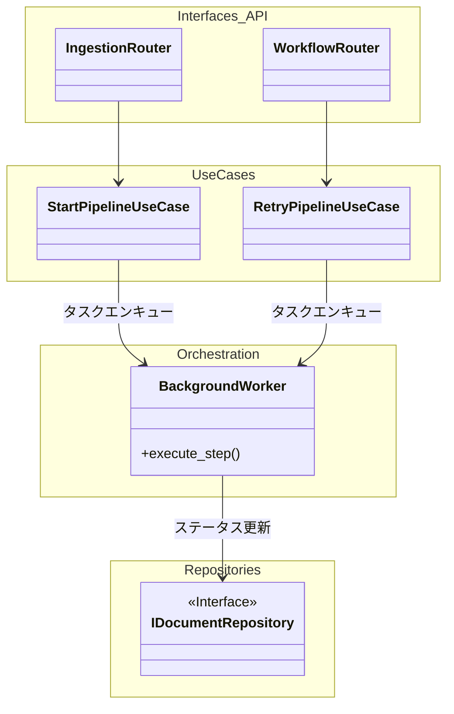
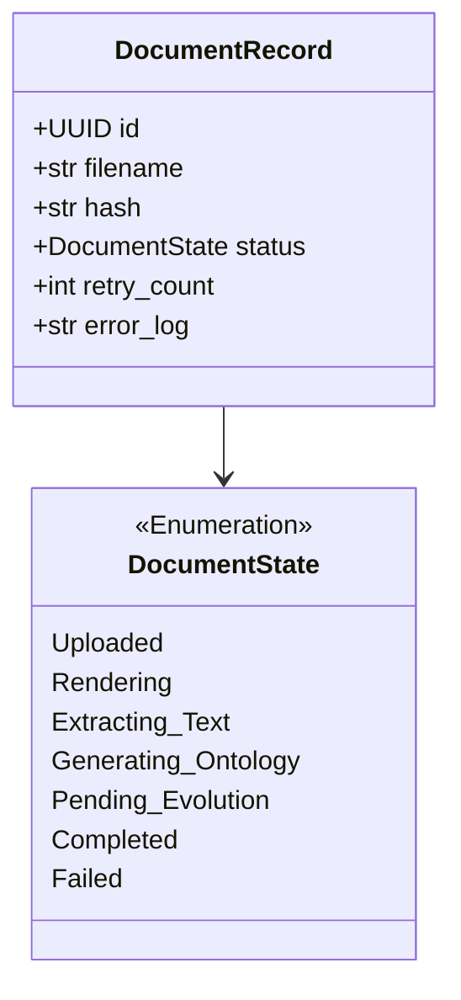
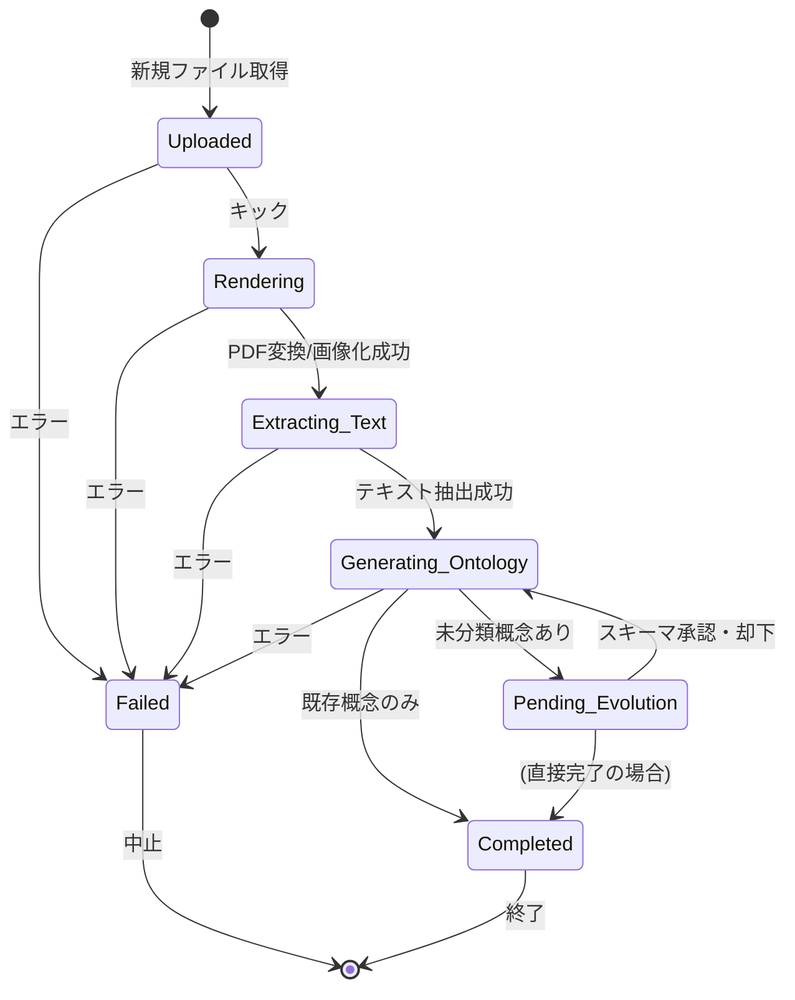
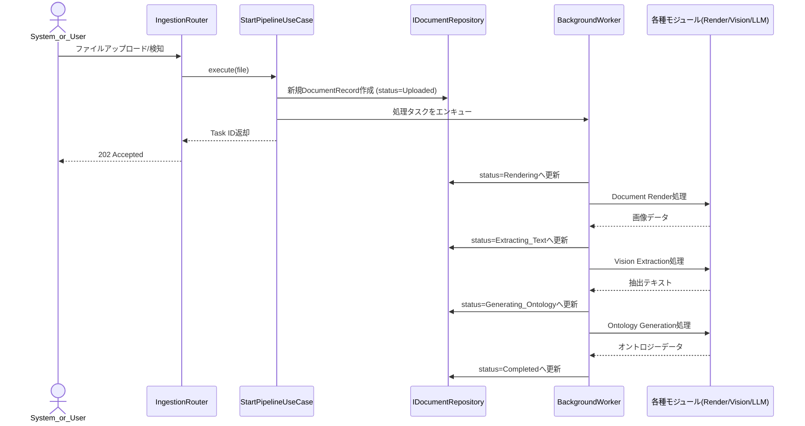

# 01. Workflow Orchestrator 詳細設計

## 1. 対象機能の概要・処理一覧

本システムにおける全体の実行をつかさどるワークフロー制御エンジン（Workflow Orchestrator）の設計詳細です。
ドキュメントのアップロードから画像化、テキスト抽出、オントロジー生成、スキーマ進化の判定に至るパイプラインを一元管理し、非同期タスクキューを利用してタスクを連動させます。

### 処理一覧
1. **ドキュメント収集（Ingestion）**: UIからの手動アップロード、ローカルフォルダの監視、外部URLの定期クロールによりドキュメントを取得する。
2. **ステート管理**: 処理フェーズごとに、DB上のドキュメントレコードのステータス（`Uploaded`, `Rendering`, `Extracting_Text`, `Generating_Ontology`, `Completed` 等）を更新する。
3. **非同期タスクのオーケストレーション**: 各処理モジュール（Render, Vision, Ontology等）を非同期ワーカーで順次実行する。
4. **エラーリカバリとリトライ**: 一時的エラー時の自動リトライ（指数的バックオフ）と、致命的エラー時のステータス停止（`Failed`）、および手動再開エンドポイントの提供を行う。

## 2. モジュール構成図・クラス図

### モジュール構成図

### クラス図（ステートとエンティティ）

## 3. 処理フロー図・シーケンス図

### 状態遷移（ステートマシン）フロー図

### 代表処理のシーケンス図（パイプライン実行）

## 4. APIインターフェース仕様 / 入出力データ（スキーマ）

- **`POST /api/v1/documents/upload`**: 手動アップロード（`multipart/form-data`）
- **`POST /api/v1/documents/register-path`**: ローカル監視対象のパスを登録（JSON Body: `path`）
- **`POST /api/v1/workflow/{id}/retry`**: エラーで停止したパイプラインの手動再開

## 5. 異常系・エラーハンドリング

| 想定されるエラー | 原因 | 対応方針 | HTTP/内部ステータス |
| :--- | :--- | :--- | :--- |
| **APIタイムアウト/一時的障害** | 外部LLMやOCR連携での遅延 | 非同期ワーカー内で指数的バックオフによる自動リトライ（最大N回）を実施。 | 内部リトライ処理 |
| **リトライ上限超過** | 復旧しない外部障害 | ドキュメントのステータスを `Failed` に遷移し、エラー詳細を `error_log` に記録。 | `Failed` ステータス |
| **ファイルパース不可** | 暗号化PDF、破損ファイル等 | 即座に `Failed` に遷移し、ログ記録。 | `Failed` ステータス |

## 6. 依存する環境変数・外部設定

- `CELERY_BROKER_URL` または `REDIS_URL`: バックグラウンドワーカー（RQやCelery）のキュー接続先。
- `MAX_RETRY_COUNT`: 自動リトライの最大試行回数。
- `WORKFLOW_STORAGE_PATH`: 一時保存用ファイルのローカルディレクトリパス。

## 7. テスト方針

- **単体テスト**: 各ステータス更新ロジック、およびリトライ上限時の `Failed` 遷移をモックワーカーで検証。
- **結合テスト**: 正常なファイルと壊れたファイルをAPIから投入し、バックグラウンドタスクが最後まで（`Completed` または `Failed` まで）遷移することを確認。
