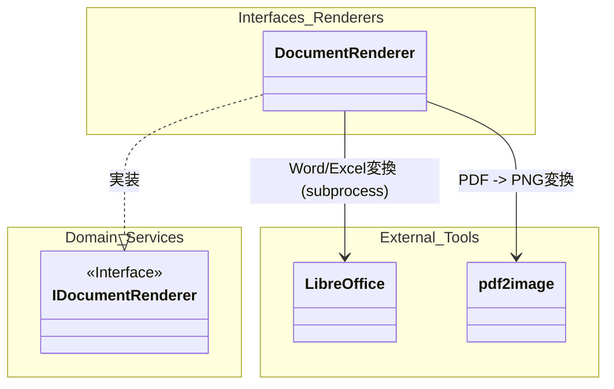
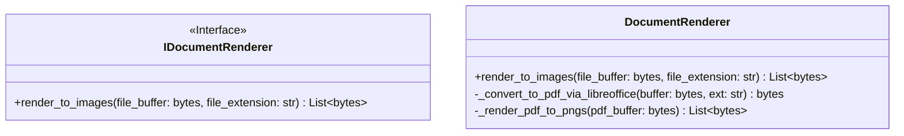
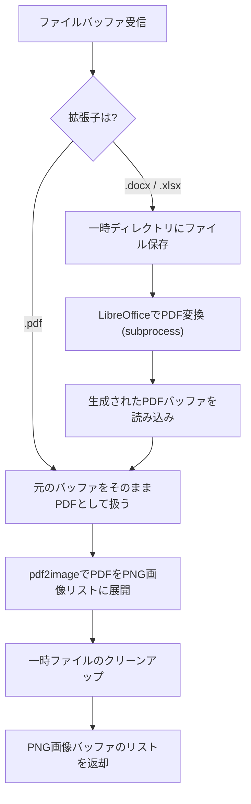
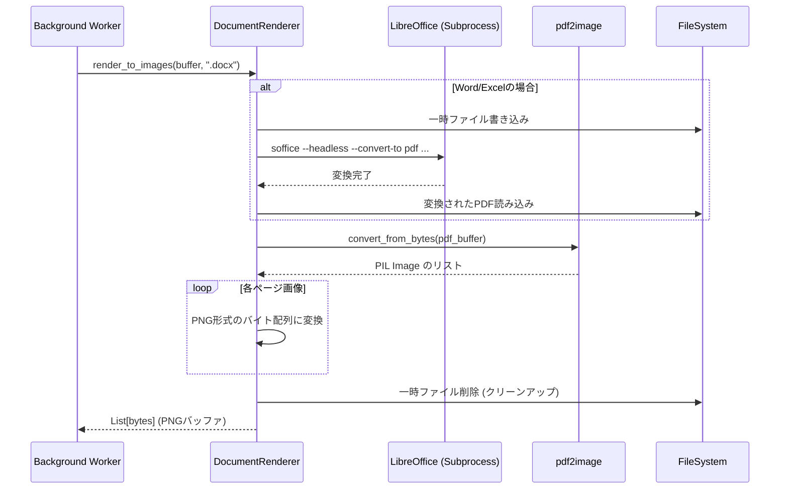

# 02. Document Render API 詳細設計

## 1. 対象機能の概要・処理一覧

アップロードされたPDF、Word、Excelデータを、非同期で画像バッファ（PNG）へレンダリングするモジュールです。後続のVision Extraction（テキスト抽出）で処理できるように、ドキュメントをページ単位の画像に変換します。

### 処理一覧
1. **ファイル形式判定**: 受け取ったバッファの拡張子（MIMEタイプ）を判定。
2. **中間フォーマット（PDF）変換**: WordやExcel等のOfficeファイルの場合は、LibreOfficeをヘッドレスモードで起動し、一時的にPDFへ変換。
3. **画像化（PNG変換）**: PDFの各ページを `pdf2image` ライブラリを用いてPNG画像バッファのリストとして展開。
4. **一時ファイルクリーンアップ**: 処理の過程で生成された一時ファイル（変換用のPDFなど）を安全に削除。

## 2. モジュール構成図・クラス図

### モジュール構成図

### クラス図

## 3. 処理フロー図・シーケンス図

### 処理フロー図

### シーケンス図

## 4. APIインターフェース仕様 / 入出力データ（スキーマ）

本機能は外部APIとして直接公開されるのではなく、Workflow Orchestrator（バックグラウンドワーカー）から内部ドメインサービスとして呼び出されます。

- **入力**: 
  - `file_buffer` (`bytes`): アップロードされたファイルのバイナリ。
  - `file_extension` (`str`): `".pdf"`, `".docx"`, `".xlsx"` など。
- **出力**: 
  - `List[bytes]`: ページごとのPNG画像バイナリデータのリスト。

## 5. 異常系・エラーハンドリング

| 想定されるエラー | 原因 | 対応方針 |
| :--- | :--- | :--- |
| **LibreOffice 変換エラー** | 不正なファイル構造、またはプロセス起動失敗 | 例外をスローし、一時ファイルを確実に削除した上で、Workflow側にエラーを伝播させる。 |
| **PDF パースエラー** | 破損したPDFファイル、パスワード保護付きPDF | `pdf2image` でのエラーを捕捉し、ユーザー対応が必要なエラーとして `Failed` ステータスへ遷移させる。 |
| **一時ファイル書き込み/削除失敗** | ディスク容量不足、パーミッションエラー | サーバー側の一時障害としてリトライ対象とするか、システム管理者に通知する。 |

## 6. 依存する環境変数・外部設定

- **LibreOffice**: システム（またはコンテナ内）に `libreoffice` または `soffice` コマンドがインストールされており、パスが通っていること。
- **Poppler**: `pdf2image` ライブラリが動作するために、OSレベルで `poppler-utils` がインストールされていること。

## 7. テスト方針

- **単体テスト**: 
  - 正当なPDFバイナリを渡し、期待されるページ数分のPNGバッファが返却されるかをテスト（LibreOfficeは呼ばれないことを確認）。
  - Word/Excelバイナリを渡し、`_convert_to_pdf_via_libreoffice` が呼ばれることをモックを使用して検証。
- **結合テスト**: 
  - 実際のテスト用 `.docx` ファイルを使用して、LibreOfficeのサブプロセス呼び出しからPNG変換までのエンドツーエンド処理が正常に完了し、かつ一時ファイルがシステムに残らない（クリーンアップされる）ことを確認。
