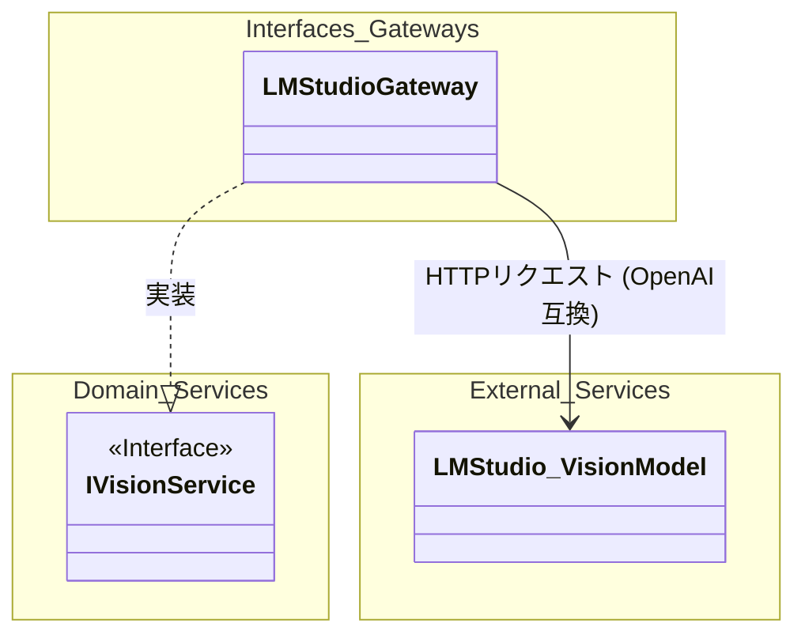
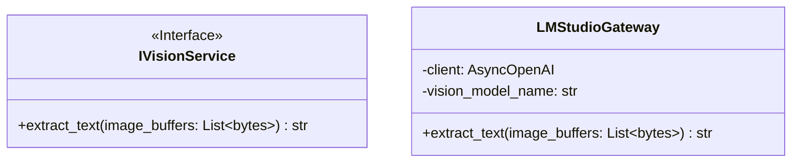
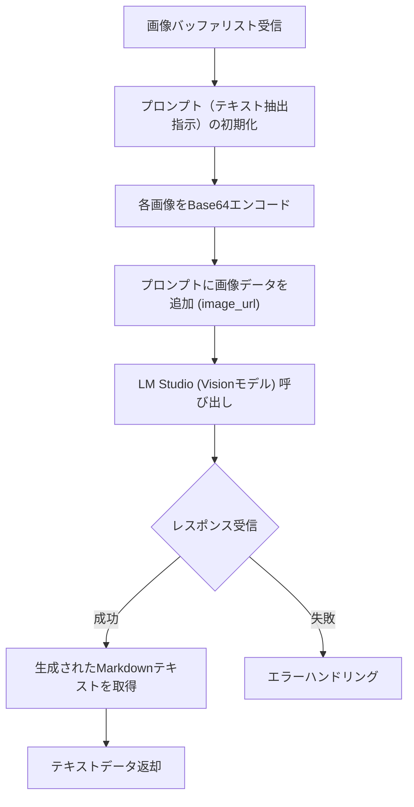
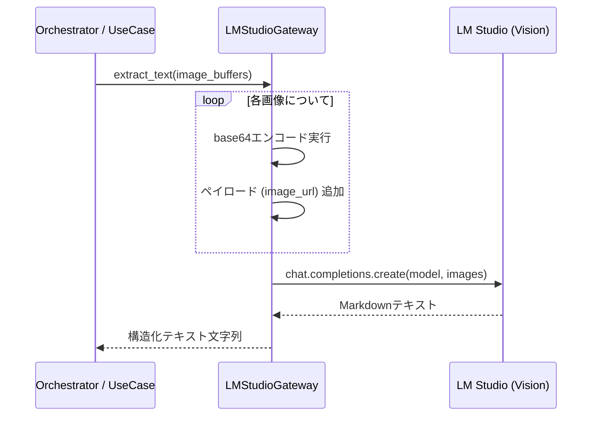

# 03. Vision Extraction API 詳細設計

## 1. 対象機能の概要・処理一覧

画像データ（PDFの各ページをPNG化したもの等）を受け取り、画像内に含まれる文書の構造（見出し、表、段落などのレイアウト情報）を維持したまま、Markdown形式の構造化テキストとして抽出する機能です。

### 処理一覧
1. **画像入力受付**: PNG画像バッファのリストを受け取る。
2. **Base64エンコード**: 各画像をBase64形式文字列に変換し、LLMに送信可能な形式（data URL形式）に組み立てる。
3. **プロンプト組み立て**: 抽出指示（システムプロンプト等）と画像データを結合し、Vision対応LLMへのリクエストペイロードを作成する。
4. **LLM推論 (Vision Extraction)**: ローカルLLM (LM Studio) のVisionモデルを呼び出し、Markdownテキストを生成する。
5. **結果返却**: 抽出されたMarkdown形式の文字列を返却する。

## 2. モジュール構成図・クラス図

### モジュール構成図

### クラス図

## 3. 処理フロー図・シーケンス図

### 処理フロー図

### シーケンス図

## 4. APIインターフェース仕様 / 入出力データ（スキーマ）

本機能は外部APIとして直接公開されるのではなく、内部サービス（ユースケース）から呼び出されます。

- **入力**: 
  - `image_buffers` (`List[bytes]`): テキスト抽出対象となるPNG形式の画像バイナリリスト。
- **出力**: 
  - `str`: 抽出された構造化テキスト（Markdownフォーマット）。

## 5. 異常系・エラーハンドリング

| 想定されるエラー | 原因 | 対応方針 |
| :--- | :--- | :--- |
| **LLM通信エラー** | LM Studioが起動していない、ネットワークエラー | `AsyncOpenAI` クライアントが投げる例外を上位に伝播させ、Orchestratorでリトライ制御を行う。 |
| **モデル未対応エラー** | 指定された `vision_model_name` がVision機能非対応 | 設定ミス。システム管理者に通知し、設定の修正を促す（即時 `Failed`）。 |
| **コンテキスト長超過** | 画像数が多すぎる、または解像度が高すぎる | ページ分割処理（数ページずつバッチ処理）の導入、または解像度ダウンサンプリングを検討。 |

## 6. 依存する環境変数・外部設定

- `LLM_API_BASE_URL`: LM StudioのAPIベースURL (例: `http://localhost:1234/v1`)
- `LLM_API_KEY`: APIキー (ダミー文字列可)
- `VISION_MODEL_NAME`: テキスト抽出に使用するVision対応モデルの名前（例: `llava-v1.5-7b`）

## 7. テスト方針

- **単体テスト**: 
  - `AsyncOpenAI` クライアントをモック化し、Base64エンコードとペイロード構築が正しく行われているかを検証。
- **結合テスト**: 
  - テスト用の小さなPNG画像を渡し、ローカルのLM Studioからテキストが返却されることを確認する（エンドツーエンド）。
