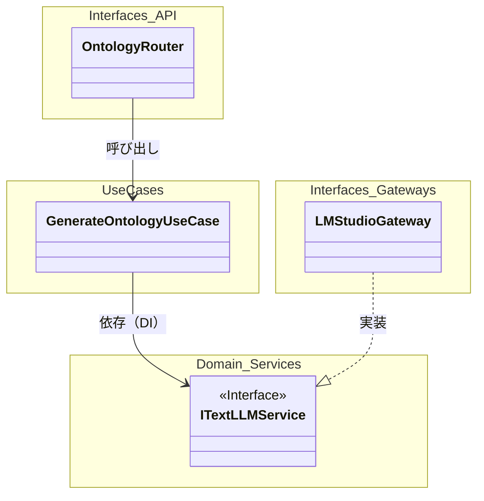
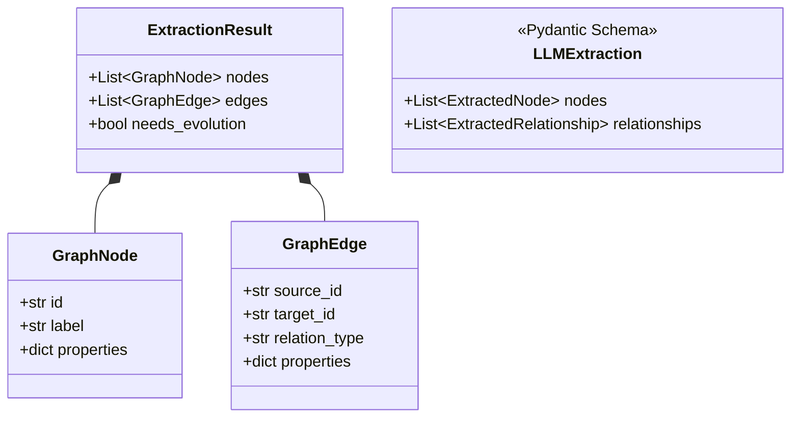
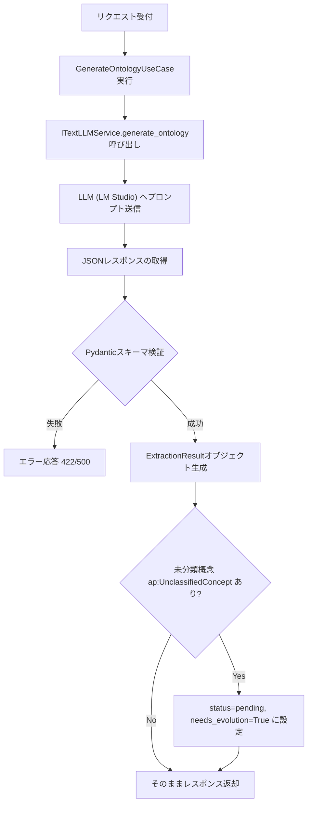
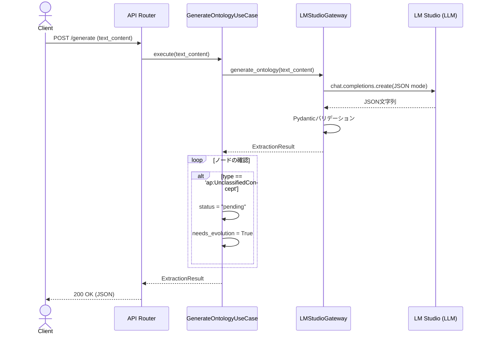

# 04. Ontology Generation API 詳細設計

## 1. 対象機能の概要・処理一覧

テキストデータ（主に行政ドキュメント等）を入力として受け取り、LLM（LM Studio等）を用いて知識グラフ（オントロジー）のノードおよびエッジを抽出する機能です。

### 処理一覧
1. **リクエスト受付**: クライアントから対象テキストを受け取る。
2. **LLM推論 (Ontology抽出)**: LLMにプロンプトとテキストを渡し、Structured Output (JSON) 形式でノードとエッジを抽出する。
3. **データ検証 (Validation)**: Pydanticを用いて、抽出結果が事前定義されたスキーマに従っているかを検証する。
4. **未分類概念の判定**: 抽出されたノードの中に未知の概念 (`ap:UnclassifiedConcept`) が含まれていないか判定し、必要に応じてフラグを設定する。
5. **結果返却**: 抽出結果（ノード配列、エッジ配列）をAPIレスポンスとして返す。

## 2. 対象機能のモジュール構成図・クラス図

### モジュール構成図
クリーンアーキテクチャに基づく、各モジュール間の依存関係です。

### クラス図（ドメイン・スキーマ定義）
オントロジー抽出に用いる主要なデータ構造です。

## 3. 対象機能の処理フロー図・シーケンス図

### 処理フロー図

### シーケンス図

## 4. APIインターフェース仕様 / 入出力データ（スキーマ）

### エンドポイント
- **`POST /generate`**

### リクエスト仕様
- **Content-Type**: `text/plain`
- **Body**: 抽出対象となるテキストデータ（行政手続きの要項など）。

### レスポンス仕様
- **Content-Type**: `application/json`
- **Status Code**: `200 OK`

#### データ構造の制約 (Pydanticバリデーションルール)

**ノード (ExtractedNode)**
- `id`: 正規表現 `^ap:[A-Za-z0-9_]+$` に一致すること。
- `type`: 以下のいずれかであること。
  - `ap:Procedure`, `ap:Actor`, `ap:Document`, `ap:Condition`, `ap:Organization`, `ap:InputItem`, `ap:LegalBasis`, `ap:UnclassifiedConcept`

**エッジ (ExtractedRelationship)**
- `type`: 以下のいずれかであること。
  - `ap:hasTargetActor`, `ap:requiresDocument`, `ap:producesDocument`, `ap:hasPrerequisite`, `ap:administeredBy`, `ap:basedOnLaw`, `ap:nextProcedure`

## 5. 異常系・エラーハンドリング

| 想定されるエラー | 原因 | 対応方針 | HTTPステータス |
| :--- | :--- | :--- | :--- |
| **LLM通信エラー** | APIキー無効、URL誤り、またはLM Studio未起動 | `ITextLLMService`内で例外を捕捉、または上層へ伝播させ、サーバーエラーとして返す。可能であればリトライを実施する。 | `500 Internal Server Error` |
| **パース/バリデーションエラー** | LLMが指定したJSONスキーマ（Pydantic定義）に沿わない形式で回答した | `LLMExtraction.model_validate()` でエラー発生。JSON再生成（リトライ）を試みるか、エラーとして終了する。 | `500 Internal Server Error` (内部起因) |
| **リクエスト不正** | リクエストボディが空、または不正な形式 | FastAPIの標準バリデーションにより自動的にエラーレスポンスを返す。 | `422 Unprocessable Entity` |

## 6. 依存する環境変数・外部設定

当該機能を動作させるためには、以下の環境変数（設定値）が必要です。

- `LLM_API_BASE_URL`: LM Studio等のOpenAI互換APIのベースURL (例: `http://localhost:1234/v1`)
- `LLM_API_KEY`: APIキー (LM Studioの場合は任意の文字列可)
- `TEXT_MODEL_NAME`: テキスト処理に使用するLLMのモデル名
- `LLM_TEMPERATURE`: LLMの出力のランダム性を制御するパラメータ（通常は `0.0` に近い値が望ましい）

## 7. テスト方針

- **単体テスト (Unit Test)**:
  - `GenerateOntologyUseCase` のテストでは、`ITextLLMService` をモック化し、LLMに依存せずに `ap:UnclassifiedConcept` の判定ロジック（`needs_evolution=True` 等）が正しく動作することを検証する。
  - `LMStudioGateway` のデータパース処理をテストする際、LLMのAPI応答（HTTPリクエスト）を `httpx` や `pytest-asyncio` のモックでシミュレートし、Pydanticのバリデーションエラー時の挙動を確認する。
- **結合テスト (Integration Test)**:
  - テスト用の簡易モデルをロードしたローカルのLM Studio環境を用いて、エンドツーエンドでの抽出精度とレスポンス形式を確認する。
