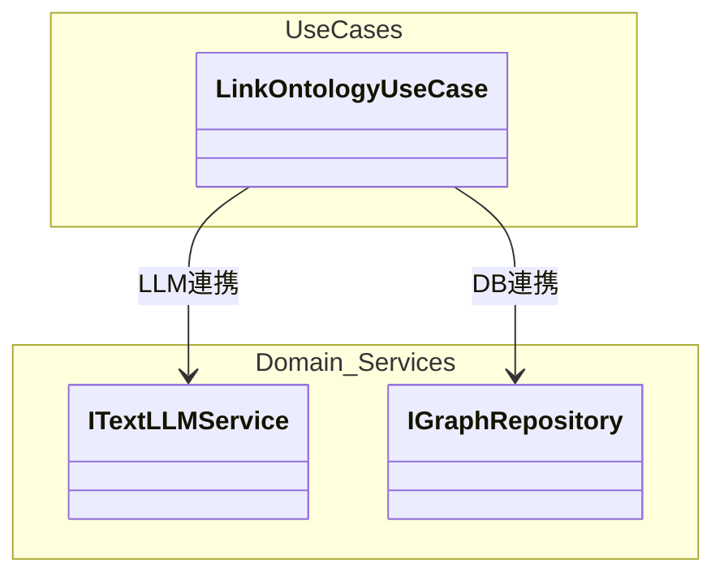
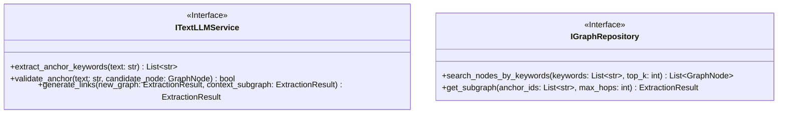
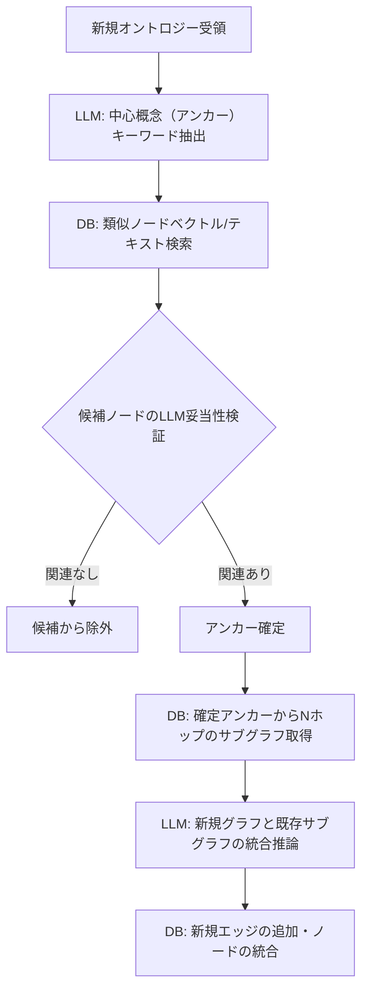
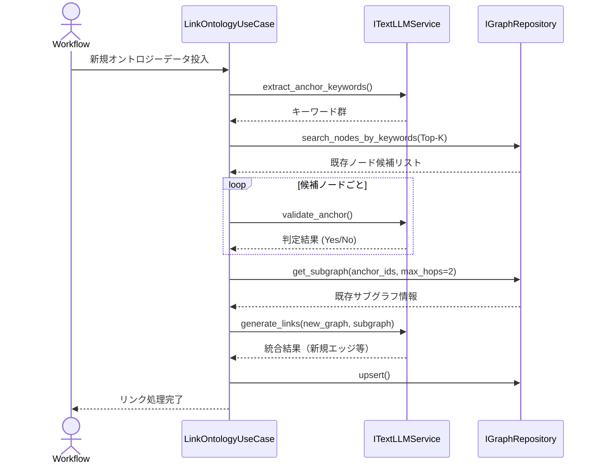

# 05. Ontology Linking & Merging 詳細設計

## 1. 対象機能の概要・処理一覧

新規ドキュメントから抽出された独自のオントロジー（ノード・エッジ群）を、グラフデータベース（Kùzu）に蓄積されている既存のオントロジー（知識グラフ）と関連付け、統合するための機能です。
多段LLM推論（アンカー探索＋サブグラフ拡張）を用いて、コンテキスト長を節約しつつ高精度なリンクを生成します。

### 処理一覧
1. **中心概念抽出**: 新規オントロジーから、検索起点となる「アンカー（キーワード）」をLLMで抽出。
2. **既存ノード検索**: アンカーを元に、VectorDB（pgvector）または文字列検索で既存グラフから類似ノード候補を取得。
3. **アンカー検証**: 検索ヒットしたノード候補が本当に新規文書の文脈と一致するか、LLMを用いて判定。
4. **サブグラフ取得**: 確定したアンカーノードを起点に、KùzuからNホップ以内の周辺グラフ情報を取得。
5. **最終統合推論**: 新規オントロジーと取得した周辺サブグラフをLLMに渡し、繋ぎ込み用のエッジや同一概念のマージ提案を生成する。
6. **DB更新**: 統合結果をグラフデータベースに永続化（Upsert）する。

## 2. モジュール構成図・クラス図

### モジュール構成図

### クラス図（依存インターフェース拡張）

## 3. 処理フロー図・シーケンス図

### 処理フロー図

### シーケンス図

## 4. APIインターフェース仕様 / 入出力データ（スキーマ）

本処理はOrchestratorから内部的に呼び出されます。

- **入力**: 
  - `new_extraction` (`ExtractionResult`): 直前に抽出された新規のノード・エッジデータ。
- **出力**: 
  - 成功時はDBへの永続化が行われ、ステータスとして完了を返却する。

## 5. 異常系・エラーハンドリング

| 想定されるエラー | 原因 | 対応方針 |
| :--- | :--- | :--- |
| **アンカー抽出失敗** | 該当ドキュメントが独立しすぎており、既存概念と一切ヒットしない | Isolated Graph（独立したサブグラフ）としてDBに保存する。後日進化プロセスで再検討される可能性がある。 |
| **LLM推論エラー** | コンテキスト長超過、または構造化出力エラー | 検索Top-K数やホップ数を減らして自動フォールバック（リトライ）を行う。 |

## 6. 依存する環境変数・外部設定

- KùzuDB および ベクトル検索エンジン（PostgreSQL/pgvector等）への接続設定。
- `MAX_SUBGRAPH_HOPS`: サブグラフ取得時の最大ホップ数（通常は 1 〜 2）。

## 7. テスト方針

- **単体テスト**: 
  - `LinkOntologyUseCase` に対し、`ITextLLMService` と `IGraphRepository` をモック化し、各ステップ（検索、検証、統合）が正しい順序で呼ばれるかを検証。
- **結合テスト**: 
  - 既知の「児童手当」オントロジーがDBにある状態で、関連する新規申請ドキュメントを入力し、正しい関係（例: `ap:requiresDocument`）が自動生成されるかを確認する。
