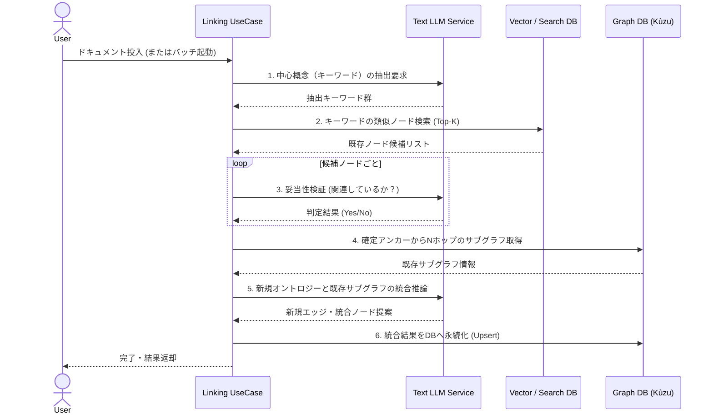

# 05. Ontology Linking & Merging 詳細設計

## 1. 概要
新規ドキュメントから抽出された独自のオントロジー（ノード・エッジ群）を、すでにグラフデータベース（Kùzu）に蓄積されている既存のオントロジー（知識グラフ）と関連付け、統合するためのアーキテクチャ詳細設計です。
APIコストが無料であるローカルLLM（LMStudio）の利点を活かし、多段推論による**「アンカー探索 ＋ サブグラフ拡張 (GraphRAG方式)」**を採用しています。

## 2. 処理アーキテクチャ（多段LLM推論フロー）

全体処理は以下の4つのステップで構成され、不要な全件検索を避けつつ、LLMに適切なコンテキスト（局所的なサブグラフ）のみを渡すことで、トークン制限の回避と推論精度の向上を両立します。

### ステップ1: LLMによる「中心概念（アンカー）」の抽出
新規ドキュメントのテキスト（または要約）をLLMに渡し、そのドキュメントの核となる重要な概念を抽出させます。
- **目的**: 既存グラフのどこに接続すべきかの「起点」となるキーワードを探す。
- **抽出対象**: 手続き名、主要な対象者、必須書類、管轄組織など（3〜5つ程度）。
- **出力例**: `["児童手当", "養育者", "市区町村窓口", "所得制限"]`

### ステップ2: ベクトル検索 / 全文検索による既存ノード照合
ステップ1で得られたキーワード群を使用し、システム内の検索エンジン（pgvectorによるベクトル検索、またはKùzuの文字列検索）を用いて、既存のオントロジーノードの中から類似度の高いTop-Kノードを取得します。
- **目的**: テキストの揺らぎ（「子供手当」と「児童手当」など）を吸収し、既存グラフ上の具体的なノードID（URI）を特定する。
- **出力例**: 既存ノード `ap:Procedure_JidouTeate`, `ap:Actor_Parent` のリスト。

### ステップ3: LLMによるアンカー候補の妥当性検証
ステップ2でヒットした「既存ノードの候補」と「新規ドキュメントの内容」を再度LLMに渡し、本当に同一または直接関連する概念であるかを検証させます。
- **目的**: ベクトル検索特有の「意味は似ているが文脈が違う（False Positive）」ノードを排除する。
- **プロンプトイメージ**: 「新規ドキュメントの内容と、既存ノード『児童手当の支給手続き』は関連していますか？理由とともにYes/Noで答えてください。」
- **結果**: `Yes` と判定された既存ノードが、正式な**「アンカーノード」**として確定します。

### ステップ4: サブグラフの取得と最終リンク生成
確定したアンカーノードを起点として、グラフデータベース（Kùzu）から**「Nホップ以内（例: 2ホップ）の周辺ノードとエッジ（サブグラフ）」**を取得します。
- **目的**: アンカー周辺の既存の論理構造（誰が対象で、何が必要か等）をコンテキストとしてLLMに提示する。
- **最終LLM推論**: 
  - **入力**: 「新規ドキュメントから抽出した新しいオントロジー」 ＋ 「Kùzuから取得した既存の周辺サブグラフ」
  - **指示**: 「これら2つのグラフ情報を統合し、新規ノードと既存ノードを繋ぐ新しい関係性（エッジ）、または同一概念の統合（ノードのマージ）を提案してください。」
- **出力**: 新たに追加すべきGraphEdgeのリスト、および更新すべきGraphNodeのリスト。

## 3. シーケンス図

## 4. 必要なインターフェース拡張

この処理方式を実現するため、各コンポーネントに以下のインターフェース拡張が必要となります。

- **`ITextLLMService`**:
  - `extract_anchor_keywords(text: str) -> List[str]`
  - `validate_anchor(text: str, candidate_node: GraphNode) -> bool`
  - `generate_links(new_graph: ExtractionResult, context_subgraph: ExtractionResult) -> ExtractionResult`
- **`IGraphRepository`**:
  - `search_nodes_by_keywords(keywords: List[str], top_k: int) -> List[GraphNode]` (Vector/Text検索)
  - `get_subgraph(anchor_ids: List[str], max_hops: int) -> ExtractionResult` (Kùzuクエリ)
