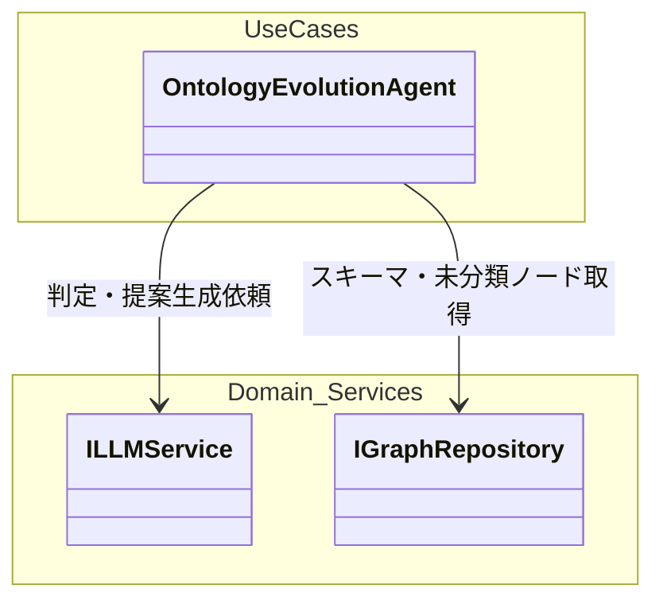
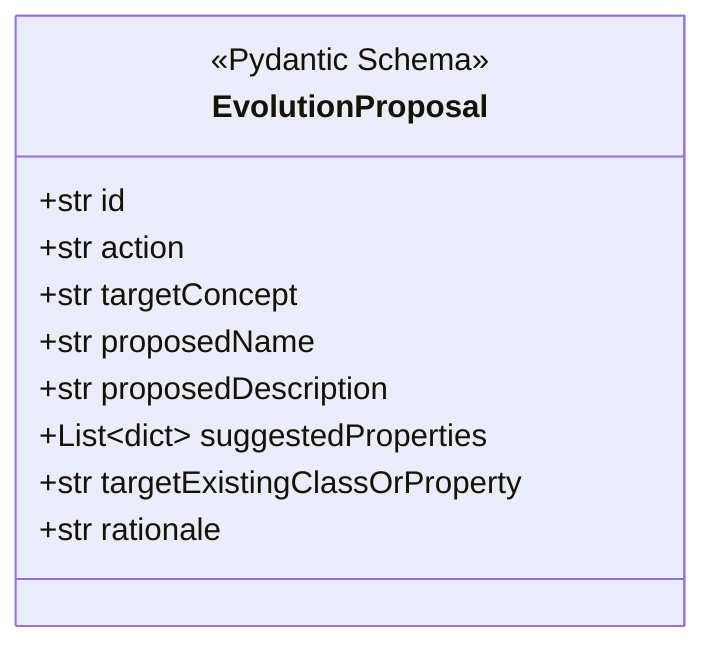
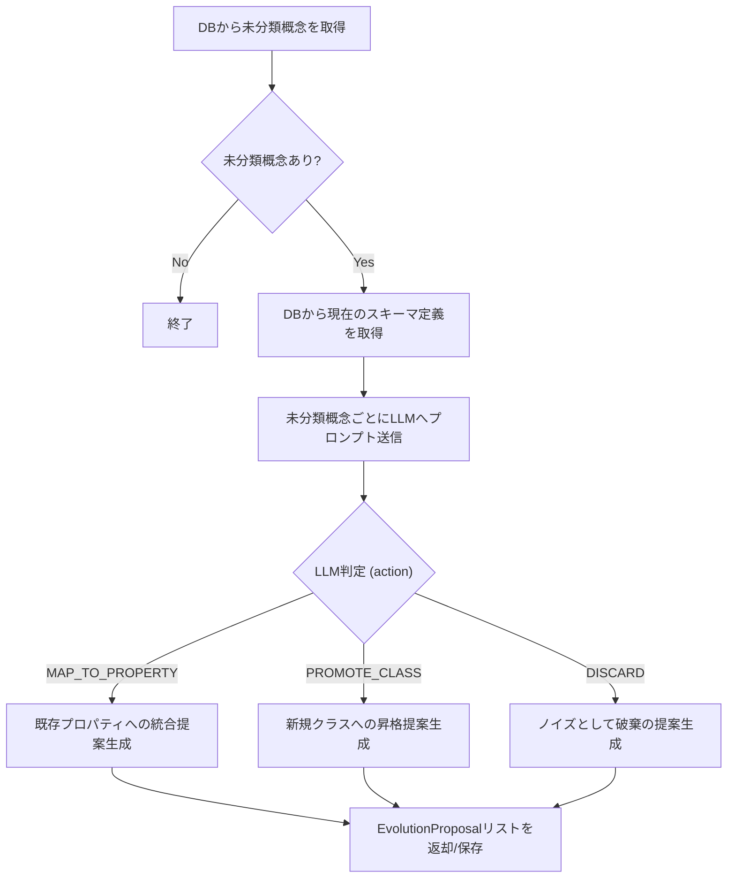
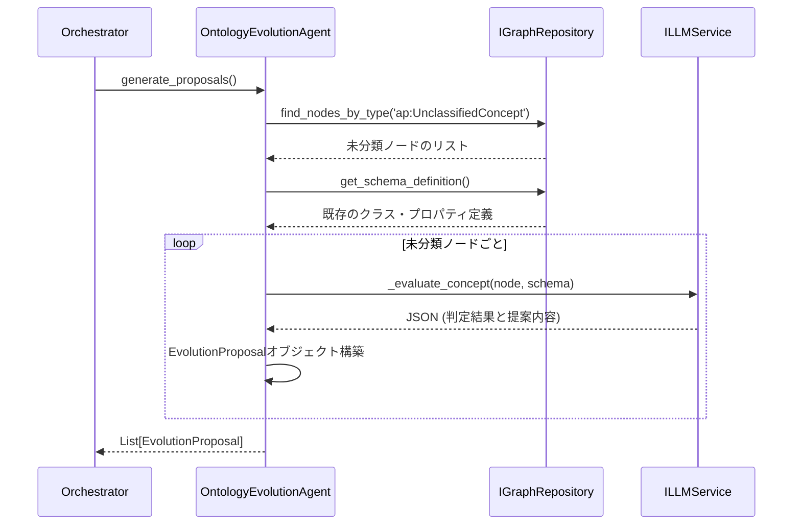

# 06. Ontology Evolution Agent 詳細設計

## 1. 対象機能の概要・処理一覧

ドキュメント解析やオントロジー生成処理の中で、既存の定義クラスに当てはまらない「未分類概念（`ap:UnclassifiedConcept`）」が見つかった場合に、LLM（Agent）がその概念を評価し、スキーマの進化提案（クラスの昇格や既存プロパティへのマッピング等）を生成する機能です。

### 処理一覧
1. **未分類概念の取得**: DBから `ap:UnclassifiedConcept` 型のノードを全て取得する。
2. **既存スキーマ情報の取得**: 現在システムに定義されているオントロジーのスキーマ（クラス、プロパティ）定義を取得する。
3. **LLM推論 (Triage)**: LLMに未分類概念と既存スキーマを渡し、「既存プロパティへのマッピング（MAP_TO_PROPERTY）」「新規クラスへの昇格（PROMOTE_CLASS）」「破棄（DISCARD）」のいずれかを判定させ、提案（EvolutionProposal）を生成する。
4. **提案の保存**: 生成された提案をデータベースに保存し、後続の人間（開発者・業務専門家）による承認待ち状態とする。

## 2. モジュール構成図・クラス図

### モジュール構成図

### クラス図（提案データモデル）

## 3. 処理フロー図・シーケンス図

### 処理フロー図

### シーケンス図

## 4. APIインターフェース仕様 / 入出力データ（スキーマ）

本モジュールは通常、定期バッチ処理またはオーケストレータから呼び出される内部サービスですが、手動実行APIも用意される場合があります。

- **入力**: なし（DBから自動取得）
- **出力**: `List[EvolutionProposal]`
  - `action`: `PROMOTE_CLASS` | `MAP_TO_PROPERTY` | `DISCARD`
  - `proposedName`: 推奨クラス名/プロパティ名
  - `rationale`: 判定に至った論理的根拠・推論プロセス（日本語）

## 5. 異常系・エラーハンドリング

| 想定されるエラー | 原因 | 対応方針 |
| :--- | :--- | :--- |
| **LLMパースエラー** | LLMが指定したJSON構造（EvolutionProposal）を返さなかった | リトライ処理を実行する。失敗が続く場合は当該ノードの処理をスキップし、アラートを出力する。 |
| **スキーマ取得エラー** | DB接続障害やスキーマデータ未初期化 | 即座に処理を中断し、エラーログを記録。 |

## 6. 依存する環境変数・外部設定

- `LLM_EVALUATION_MODEL`: 進化判定に使用するLLMモデル名（複雑な推論が必要なため、Claude 3.5 SonnetやGPT-4相当のモデルを推奨）。

## 7. テスト方針

- **単体テスト**: 
  - `ILLMService` をモック化し、各判定パターン（PROMOTE, MAP, DISCARD）のJSONレスポンスを返却させた際に、`EvolutionProposal` が正しくパースされるかを検証。
- **結合テスト**: 
  - テストDBに疑似的な `ap:UnclassifiedConcept` を挿入し、Agentを実行して期待通りの提案が生成・保存されることを確認。
