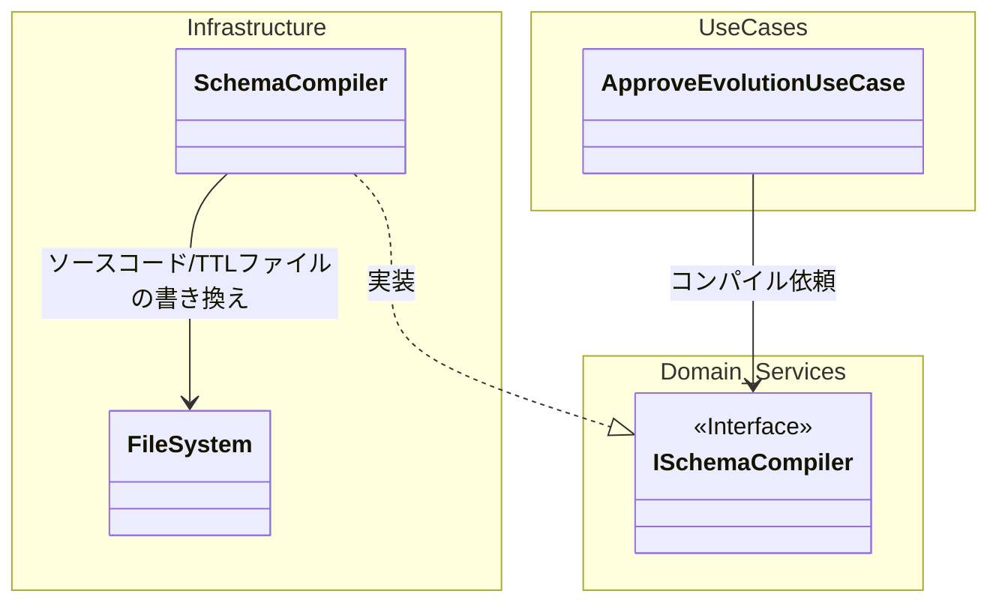
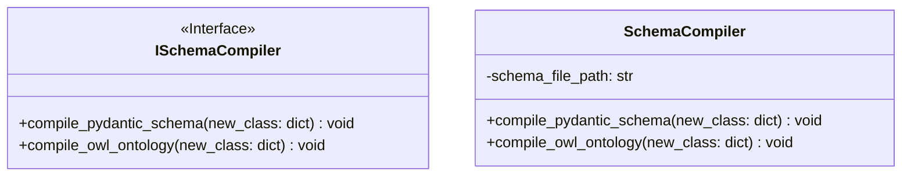
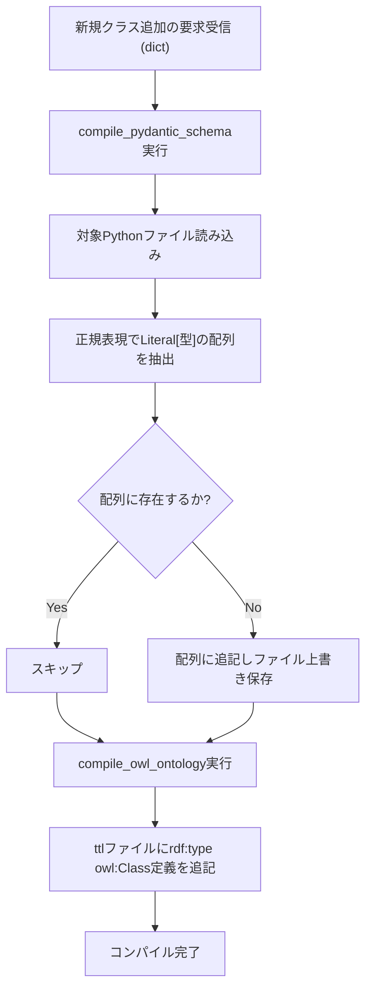
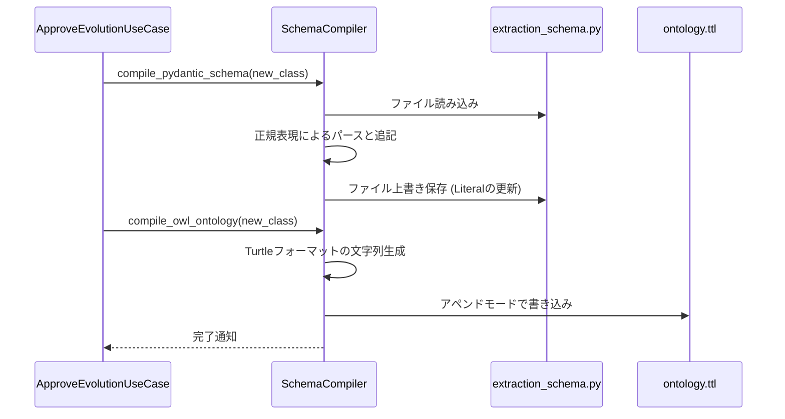

# 07. Schema Compiler 詳細設計

## 1. 対象機能の概要・処理一覧

開発者や業務専門家によって新しいオントロジークラスの追加（Schema Evolution）が承認された際に、システム内のソースコード（Pydanticスキーマ定義）および標準オントロジー定義ファイル（OWL/Turtle）を動的に書き換えるモジュールです。

### 処理一覧
1. **Pydanticスキーマのコンパイル**: `extraction_schema.py` 内の `Literal` 定義を正規表現で解析し、新規クラス名を追加して上書き保存する。
2. **OWL定義ファイルの更新**: W3C標準のオントロジー定義ファイル（`.ttl`）に、新規クラスのRDF/OWL定義フラグメントを追記する。
3. **ホットリロード連携（将来構想）**: コード変更後、FastAPI等のサーバープロセスが変更を検知して自動再起動（またはスキーマの動的再ロード）を行うよう促す。

## 2. モジュール構成図・クラス図

### モジュール構成図

### クラス図

## 3. 処理フロー図・シーケンス図

### 処理フロー図

### シーケンス図

## 4. APIインターフェース仕様 / 入出力データ（スキーマ）

本モジュールはAPIを持たず、ユースケースから呼び出されるドメインサービスとして機能します。

- **入力データ構造 (`new_class: dict`)**:
  - `name` (`str`): クラス名 (例: `NotificationForm`)
  - `description` (`str`): クラスの説明文
  - `properties` (`List[dict]`): 紐づくプロパティ情報

## 5. 異常系・エラーハンドリング

| 想定されるエラー | 原因 | 対応方針 |
| :--- | :--- | :--- |
| **ファイルIOエラー** | パーミッション不足、ファイルが存在しない | `IOError` 例外をスローし、APIレスポンスとして `500 Internal Server Error` を返す。ログにパスを記録。 |
| **正規表現パースエラー** | ソースコードの構造が手動で変更され、`type: Literal[...]` のパターンが見つからない | 静的書き換えが不可能なため例外をスロー。手動でのスキーマ修正を促すエラーログを出力。 |

## 6. 依存する環境変数・外部設定

- 編集対象のファイルパスは、初期化時に相対パスまたは環境変数（`SCHEMA_FILE_PATH`, `ONTOLOGY_TTL_PATH`）から解決される想定です。実行環境（コンテナ等）でファイル書き込み権限が必要です。

## 7. テスト方針

- **単体テスト**: 
  - ダミーのPythonファイルおよびTTLファイルを一時ディレクトリ（`tempfile`）に作成し、コンパイラを実行。
  - 実行後、Pythonファイルの `Literal` に指定したクラスが正しく追加され、構文エラー（SyntaxError）にならないか、`ast.parse` 等を用いて検証する。
  - TTLファイルに正しいRDFシンタックスが追記されているかを検証。
