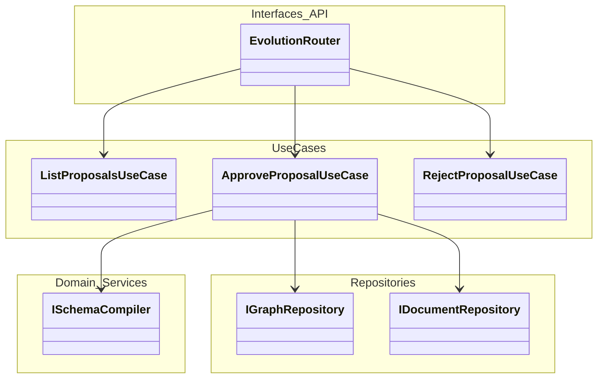
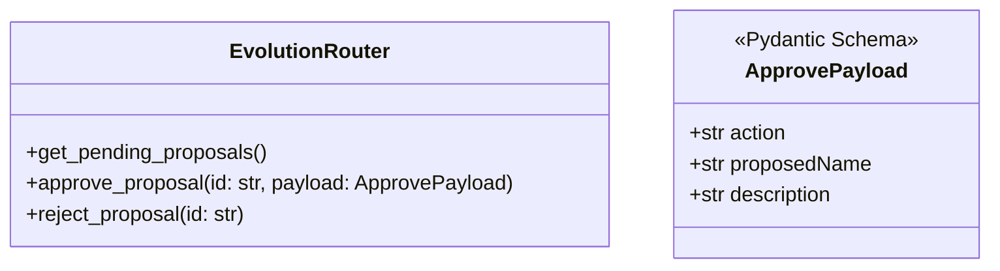
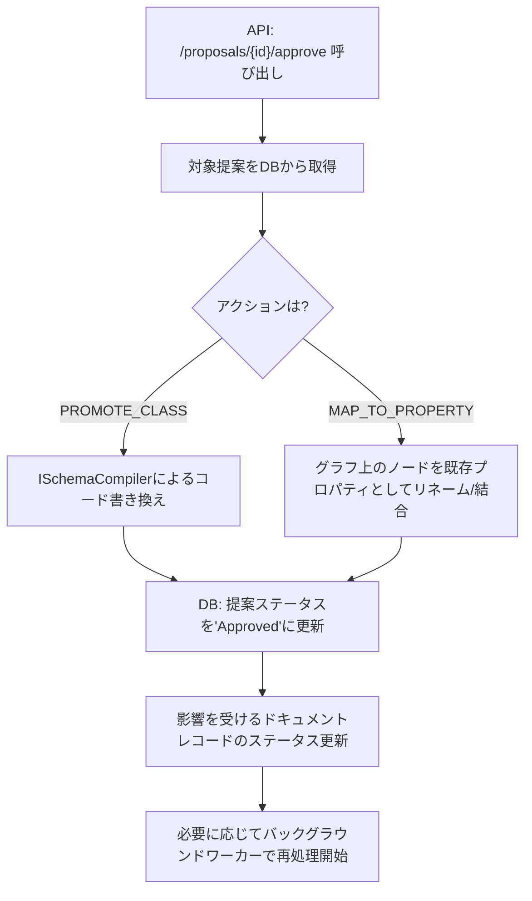
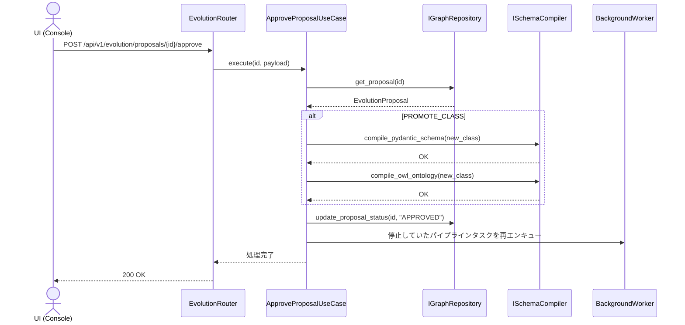

# 08. Schema Evolution API 詳細設計

## 1. 対象機能の概要・処理一覧

未分類概念に対する進化提案（Evolution Proposal）を管理し、ユーザー（開発者・業務専門家）からの承認・却下のアクションを受け付けるためのREST APIです。
承認された場合は、スキーマコンパイラを通じたコードの自動書き換えと、対象ドキュメントの再処理（パイプラインの再開）をトリガーします。

### 処理一覧
1. **提案一覧取得**: 保留中（Pending）の進化提案リストを取得する。
2. **提案の承認 (Approve)**: 提案内容（クラス昇格、マッピング等）を承認し、スキーマコンパイラを起動する。
3. **提案の却下 (Reject)**: 提案を却下し、対象の未分類概念ノードを破棄または無視リストに追加する。
4. **パイプライン再開**: 承認・却下によってステータスが確定した対象ドキュメントのオーケストレーションを再開（`Generating_Ontology` または `Completed` へ遷移）させる。

## 2. モジュール構成図・クラス図

### モジュール構成図


### クラス図


## 3. 処理フロー図・シーケンス図

### 処理フロー図（Approve）


### シーケンス図


## 4. APIインターフェース仕様 / 入出力データ（スキーマ）

### 4.1 提案一覧取得
- **`GET /api/v1/evolution/proposals`**
- **レスポンス**: `List[EvolutionProposal]`

### 4.2 提案の承認
- **`POST /api/v1/evolution/proposals/{id}/approve`**
- **リクエストボディ** (`ApprovePayload`):
  ユーザーが提案内容を微修正して承認できるように、LLMの生成内容を上書き可能です。
  ```json
  {
    "action": "PROMOTE_CLASS",
    "proposedName": "CustomForm",
    "description": "ユーザー定義フォーム"
  }
  ```
- **レスポンス**: `200 OK`

### 4.3 提案の却下
- **`POST /api/v1/evolution/proposals/{id}/reject`**
- **レスポンス**: `200 OK`

## 5. 異常系・エラーハンドリング

| 想定されるエラー | 原因 | 対応方針 | HTTPステータス |
| :--- | :--- | :--- | :--- |
| **対象提案が存在しない** | 不正なID、または既に処理済み | 例外を捕捉し、404を返却する。 | `404 Not Found` |
| **コンパイル失敗** | `SchemaCompiler` でのファイル書込エラー | 500エラーとして返却し、DB上のステータスはPendingのままとする（ロールバック）。 | `500 Internal Server Error` |

## 6. 依存する環境変数・外部設定

- スキーマコンパイルに利用するファイルパス等の設定（`SchemaCompiler` 側の設定に依存）。

## 7. テスト方針

- **API結合テスト**:
  - `FastAPI` の `TestClient` を使用。
  - テスト用DBにPending状態の提案をセットアップし、`/approve` を呼び出す。
  - `SchemaCompiler` のメソッドが意図した引数でコールされたか（モック化して検証）、およびDBのステータスが `Approved` に変わったかを確認する。
