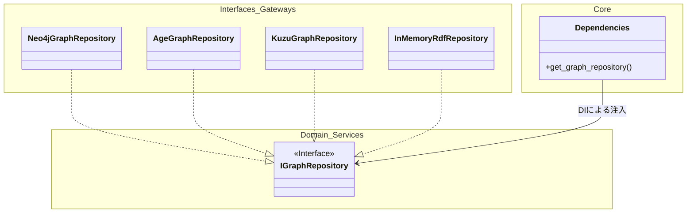
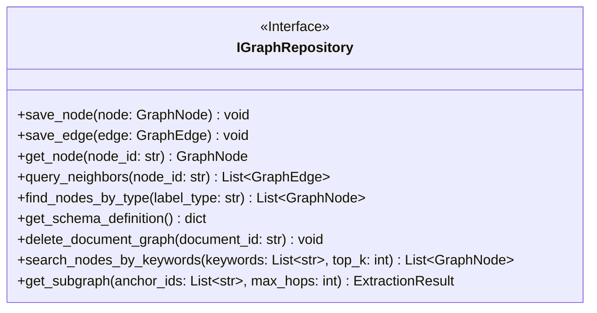
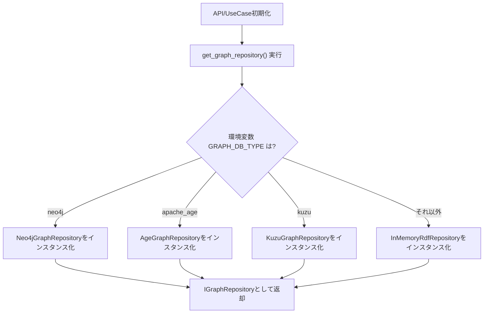
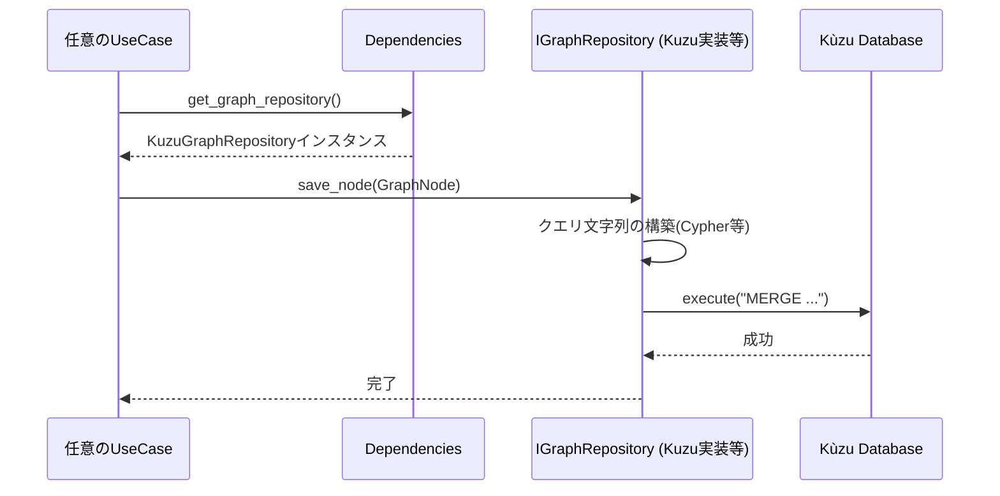

# 09. Graph Repository 詳細設計

## 1. 対象機能の概要・処理一覧

特定のデータベース製品（Neo4j, Apache AGE, Kùzu等）への依存を排除し、アプリケーション全体からグラフデータベース（知識グラフ）への共通アクセス基盤を提供するリポジトリアクセス層です。

### 処理一覧
1. **データ保存・更新**: `GraphNode` や `GraphEdge` を受け取り、データベースのスキーマに合わせて永続化（Upsert）する。
2. **データ検索**: ノードID指定の取得や、近傍エッジ（1ホップ）の取得を行う。
3. **メタデータ・特殊検索**: 特定タイプ（`ap:UnclassifiedConcept` 等）のノード検索や、現在のシステムスキーマ定義を取得する。
4. **サブグラフ・全文/ベクトル検索**: オントロジー統合時に利用する、キーワードベースのアンカー検索や、指定ホップ数のサブグラフ取得処理を提供する。
5. **依存性注入 (DI)**: 環境変数（`GRAPH_DB_TYPE`）に基づいて、アプリケーション起動時に適切なデータベース実装（Gateway）を動的にバインドする。

## 2. モジュール構成図・クラス図

### モジュール構成図

### クラス図

## 3. 処理フロー図・シーケンス図

### 処理フロー図（DIによる動的バインド）

### シーケンス図（ノード保存処理の抽象化）

## 4. APIインターフェース仕様 / 入出力データ（スキーマ）

本モジュールは内部ドメインサービスであり、直接のREST APIは持ちません。
入出力にはドメインモデルである `GraphNode`, `GraphEdge`, およびこれらをまとめた `ExtractionResult` を共通言語として使用します。

## 5. 異常系・エラーハンドリング

| 想定されるエラー | 原因 | 対応方針 |
| :--- | :--- | :--- |
| **データベース接続エラー** | DBサーバーダウン、認証失敗 | DBドライバ固有の例外を捕捉し、共通の `DatabaseConnectionError` にラップして上位（UseCase）へ伝播。 |
| **クエリ構文エラー/制約違反** | 保存しようとしたデータ型がDBスキーマと不一致 | `RepositoryError` としてログを出力。パイプライン中の場合は当該ドキュメント処理を `Failed` とする。 |

## 6. 依存する環境変数・外部設定

- `GRAPH_DB_TYPE`: 利用するデータベースエンジン (`neo4j`, `apache_age`, `kuzu`, `inmemory`)
- `NEO4J_URI`, `NEO4J_USER`, `NEO4J_PASSWORD`: Neo4j選択時の接続情報
- `POSTGRES_DSN`: Apache AGE選択時のPostgreSQL接続情報
- `KUZU_DB_PATH`: Kùzu選択時のローカルDBファイル保存パス

## 7. テスト方針

- **単体テスト**: 
  - `InMemoryRdfRepository` を用いるか、`IGraphRepository` のモック（MagicMock）を作成し、上位ユースケース層のロジックがDB製品に依存せずに動作することをテストする。
- **結合テスト**: 
  - 各具象リポジトリ（Neo4j, Kuzu等）ごとにテストコンテナ・テストDBを用意し、インターフェースの全メソッドが期待通りにDBの読み書きを行えるかを検証する。
