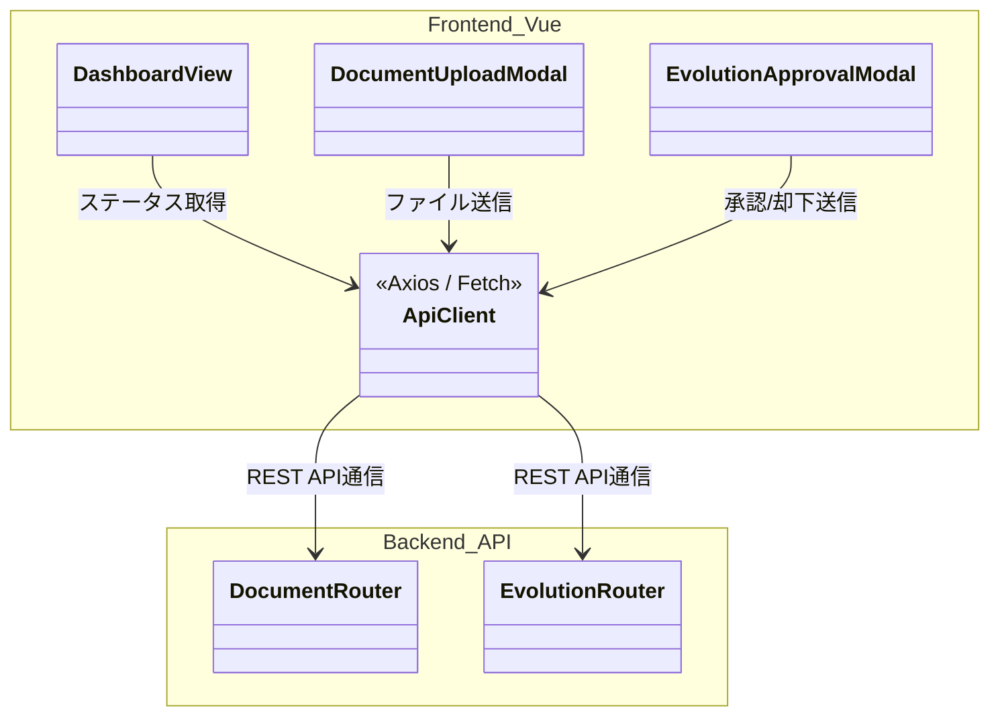
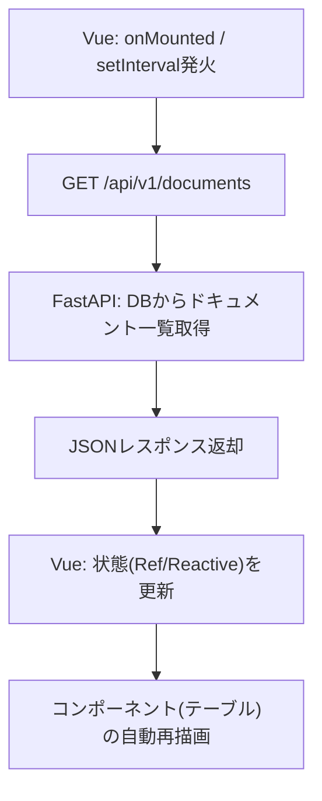
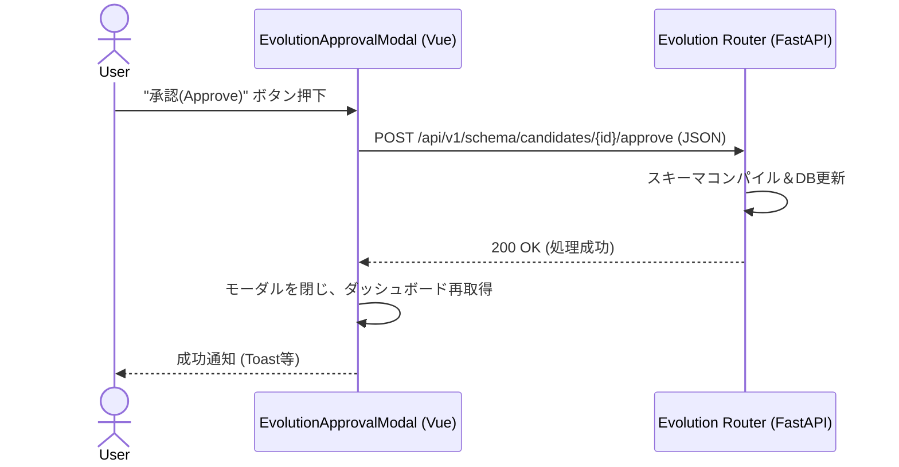

# 10. Console UI 詳細設計

## 1. 対象機能の概要・処理一覧

バックグラウンド実行エンジンの処理状況をモニタリングし、必要最小限のユーザー介入（ドキュメントのアップロードや、AIからのスキーマ進化提案の承認）を行うためのダッシュボードUIです。
Graph Visualization機能（GraphViewer.vue）と統合された **Vue 3 + Vite** ベースのSPA（Single Page Application）として構築されます。

### 処理一覧
1. **ダッシュボード監視**: Vueコンポーネントからの定期ポーリング（またはWebSocket）により、バックエンドの `/api/v1/documents` から最新のドキュメント処理ステータス（JSON）を取得し、テーブルを更新する。
2. **ドキュメント登録**: ファイルアップロードフォームからの非同期リクエスト送信。
3. **スキーマ進化管理**: AI（Agent）が提案した未知概念のクラス昇格・マッピング提案（`/api/v1/schema/candidates`）をプレビューし、承認/却下アクションをバックエンドへ送信する。
4. **エラー管理・リトライ**: 処理に失敗したドキュメントのエラーログを展開し、再試行リクエストを送信する。

## 2. モジュール構成図・クラス図

### モジュール構成図

## 3. 処理フロー図・シーケンス図

### 処理フロー図（ダッシュボード更新）

### シーケンス図（スキーマ進化の承認）

## 4. APIインターフェース仕様 / 入出力データ

Console UIはバックエンドのREST APIとJSONで通信します。（APIの詳細な入出力スキーマは `02_system_design.md` や関連機能の詳細設計書に準じます）

- **`GET /api/v1/documents`**: ダッシュボードのステータスリスト取得
- **`POST /api/v1/documents/upload`**: ドキュメントのアップロード
- **`GET /api/v1/schema/candidates`**: スキーマ進化の候補リスト取得
- **`POST /api/v1/schema/candidates/{id}/approve`**: スキーマ進化の承認

## 5. 異常系・エラーハンドリング

| 想定されるエラー | 原因 | 対応方針 |
| :--- | :--- | :--- |
| **ポーリング通信失敗** | サーバーダウン、ネットワーク切断 | Axios等のインターセプターで検知し、画面上部に赤色のトースト通知「サーバーとの接続が切れました」を表示。 |
| **アップロードエラー** | ファイルサイズ超過、未対応形式 | サーバーからの `400 Bad Request` などのエラーメッセージを解釈し、フォーム上部にエラー表示する。 |
| **承認処理失敗** | 他ユーザーが既に処理済み、DBエラー | 更新失敗の旨をToastやモーダル内にエラーとして表示し、リストを最新状態にリフレッシュする。 |

## 6. 依存する環境変数・外部設定

- **フロントエンドビルド**: Vue 3 / Vite のビルド環境。本番稼働時はビルド済みの静的ファイル（`dist/`）をFastAPI (`StaticFiles`) から配信するか、Nginx等のWebサーバーでホスティングします。
- **UIフレームワーク**: TailwindCSSを用いたスタイリングを利用。

## 7. テスト方針

- **フロントエンド表示テスト**:
  - `Vitest` や `Vue Test Utils` を用い、モックのAPIレスポンスを受け取った際にテーブルやモーダルが正しくレンダリングされるかテストする。
- **E2Eテスト**:
  - Playwright 等を使用し、アップロードから承認までの一連のユーザー操作が正常に機能するかテストする。
