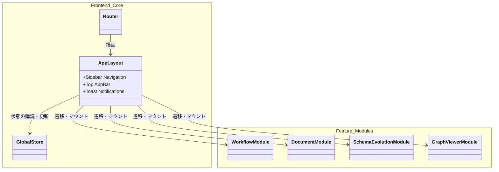

# 10. Console UI 詳細設計

## 1. 対象機能の概要・処理一覧

ontoNgnが提供する様々な機能群（ワークフロー、スキーマ管理、ドキュメント管理、グラフ探索等）へアクセスするための、**ポータル画面（App Shell）** としての役割を担うフロントエンドUI（Vue 3 + ViteベースのSPA）の設計です。

ここには、全体レイアウト（ヘッダー、サイドバー等）とルーティング基盤のみを定義します。個別の機能詳細（ワークフロー画面やスキーマ進化画面など）はそれぞれの詳細設計書に委譲します。

### 処理一覧
1. **全体ナビゲーション**: サイドバーおよびトップメニューによるサブシステム間の画面遷移（`vue-router`）を提供します。
2. **グローバル状態管理**: 認証情報やグローバルな通知（Toast/Snackbar）を一元管理します（`Pinia` 等）。
3. **メニュー項目（サブシステムへのルーティング）**:
   - `ダッシュボード (ポータルトップ)`
   - `ワークフロー管理 (01_workflow_orchestrator.md に委譲)`
   - `ドキュメント管理 (12_document_management.md に委譲)`
   - `スキーマ進化・承認 (08_schema_evolution_api.md に委譲)`
   - `ナレッジグラフ探索 (11_graph_visualization.md に委譲)`

## 2. モジュール構成図・クラス図

### モジュール構成図

## 3. 処理フロー図・シーケンス図

ポータルとしての処理フローは「各サブモジュール画面へのシームレスなSPA遷移」となるため、複雑なバックエンドシーケンスは持ちません。

## 4. APIインターフェース仕様 / 入出力データ

Console UI本体（App Shell）が直接呼び出す固有の業務APIはありません。
（※ 各サブモジュールがマウントされた後に、それぞれの機能がAPIを呼び出します。）

## 5. 異常系・エラーハンドリング

| 想定されるエラー | 原因 | 対応方針 |
| :--- | :--- | :--- |
| **ルーティングエラー（404）** | 存在しないURLへのアクセス | グローバルな「Page Not Found」画面を表示する。 |
| **グローバルAPI通信エラー** | 認証トークン切れ、システム全体ダウン | APIクライアント共通のインターセプタでキャッチし、ログイン画面へのリダイレクトや「システム障害」の全体通知を表示する。 |

## 6. 依存する環境変数・外部設定

- **VITE_API_BASE_URL**: 各モジュールがバックエンドのFastAPIにリクエストを送信する際のベースURL。
- **UIフレームワーク**: Vuetify, Quasar, または TailwindCSS ベースのコンポーネントライブラリなどを利用して共通レイアウトを構築。

## 7. テスト方針

- **レイアウト・ナビゲーションテスト**:
  - `vue-router` をモックし、サイドバーのリンクをクリックした際に正しいURLへ遷移するかを `Vue Test Utils` で検証する。
- **グローバル状態テスト**:
  - `Pinia` のストアを用いて、トースト通知の表示・非表示アクションが正しく機能するかを単体テストで検証する。
