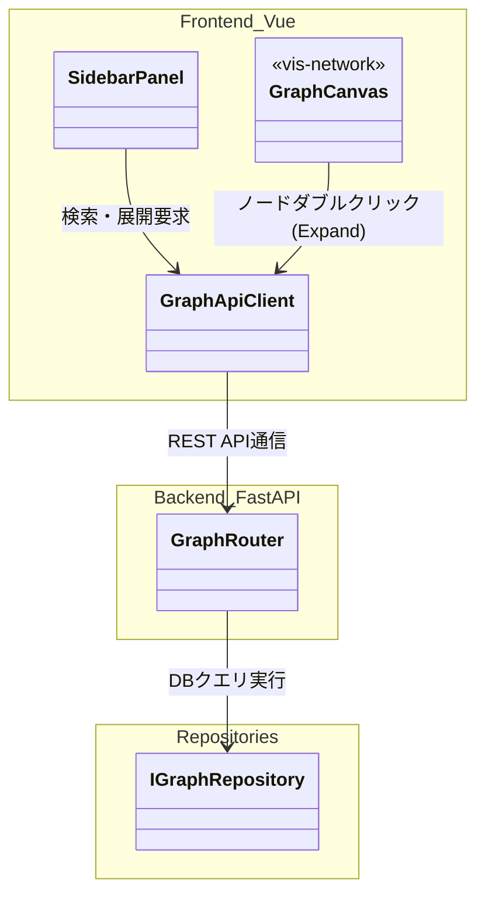
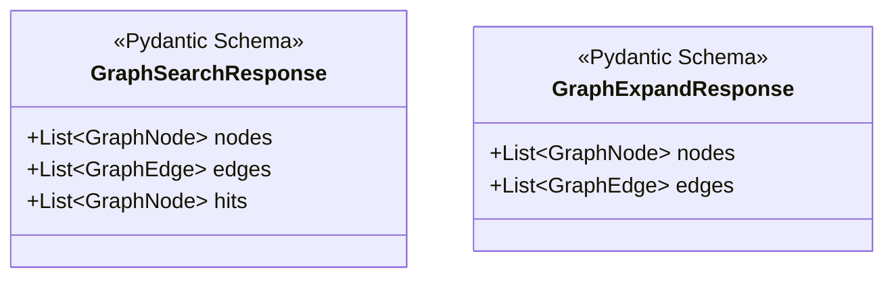
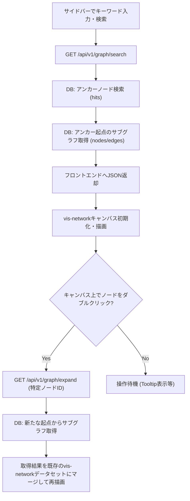
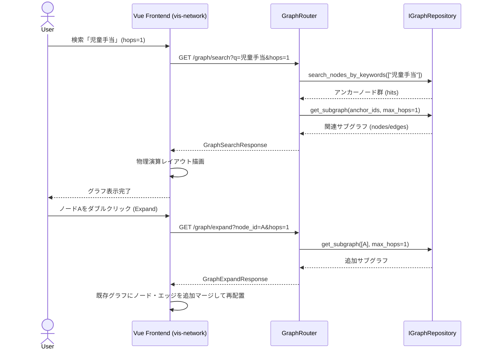

# 11. Graph Visualization (グラフ可視化機能) 詳細設計

## 1. 対象機能の概要・処理一覧

Kùzu DB内に蓄積されたオントロジーデータ（ノードおよびエッジ）を視覚的に探索・確認するためのUIおよびAPIです。
大規模なグラフ全体を一度に描画することによるパフォーマンス低下を防ぐため、**「キーワード検索を起点としたサブグラフの表示」**アプローチを採用しています。

### 処理一覧
1. **キーワード検索**: ユーザーが入力したキーワードから関連するアンカーノードを検索する。
2. **サブグラフ展開**: 検索されたアンカーノード、または画面上で選択したノードを起点として、指定ホップ数（Nホップ以内）のサブグラフを取得する。
3. **グラフ描画・物理演算**: フロントエンドにて `vis-network` を用い、ノードとエッジを物理演算（Force-directed）レイアウトで描画・再配置する。
4. **詳細情報表示**: 画面上のノード・エッジをクリックした際に、プロパティ詳細情報をツールチップ/サイドパネルで表示する。

## 2. モジュール構成図・クラス図

### モジュール構成図

### クラス図（API入出力スキーマ）

## 3. 処理フロー図・シーケンス図

### 処理フロー図

### シーケンス図

## 4. APIインターフェース仕様 / 入出力データ（スキーマ）

### 4.1 検索起点のグラフ取得
- **`GET /api/v1/graph/search`**
- **Query Params**: `q` (キーワード), `hops` (デフォルト1), `limit` (デフォルト50)
- **Response**: `nodes`, `edges`, `hits` (アンカーとなったノードリスト) のリストを含むJSON。

### 4.2 指定ノードからのサブグラフ展開
- **`GET /api/v1/graph/expand`**
- **Query Params**: `node_id` (起点ノードID), `hops` (デフォルト1)
- **Response**: `nodes`, `edges` のリストを含むJSON（既存UIへのマージ用）。

## 5. 異常系・エラーハンドリング

| 想定されるエラー | 原因 | 対応方針 |
| :--- | :--- | :--- |
| **検索ヒットなし** | キーワードに合致するノードがDBに存在しない | 空のレスポンス（`nodes=[]`, `hits=[]`）を返し、フロントエンド側で「該当ノードが見つかりません」と表示する。 |
| **ノード数が多すぎる** | ハブとなっているノードを展開した等 | DBクエリ側で `limit` を設け（例: 500ノード）、超過した場合は警告メッセージ付きで制限されたサブグラフを返す。 |
| **バックエンド通信エラー** | APIサーバーダウン | フロントエンドでエラーをCatchし、画面にエラー通知（Toast）を表示する。 |

## 6. 依存する環境変数・外部設定

- **フロントエンドビルド**: Vue 3 / Vite のビルド環境。開発時はVite dev-server を用いる。本番稼働時はビルド済みの静的ファイルをFastAPI (`StaticFiles`) から配信するため、設定パス（`STATIC_DIR` 等）の整合性が必要。
- **グラフ描画ライブラリ**: `vis-network` (NPMパッケージ)

## 7. テスト方針

- **単体テスト (バックエンド)**:
  - `GraphRouter` の各エンドポイントを `TestClient` で呼び出し、`IGraphRepository` をモック化して、`hops` や `limit` パラメータが正しく伝搬されるかを検証。
- **単体テスト (フロントエンド)**:
  - `Vitest` を用いて、APIクライアントモジュールが正しく `GraphSearchResponse` をパースし、vis-network 用のデータセットにマージできるかをテスト。
