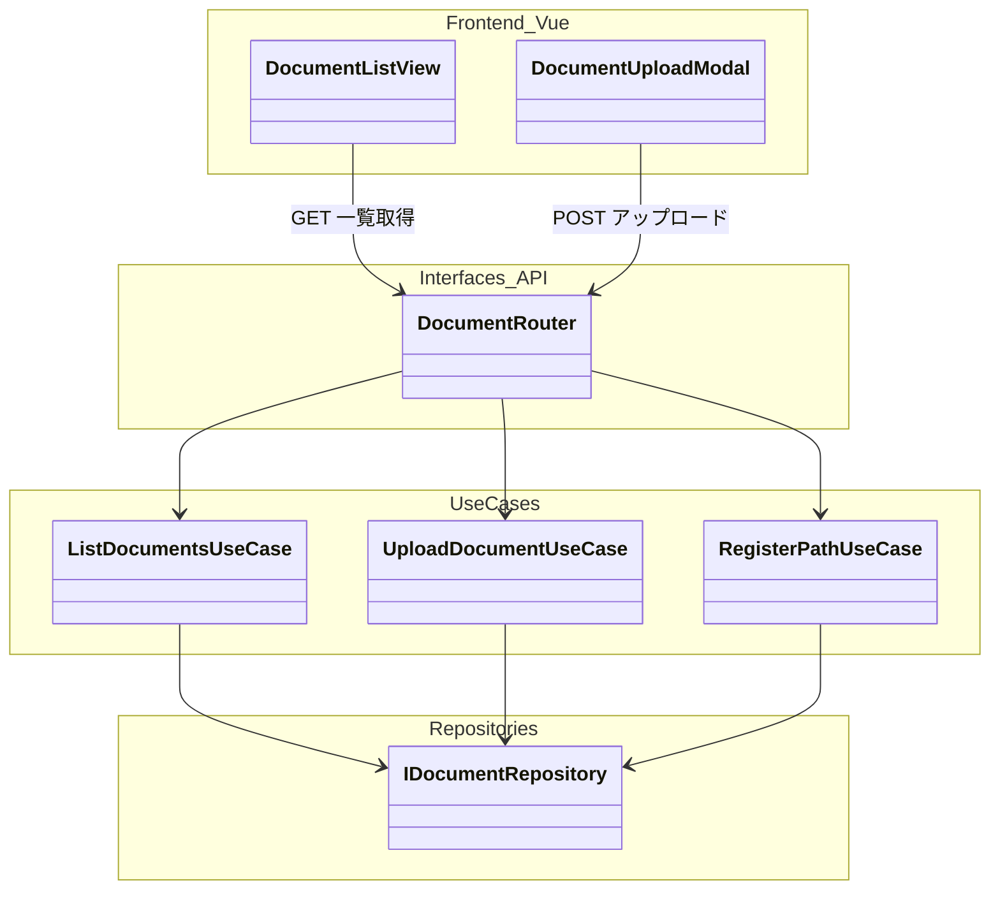
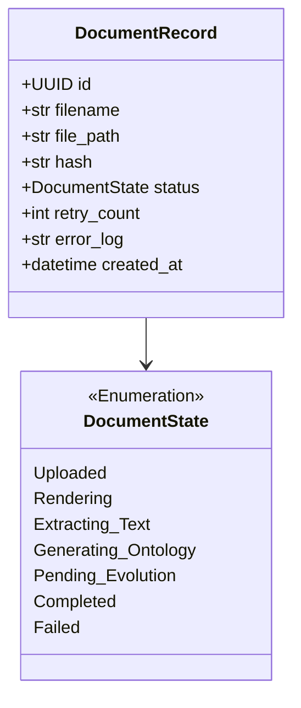
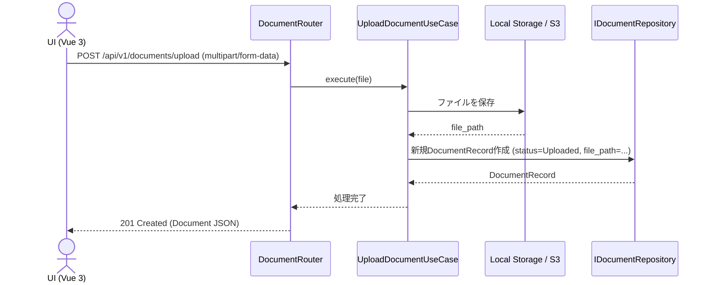

# 12. Document Management 詳細設計

## 1. 対象機能の概要・処理一覧

ontoNgnにおけるワークフローの起点となる、対象ドキュメント（PDF、Officeファイル等）の登録、一覧表示、およびステータス管理を行うためのフロントエンド画面およびバックエンドAPIの設計です。

### 処理一覧
1. **ドキュメントの一覧表示**: 登録済みのドキュメントの一覧（ファイル名、アップロード日時、現在の処理ステータスなど）を取得・表示する。
2. **ドキュメントのアップロード**: ユーザーのローカル環境からシステムへファイルをアップロードし、データベースに新規レコード（`DocumentRecord`）を作成する。
3. **ローカルパスの登録**: システムがアクセス可能なサーバー上のファイルパスを指定し、監視対象として登録する。
4. **ステータス監視**: ワークフローエンジンによる処理進行状況（`Uploaded`, `Rendering`, `Completed`, `Failed`等）をポーリングまたはWebSocketで監視する。

## 2. モジュール構成図・クラス図

### モジュール構成図

### クラス図（エンティティ）

## 3. 処理フロー図・シーケンス図

### ドキュメントアップロードのシーケンス図

## 4. APIインターフェース仕様 / 入出力データ

| Method | Endpoint | 概要 | リクエスト例 | レスポンス例 |
| :--- | :--- | :--- | :--- | :--- |
| GET | `/api/v1/documents` | 登録済みドキュメント一覧とステータス取得 | - | `[{ "id": "uuid", "filename": "spec.pdf", "status": "Completed" }]` |
| POST | `/api/v1/documents/upload` | 手動アップロード | `multipart/form-data` | `{ "id": "uuid", "status": "Uploaded" }` |
| POST | `/api/v1/documents/register-path` | ローカル監視対象のパスを登録 | `{ "path": "/data/docs/spec.pdf" }` | `{ "id": "uuid", "status": "Uploaded" }` |
| DELETE | `/api/v1/documents/{id}` | ドキュメントの削除 | - | `{ "status": "success" }` |

## 5. 異常系・エラーハンドリング

| 想定されるエラー | 原因 | 対応方針 | HTTPステータス |
| :--- | :--- | :--- | :--- |
| **ファイルサイズ超過** | 設定値を超える巨大なファイルのアップロード | ミドルウェアで弾き、クライアントへエラーを返す。 | `413 Payload Too Large` |
| **非対応フォーマット** | サポート外の拡張子（.exe等） | APIルーターで拡張子・MIMEチェックを行い、弾く。 | `415 Unsupported Media Type` |
| **ストレージ保存エラー** | ディスク容量不足など | 例外を補足しエラーログを出力。DBへの保存は行わない。 | `500 Internal Server Error` |

## 6. 依存する環境変数・外部設定

- `MAX_UPLOAD_SIZE`: アップロード可能な最大ファイルサイズ。
- `DOCUMENT_STORAGE_PATH`: アップロードされたファイルを一時的または永続的に保存するローカルディレクトリパス（またはS3バケット等の設定）。

## 7. テスト方針

- **API結合テスト**:
  - `TestClient` を用いて、ダミーのテキストファイル等を `/upload` エンドポイントにPOSTする。
  - レスポンスとして `201 Created` とUUIDが返却されること、および指定したストレージパスにファイルが正しく書き込まれていることを検証する。

## 8. 画面設計 (UI Screens)

Console UI のポータルからアクセス可能な専用のSPA画面コンポーネント（Vue 3）として提供されます。

### 8.1 ドキュメント一覧画面 (Document List Screen)
- 登録されたドキュメントのリストをテーブル等で表示する。
- 表示項目: ファイル名、ステータス（色付きバッジ）、登録日時、アクション。
- **機能・アクション**: リストのフィルタリング（ステータス別など）、ドキュメントの削除機能。

### 8.2 ドキュメント登録画面 / モーダル (Document Upload Modal)
- 新規ドキュメントをシステムへ追加するためのアップロードUI。
- **機能・アクション**: ドラッグ＆ドロップでのファイルアップロード、またはサーバー上の特定ディレクトリパスを直接入力しての登録。アップロード成功時に一覧画面を自動リフレッシュする。
